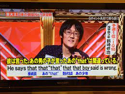

# Grammar

## 倒裝句

### A. 地方副詞(片語) + V. / beV. + S. / 代名詞 + V. / beV.

* 這群鳥飛走了。\
  Away flew the flock of birds.
* 然後科技的時代來臨了。\
  Then came the era of technology.
* Lisa跳進水裡。\
  Into the water jumped Lisa.

### B. 否定副詞 + Aux. + S. + V. / be + S.

* 他從沒想過出國留學。\
  Never had he thought of going abroad for further studies.
* 我母親很少說別人的壞話。\
  Seldom does my mother speak ill of others.
* 我幾乎不可能當面見到我最喜歡的明星。\
  Hardly am I likely to meet my favorite star in person.

### C. 絕不：by no means + Aux. + S. + V. / beV. + S.


要表示「絕不」的意思，除了by no means，也能用on no account、under no circumstance、in no way等片語，可以在寫作時靈活運用。&#x20;


* 沒有我的允許，你絕對不能閱讀我的信件。\
  By no means can you read my letter without my permission.
* 你絕對不能在考試時作弊。\
  On no account can you cheat on tests.
* 因為他已經騙我超過三次，我再也不信任他了。\
  By no means can I trust him since he has cheated me for more than three times.

### **D. So adj. / such n. + beV. + S. that + S. + V.**

* Jack的提案如此之好，以至於被他的老闆所信用。\
  So great was Jack's proposal that it was adopted by his boss.
* 我父親如此憤怒，將所有東西橫掃到桌下。\
  So angry was my father that he swept all the things under the table.
* Michael是如此優秀的球員，以致於他已經為他的球隊贏得許多比賽。\
  Such an excellent player is Michael that he has won a lot of games for his team.

### E. **Only + adv.子句 / 片語 + beV. / Aux. + S.**

*   只有在他失去健康後，他才知道健康的重要性。

    Only when he lost his health did he realize the importance of health.
*   只有努力工作，你才能成功實現你的目標。

    Only if you work hard will you attain your aims successfully.

    他只有當他的孩子們睡著時，才能休息一下。

    Only when his children fell asleep could he take a rest for a while.

## 強調用法

### A. It is ... that

* 正是這種敢於叛逆與表達自己想法的勇氣，使他的作品有獨特的創造力。\
  It is exactly his courage to rebel and to express his own ideas that makes his films with distinct creativity.
*   直到兩小時後電力才恢復。

    It wasn't until two hours later that the electricity was restored.
*   就是他的鼓勵，讓我度過了困難。

    It was his encouragement that helped me go through the hardships.

### B. Such + N. + that / so + adj. / adv. + that

*   她是這麼善解人意的女人，以至於她的朋友們常對她傾吐心事。

    Such a considerate woman is she that her friends usually confide in her.
*   他花在課業上的時間是如此的少，以至於比同學落後許多。

    So little was the time he spent on his studies that he fell behind his classmates a lot.
* Candy太可愛了，以至於班上很多人都很喜歡她。\
  So adorable is Candy that many people in the class love her very much.

### C. Cannot V. too much / adv. / cannot over V. / cannot be too adj.

*   人們覺得這個孩子的英勇行為非常值得稱讚。

    People cannot praise the boy for his heroic act too much.
*   守時的重要性再怎麼強調也不為過。

    The importance of punctuality cannot be over emphasized.
*   開車的時候再怎麼小心也不為過。

    You cannot be too careful when driving.

### D. **It's important / crucial / essential that S. (should) VR.**

*   老人要定期做健康檢查，這是很重要的。

    It is crucial that an old person have regular physical examinations.
*   所有的期末報告都得在星期一早上之前交出去，這是必要的。任何做不到這一點的人都會被當掉。

    It is necessary that all term papers be submitted by Monday morning. Anyone who cannot do this will be flunked.
*   為了安全的緣故，這些規則需要嚴格遵守，這是必要的。

    It is vital that these rules be observed seriously for the sake of your safety.


通常當句意有「應該」的意思時，以下動詞或形容詞就可能使用「省略should」的用法。

* 建議：advise / advice / suggest / suggestion / propose / proposition / proposal / recommend / recommendation
* 堅持：insist
* 命令：order / command
* 要求：ask / demand / require / requirement / request
* 規定：rule / regulation / stipulate / stipulation
* 必須的：necessary / essential / imperative / urgent / vital
* 明智的：advisable
* 重要的：important
* 適當的：proper

Nobody suggested that the meeting <mark style="color:blue;">**(should) be held**</mark> on the first day of the next month.



雖然上述動詞或形容詞可能會使用「省略should」的句型，但他們通常也有別的用法，需要視句意而定。

* John insists that Grace <mark style="color:blue;">**(should) apologize**</mark> to his daughter. 堅持(應該)要道歉\
  However, Grace insists that she <mark style="color:blue;">**is**</mark> innocent. 堅持自己是無辜的
* I suggest that Mary <mark style="color:blue;">**(should) go**</mark> on a diet. 建議(應該)要節食\
  The study suggests that girls <mark style="color:blue;">**are**</mark> more sensitive to sounds than boys. 研究顯示...


### **E. Lest + (should) VR.** 以免

*   那個媽媽墊著腳尖走路，以免把睡覺中的寶寶吵醒。

    The mother walked on tiptoe lest she (should) wake the sleeping baby up.
*   我們應該盡可能常使用大眾交通工具，以免全球暖化更惡化。

    We should do our best to take public transportation often lest the global warming become worse.
*   他拿著傘以免淋成落湯雞。

    He brought an umbrella lest he get soaking wet in the rain.

### F. It's (about / almost / high / right / proper) time that + S. / to V. 是時候...

* 現在是時候採取預防措施來防止不良後果了。\
  It's high time that the precautionary measures <mark style="color:blue;">**were taken**</mark> to prevent the bad consequences.
* 從現在起，正是存錢的好時機。\
  It's high time to <mark style="color:blue;">**save**</mark> your money from now on.

## 動名詞

### A. Be worth + Ving / N.

*   他的善行值得讚揚。

    His good deed is worth praising.
*   這首詩值得背誦。

    The poem is worth reciting.
*   你們對這議題進行冗長的討論是不值得的。

    It is not worthwhile for you to discuss too much about the issue.

### B. Have fun / a good time + Ving / have difficulty / trouble / problems / a hard time + Ving

*   他錯過了許多課，進度趕得很辛苦。

    Having missed a lot of lessons, he had a hard time catching up.
*   我們的外國朋友在台灣各地旅遊並品嘗當地美食，玩得很愉快。

    Our foreign friends had a good time traveling in Taiwan and tasting local delicacies.

### C. 一...就...：On + Ving, S. ... / 當...：In + Ving, S. ...

*   一獲知球隊贏得冠軍，所有的球迷高興地又叫又跳。

    On learning that the team won the championship, all the fans shouted and jumped with joy.
*   當面對生命中的種種挑戰時，他一直保有對上帝的信仰，從不放棄。

    In facing a variety of challenges in life, he always believes in God and never gives up.
*   那些問題學生一看到教官就逃跑。

    Those troublesome students ran away on seeing the military instructor.
*   一聽到火災警報響起，他馬上向消防隊報案

    On hearing the fire alarm go off, he called the fire department immediately.

### D. 無法...的；不可...的：There is no + Ving

*   不可否認的，網際網路已成為我們生活中一項不可或缺的便利工具。

    There is no denying that the Internet has become an indispensable convenience in our life.
*   由於競爭激烈，最後誰會贏得冠軍還無從得知。

    There is no knowing who'll be the champion in the end due to the keen competition.
*   喜好是無法解釋的。

    There is no accounting for taste.

### E. Can't help + Ving / can't but + VR / have no choice but to + VR / can't do nothing but + VR

*   這公司因為生意越來越差，不得不解雇一些工人。

    The company can't do nothing but dismiss some of the workers because of the declining business.
*   被搶匪以槍指著，店員別無選擇，只好把所有錢都交出來。

    Being pointed at a gun by the robber, the clerk had no choice but to give out all the money.
*   被欺侮的男孩忍不住揮拳回擊保護自己。

    The bullied boy couldn't help but punch back to protect himself.

## It的用法

### A. It is adj. (for sb.) to V.

*   年輕人需要盡量多讀好書，這是必要的。

    It's necessary for young people to read as many good books as possible.
*   今天要堅持那個信念是困難的。

    It's difficult to persist in that belief today.

### B. It is adj of sb. to V.

*   他這樣當面羞辱你，真是壞心。

    It's unkind of him to insult you to your face.
*   他捐了一大筆錢給孤兒院，真是好心。

    It's kind of him to donate a lot of money to the orphanage.

### C. It occurs to / hits / strikes sb. that + S. / it occurs to / hits / strikes sb. to V.

*   當我走在路上的時候突然想到媽媽叫我幫她跑腿辦事。

    When I was walking on the street, it occurred to me that Mother had asked me to run an errand for her.
*   你有沒有想過要充分利用時間而不是虛度光陰。

    Has it ever occurred to you that you should make good use of time instead of idling it away?

### D. Find / believe / make it adj. (for sb.) to V.

*   她跑得這麼快，以至於我發現要追上她很難。

    She ran so fast that I found it hard to catch up with her.
*   捷運使得人們更加方便地在這個城市四處行動。

    The MRT makes it much more convenient for people to move around in this city.

### E. It is said / believed / reported / rumored that + S.

*   謠傳他中了樂透的頭彩。

    It is rumored that he hit the jackpot.
*   大家相信多吃少運動會造成肥胖。

    It is believed that eating more and exercising less will cause obesity.

## 假設語氣

General Rules:

<table><thead><tr><th width="211.33333333333331">假設的時間</th><th width="244">假設的句子</th><th>主要的句子</th></tr></thead><tbody><tr><td>未來</td><td>現在式</td><td>will</td></tr><tr><td>現在</td><td>過去式</td><td>would/ could/ might</td></tr><tr><td>過去</td><td>過去完成式</td><td>would/ could/ might have p.p.</td></tr></tbody></table>

### A. if

* If I <mark style="color:blue;">**had**</mark> money now, I <mark style="color:blue;">**would buy**</mark> the car immediately.
* If I <mark style="color:blue;">**had had**</mark> enough time then, I <mark style="color:blue;">**might have accomplished**</mark> the task.
* If I <mark style="color:blue;">**had accomplished**</mark> the task at that time, I <mark style="color:blue;">**wouldn't be**</mark> to blame now.
* If Sam <mark style="color:blue;">**had been driving**</mark> more carefully, he <mark style="color:blue;">**wouldn't have been killed**</mark> in the accident.
* If James <mark style="color:blue;">**stopped**</mark> insulting me, I <mark style="color:blue;">**wouldn't fight**</mark> with him.
* If you <mark style="color:blue;">**hadn't spoken**</mark> ill of Amy, she <mark style="color:blue;">**wouldn't have been**</mark> so annoyed.
* If I <mark style="color:blue;">**had**</mark> the money, I <mark style="color:blue;">**would go**</mark> abroad for traveling.
* If I were billionaire, I would still live a simple life. -> Were I a billionaire, I would still live a simple life.
* If I had had enough time, I would have attained the end I had in view. -> Had I had enough time, I would have attained the end I had in view.
* If the sun <mark style="color:blue;">**were to rise**</mark> in the west, the impossible <mark style="color:blue;">**would be**</mark> possible. (與真理相反的假設)
* <mark style="color:blue;">**If there should be a fire**</mark>, do not panic. -> Should there be a fire, do not panic. (「萬一」的假設與倒裝)
* What would you do if you <mark style="color:blue;">**should**</mark> fail to enter the dream college of yours? (「萬一」的假設)

### B. Wish


Wish 一般用在<mark style="color:blue;">**不可能實現的願望**</mark>上，用在未來時，會用would。


* I wish you <mark style="color:blue;">**were**</mark> here now.
* I wish we <mark style="color:blue;">**had met**</mark> each other ten years ago.
* I wish I <mark style="color:blue;">**could attend**</mark> your wedding tomorrow.
* I wished I <mark style="color:blue;">**hadn't failed**</mark> the English exam yesterday.
* I wish I <mark style="color:blue;">**could win**</mark> much money in the lottery tomorrow.
* Adam wishes that he <mark style="color:blue;">**didn't make**</mark> the mistake.
* Adam wished that he <mark style="color:blue;">**had been offered**</mark> the job.

### C. As if


「彷彿」和假設相似，所以用假設語句。


* The lady smiled at me as if she <mark style="color:blue;">**had known**</mark> me for many years.
* Bruce rushed to me as if to tell me something important.

### D. But for/ Without/ If only


當句子出現以下的東西時，也常用假設語氣，句子的邏輯和上面的General Rules相同。


* But for: But for the income, Tom <mark style="color:blue;">**would not be**</mark> able to pay the rent.
* Without: Without his help yesterday, I <mark style="color:blue;">**wouldn't have succeeded**</mark>.
* If only (用在未來時，會用would): If only he <mark style="color:blue;">**had written**</mark> his homework yesterday. / If only I <mark style="color:blue;">**were**</mark> rich. / If only it <mark style="color:blue;">**would stop**</mark> raining.

## 分詞構句


使用分詞構句時，除了「獨立分詞構句」外，其他的狀況下<mark style="color:blue;">**句子前後主詞需一致**</mark>。


### A. 將對等句簡化成分詞構句

* She opened the washer door, and she put her laundry in. -> She opened the washer door, putting her laundry in.
* I stood on top of the mountain, and I was fascinated by the sea of clouds. -> I stood on top of the mountain, fascinated by the sea of clouds.
* Papua's glaciers have shrunk by 85% to a mere 0.5 square kilometers, and Papua's glaciers will completely disappear within a decade. → Having shrunk by 85% to a mere 0.5 square kilometers, Papua's glaciers will completely disappear within a decade.

### B. 將副詞子句簡化成分詞構句


If/ because/ before/ after/ as/ when / while/ once/ unless


* When the thief saw the policeman, he ran away. -> Seeing the policeman, the thief ran away.
* Because he has failed math twice, he fears this subject above all others. -> Having failed math twice, he fears this subject above all others.
* As the man was hungry and tired, he couldn't walk any further. -> (Being) hungry and tired, he couldn't walk any further.
* Because he didn't know what to do, he asked his parents for help. -> Not knowing what to do, he asked his parents for help.
* Since he hasn't finished his homework, he is not allowed to watch TV. → Not having finished (Having not finished) his homework, he isn't allowed to watch TV.
* 被女友拋棄後，John開始思考自己的人生目標 → Having been abandoned by his girlfriend, John started to think about his goal of life.

### C. 獨立分詞構句


用在前後主詞不一致時，主要子句用正常的方式書寫，附屬子句則需用分詞構句。


* When the sun has risen, the farmers start to work. -> The sun having risen, the farmers start to work.
* If the weather permits, we will go on a picnic tomorrow. -> The weather permitting, we will go on a picnic tomorrow.

### D. 練習

點一下顯示答案

1. playing
2. asked
3. Shocked / rolling
4. Judging
5. given
6. D
7. B
8. A
9. C
10. C

1. Alison sat on the sofa \_\_\_\_\_\_\_\_ (play) with her dolls.
2. When \_\_\_\_\_\_\_\_ (ask) if I smoke, I told him that I am a heavy smoker.
3. \_\_\_\_\_\_\_\_ (Shock) at the news of her son's death, Susan shouted and screamed, tears \_\_\_\_\_\_\_\_ (roll) down her cheeks.
4. \_\_\_\_\_\_\_\_ (Judge) from his face, he is very upset.
5. He has done pretty well so far \_\_\_\_\_\_\_\_ (give) that he is only a rookie on the team.
6. \_\_\_\_\_\_\_\_ the only daughter in her family, she has been pampered by her father and brothers.\
   (A) She is (B) Be (C) To be (D) Being
7. Choose the **CORRECT** sentence.\
   (A) Sally waved goodbye to us, with tears ran down her cheeks.\
   (B) Tina looked at me with her eyes filled with tears.\
   (C) A middle-aged man is jogging along the river, with a dog followed him.\
   (D) Mom is sitting on the bed, with her eyes closing.
8. \_\_\_\_\_\_\_\_ a fine day, Time and his wife went out for a walk.\
   (A) It being (B) Being (C) As it is (D) As being
9. \_\_\_\_\_\_\_\_ across the table, she was terrified and couldn't help bursting into tears.\
   (A) Seeing the cockroach ran\
   (B) When she seeing the cockroach running\
   (C) Seeing the cockroach run\
   (D) Seeing running
10. \_\_\_\_\_\_\_\_ with Jane's term paper, professor Wang asked her to rewrite it.\
    (A) Not satisfying (B) Having not satisfied (C) Not satisfied (D) Being not satisfying

## 各種關係

### 關係代名詞

#### A. 限定 vs. 非限定

* My brother who is studying in Tainan is very tall. (限定，代表不只一個brother)
* They plan to go to Paris, which is the capital of France. (只有一個，非限定)

#### B. , which 指設一整件事情

* They had to wait for over an hour, which annoyed them very much.

#### C. 當關係代名詞遇到不定量詞

* I read four English novels during this summer vacation. Three of them were written by J.K. Rowling. -> I read four English novels during this summer vacation<mark style="color:blue;">**, three of which**</mark> were written by J.K. Rowling.
* Mr. and Mrs. Bennet have five daughters. None of them is married. -> Mr. and Mrs. Bennet have five daughters<mark style="color:blue;">**, none of whom**</mark> is married.

### 關係副詞


Where/ when/ why/ how


* The factory was burned down. I used to work in it. -> The factory where I used to work was burned down.
* I can clearly remember the good old days. We studied and had fun together in those days. -> I can clearly remember the good old days when we studied and had fun together.
* I don't know the reason she is crying. -> I don't know why she is crying.
* I don't like the way he dealt with the crisis. -> I don't like how he dealt with the crisis.

### 複合關係代名詞 (the thing which -> what)

* All you can do is calm down and wait. -> <mark style="color:blue;">**What**</mark> you can do is calm down and wait.
* Do you understand the things that he said? -> Do you understand <mark style="color:blue;">**what**</mark> he said?

### That 的使用時機

* 先行詞有形容詞最高級時\
  This is the most interesting book that I have ever read.
* 先行詞為 all, anything, everything, nothing, something\
  There is nothing that can be done to solve the problem.
* 先行詞有人+動物\
  The man and the dog that are coming toward me are both my friends.
* 有疑問詞 who/ which\
  Who is the man that is sitting over there?

<figure><figcaption>
He says that that "that" that that boy said is wrong.
</figcaption></figure>

### 練習

點一下顯示答案

1. B
2. C
3. B
4. A
5. A
6. D
7. B
8. A

1. Many more people \_\_\_\_\_\_\_\_ were invited showed up at the party. That's \_\_\_\_\_\_\_\_ there was not enough food to go around.\
   (A) than; the way (B) than; why (C) that; the way (D) that; why
2. Are you sure the man \_\_\_\_\_\_\_\_ a green tie and a big red hat is our new teacher?\
   (A) who wearing (B) wears (C) wearing (D) wore
3. \_\_\_\_\_\_\_\_ you may have noticed, that website has been removed because it contained too much violence.\
   (A) What (B) As (C) That (D) Which
4. Once used, the bags are sealed and stored for the flight back to the earth, \_\_\_\_\_\_\_\_ they are discarded.\
   (A) where (B) what (C) which (D) whether
5. My best friend, Jay, is a person \_\_\_\_\_\_\_\_ I can share my secrets\
   (A) with whom (B) to whom (C) whom (D) with that
6. I don't know \_\_\_\_\_\_\_\_ he is afraid of.\
   (A) which (B) that (C) how (D) what
7. I don't like the way \_\_\_\_\_\_\_\_ he presented his ideas. He could have done better.\
   (A) how (B) X (C) which (D) in that
8. My English tutor asked me to read the first four chapters of this book, \_\_\_\_\_\_\_\_ are about genetic engineering.\
   (A) two of which (B) two of them (C) and two of which (D) two

## 代名詞

### A. one/ ones/ another/ other/ others/ the other/ the others

* A new car is more expensive than an old <mark style="color:blue;">**one**</mark>.\
  I think old friends are more important than new <mark style="color:blue;">**ones**</mark>.
* This skirt is a little dirty. Could I have <mark style="color:blue;">**another**</mark> one?\
  Time is not enough. I need <mark style="color:blue;">**another**</mark> two days to finish this project.
* Some people like dogs, but <mark style="color:blue;">**other**</mark> people like cats.
* Some people like dogs, but <mark style="color:blue;">**others**</mark> like cats.
* Mr. Wang has two sons. One is a doctor, and <mark style="color:blue;">**the other**</mark> is a teacher.
* Only Tom got good grades, but <mark style="color:blue;">**the others**</mark> (= <mark style="color:blue;">**the other students**</mark>) in his class didn't.

### B. Each vs. every

* each強調「個別」，every強調「整體」\
  <mark style="color:blue;">**Each**</mark> bedroom has its own bathroom. (每一間臥室)\
  <mark style="color:blue;">**Every**</mark> student has to pass the GEPT before graduation. (所有的學生)
* each可為代名詞，every不可為代名詞\
  <mark style="color:blue;">**Each**</mark> of us has a locker. = <mark style="color:blue;">**Every one**</mark> of us has a locker.
* each：2個，every：3個以上\
  She has a tattoo on <mark style="color:blue;">**each**</mark> of her feet.\
  Cars of <mark style="color:blue;">**every**</mark> kind are on display.
* every的其他用法\
  Gina visits her grandparents <mark style="color:blue;">**every**</mark> two weeks.\
  Angela goes to the supermarket <mark style="color:blue;">**every other day**</mark> (每隔一天).\
  Not <mark style="color:blue;">**every**</mark> student pays attention in class. (部分否定)

### C. That/ those

* The pace of life in a big city is much faster than <mark style="color:blue;">**that**</mark> in the country.\
  The leaves of this tree are greener than <mark style="color:blue;">**those**</mark> of that tree.
* I keep a golden retriever and a Chihuahua; <mark style="color:blue;">**that**</mark> (= the former) requires more care than <mark style="color:blue;">**this**</mark> (= the latter).

### D. 虛受詞

#### S + believe/ think/ consider/ find/ feel/ hold/ deem/ make/ take it adj/N ...

* I <mark style="color:blue;">**think it wrong**</mark> to cheat on your wife.
* The teacher <mark style="color:blue;">**thinks it a pity that**</mark> John dropped out of school.

### E. 列舉用法


一共兩者：one... the other\
一共三者：one... another... the other\
一共四者：one... another... (still) another... the other\
一些... 而一些：some... the other/ others/ some/ other Ns，或<mark style="color:blue;">**some of the... the others**</mark>


* A successful person has three qualities. <mark style="color:blue;">**One**</mark> is confidence. <mark style="color:blue;">**Another**</mark> is perseverance. <mark style="color:blue;">**The other**</mark> is courage.
* Some people work for ideals, while <mark style="color:blue;">**some/ others**</mark> work for money.

### F. 練習

點一下顯示答案

1. C
2. C
3. D
4. B
5. D
6. C
7. C
8. B
9. C

1. Ways of making gestures are different from one culture to \_\_\_\_\_\_\_\_.\
   (A) the other (B) other (C) another (D) others
2. In English-speaking areas, people need two hands to communicate the number "six," five fingers on one and the thumb of \_\_\_\_\_\_\_\_.\
   (A) another (B) others (c) the other (D) the others
3. Many people fail to do what they preach. They tend to say one thing and do \_\_\_\_\_\_\_\_.\
   (A) other (B) others (C) the other (D) another
4. Some people are building houses, and \_\_\_\_\_\_\_\_ are working in factories.\
   (A) another (B) others (C) the others (D) the rest
5. Concerning climate, Taiwan can be divided into two areas. One is in the tropical Zone \_\_\_\_\_\_\_\_ is in the Subtropical Zone.\
   (A) another (B) other (C) , the other (D) , and the other
6. Check out the pictures in this letter. Aren't they great, especially \_\_\_\_\_\_\_\_ of me and Father on the beach?\
   (A) it (B) this (C) the one (D) the other
7. Jane: Isn't Mike cute? Tracy: You mean \_\_\_\_\_\_\_\_ sitting on the bench?\
   (A) one (B) it (C) the one (D) ones
8. A man's voice is deeper than \_\_\_\_\_\_\_\_ of a woman.\
   (A) this (B) that (C) it (D) what
9. I find \_\_\_\_\_\_\_\_ necessary to study a lesson before my teacher lectures on it.\
   (A) this (B) that (C) it (D) its

## 從屬連接詞

### Wh-ever = no matter wh- 無論

* No matter who (= Whoever) breaks the rule, he or she should be punished.
* No matter how (= However) busy you were, you should made a phone call to your wife.

### no matter wh- = any... that 複合關係代名詞(先行詞+關係代名詞)

* I don't care anything that (= whatever) you say.
* Anyone who (= Whoever) may say so is not trustworthy.

### Whether 不論、不管

* Whether his advice works or not (= Whether or not his advice works), I will give it a try. (or not 在這裡不可以省略)
* Whether the answer is right or not (= Whether or not the answer is right), it doesn't matter at all. (or not 在這裡不可以省略)


whether 引導名詞子句、當作主詞、受詞或補語時，or not 可以省略。\
I don't know whether the answer is correct (or not).


## 分詞片語：形容詞子句可以簡化成分詞片語

* The movie is about a scientist who won the Nobel Prize. → The movie is about a scientist winning the Nobel Prize.
* Some people who are infected with the virus look and feel healthy, but still can pass it to others. → Some people infected with the virus look and feel healthy, but still can pass it to others.
* Starting from April 2017, the pills were placed in 40 bird feeders that were installed throughout the city. → Starting from April 2017, the pills were placed in 40 bird feeders installed throughout the city.


當使用分詞片語的時候，只要記住一個大原則，基本上就能活用這個文法了：想要省略的部分，原先是主動→分詞片語是ing；原先是被動→分詞片語是ed。


## To 的各種用法

### A. 不定詞當受詞補語

#### S + advise / desire / expect / wish / want / tell / ask / get / bid / compel / force / order / command / encourage / inspire / motivate / remind / persuade / warn / allow / cause / enable / teach / invite + O + O.C.

* He warned us <mark style="color:blue;">**not to get**</mark> close to the fierce dog.
* Laws during that time allowed crews <mark style="color:blue;">**to kill**</mark> the sharks, after which they sold the sharks.
* She also urged Rejoice <mark style="color:blue;">**to return**</mark> to school and arranged a Malala scholarship for her.

### B. 不定詞當主詞補語

* When Debra went home, it seemed that someone had broken into the house. → When Debra went home, someone seemed <mark style="color:blue;">**to have broken into the house**</mark>.

### C. ..., only to + V 僅僅為了；沒想到竟會

* We drove for hours to the amusement park, <mark style="color:blue;">**only to find it closed for maintenance**</mark>. (結果卻發現他正在維護中沒有營業)

### D. To 當介系詞 + N/ Ving

反對 be opposed to = object to\
習慣於 be used to = be accustomed to = adapt (oneself) to = adjust (oneself) to\
致力於 devote oneself to = dedicate oneself to = commit oneself to = be devoted to = be dedicated to\
除了 in addition\
期盼 look forward to\
注意 attend to = pay attention to = be attentive to\
較喜歡 prefer N/ Ving to N/ Ving\
提到 when it comes to\
為了 with a view to = with an eye to

* We all like Tom because he <mark style="color:blue;">**is used to speaking**</mark> well of others.
* Tony's parents <mark style="color:blue;">**objected to his going abroad**</mark>, but in vain. (這裡可以視his going abroad為一整個東西，這樣會比較好理解)

### E. 練習

點一下顯示答案

1. to lose
2. to celebrate
3. to be
4. is
5. to show
6. to talk
7. To meet
8. to help
9. C
10. D

1. My sister ate less and exercised more in order \_\_\_\_\_\_\_\_ (lose) weight.
2. Mr. and Mrs. Lin invited us \_\_\_\_\_\_\_\_ (celebrate) their parent's birthday at a fancy restaurant.
3. Carl is quiet and gently in my class. He seems \_\_\_\_\_\_\_\_ (be) a nice boy.
4. To hang out with some of my classmates \_\_\_\_\_\_\_\_ (be) fun and delightful.
5. I know I have to attend the meeting, but I'm not sure when \_\_\_\_\_\_\_\_ (show) up.
6. The class leader advised \_\_\_\_\_\_\_\_ (talk) quietly so that we wouldn't disturb the students in other classrooms.
7. \_\_\_\_\_\_\_\_ (meet) the deadline, the team worked very hard on the project.
8. Anyone who is willing \_\_\_\_\_\_\_\_ (help) children with homework can sign up for the voluntary program.
9. Kevin is good at photographing and painting. He seems \_\_\_\_\_\_\_\_ art in college years ago.\
   (A) to study (B) to be studying (C) to have studied (D) to studying
10. Larry woke up early \_\_\_\_\_\_\_\_ arriving at the airport by 7 a.m.\
    (A) in order to (B) so as to (C) to (D) with a view to

## 特殊動詞

### A. Help + O + (to) + VR

* Charging people for new plastic bags sometimes <mark style="color:blue;">**helps reduce**</mark> their use, but many shoppers just pay the costs and keep wasting plastic.

### B. 連綴動詞 + adj / 連綴動詞 + like + N


連綴動詞可以分成底下兩種。\
表達人的知覺反應：feel / look / sound / taste / smell\
表達動作反應：become / grow / fall / keep / get / go / turn


* Tina usually <mark style="color:blue;">**feels sleepy**</mark> because she goes to bed very late.
* Everything <mark style="color:blue;">**goes wrong**</mark>.

### C. 授與動詞

* May I ask a question <mark style="color:blue;">**of**</mark> you? → May I ask you a question?
* I sent the letter <mark style="color:blue;">**to**</mark> Dad. (我把信寄給了Dad)
* I sent the letter <mark style="color:blue;">**for**</mark> Dad. (我幫Dad送信)
* I paid Jim one thousand dollars for his painting. → Jim was paid one thousand dollars for his painting. = One thousand dollars was paid (by me) to Jim for his painting.

### D. 使役動詞


使役動詞有以下幾個。\
make (迫使) / have (要求) / let (容許) + VR / Ved (看動作對被作用者為主動或被動決定)\
get (說服) + O. + to V.\
get / make + O. + N. / adj.


* Mom always <mark style="color:blue;">**makes**</mark> me <mark style="color:blue;">**do**</mark> my homework first after school.
* I <mark style="color:blue;">**had**</mark> the tree at the door <mark style="color:blue;">**cut (被動)**</mark>.
* His wife's unconditional love <mark style="color:blue;">**makes**</mark> him <mark style="color:blue;">**a better person**</mark>.
* I'll <mark style="color:blue;">**get**</mark> the luggage <mark style="color:blue;">**ready**</mark> in thirty minutes.

### E. 感官動詞 + O. + Ving / VR / p.p.

* I <mark style="color:blue;">**saw**</mark> John <mark style="color:blue;">**eating**</mark> dinner with his girlfriend when I passed by the restaurant.
* I <mark style="color:blue;">**saw**</mark> the car <mark style="color:blue;">**stolen**</mark> by a young man.
* Everybody <mark style="color:blue;">**heard**</mark> John <mark style="color:blue;">**sing**</mark> a song to his wife. -> John <mark style="color:blue;">**was heard to sing / singing**</mark> a song to his wife.

### F. 練習

點一下顯示答案

1. D
2. C
3. D
4. B

1. \_\_\_\_\_\_\_\_ at that time? He looked very happy when he knew his daughter was going to be married.\
   (A) What did Mr. William look (B) What did Mark watch (C) What did Kevin look for (D) How did Mr. North look
2. Some teachers \_\_\_\_\_\_\_\_ their students to keep studying all the time. (選錯的)\
   (A) asked (B) wanted (C) made (D) got
3. The cold weather \_\_\_\_\_\_\_\_ the leaves \_\_\_\_\_\_\_\_ yellow. They look so \_\_\_\_\_\_\_\_.\
   (A) made; turned; cold (B) make; turning; pretty (C) made; to turn; beauty (D) makes; turn; beautiful
4. When I was waiting for my bus, I saw the man \_\_\_\_\_\_\_\_ the bus, and noticed him \_\_\_\_\_\_\_\_ the young lady's purse.\
   (A) got on; take away (B) get on; take away (C) getting on; taken away (D) got on; took away

## 不定代名詞

### A. 不定代名詞可用作主詞、主詞補語、受詞或同位語

* <mark style="color:blue;">**Many**</mark> were invited to the lunch but only <mark style="color:blue;">**few**</mark> showed up.
* Give a registration card to <mark style="color:blue;">**each**</mark>.

### B. all, any, more, most, none, some

這些不定代名詞使用單數或複數動詞，視句子語意而定。

* All the cake <mark style="color:blue;">**is**</mark> gone.
* All the girls in my class <mark style="color:blue;">**are**</mark> smart.

### C. nothing / anything / everything + but

* Paul wants <mark style="color:blue;">**nothing but**</mark> pizza. (Paul只想要披薩)
* Give Paul <mark style="color:blue;">**anything but**</mark> pizza. (給Paul任何東西，但不要披薩)
* Paul will eat <mark style="color:blue;">**everything but**</mark> pizza. (除了披薩，Paul會把一切吃掉)

### D. other

other後面的名詞通常是不可數名詞或複數名詞。other後面若是跟著單數名詞，則other前面必須要有另一個限定詞。

* "Gone with the Wind" has sold some 28 million copies in 27 languages, more than <mark style="color:blue;">**any other book**</mark> but the Bible. (任何其他的書)
* There are <mark style="color:blue;">**other ways**</mark> to solve this problem.
* We want to make sure something like this doesn't happen to <mark style="color:blue;">**some other student**</mark>. (某個學生)

### E. the other / others / the others / another

* My uncle has four kids. One of them is a boy and <mark style="color:blue;">**the others**</mark> are girls.
* John held the racquet in one hand and the ball in <mark style="color:blue;">**the other**</mark>.
* Would you like <mark style="color:blue;">**another**</mark> cup of tea?
* Your opinion about what is right for you doesn't mean that it is right for <mark style="color:blue;">**others**</mark>.
* I saw eight sweaters. There are red, and five are blue.\
  \= I saw eight sweaters. Three are red, and <mark style="color:blue;">**the others**</mark> are blue.\
  \= I saw eight sweaters. <mark style="color:blue;">**Some of the sweaters**</mark> are red and <mark style="color:blue;">**the others**</mark> are blue.\
  \= I saw eight sweaters. <mark style="color:blue;">**Some of them**</mark> are red and <mark style="color:blue;">**the others**</mark> are blue.
* I saw four sweaters. <mark style="color:blue;">**One**</mark> is red, <mark style="color:blue;">**another**</mark> is blue, <mark style="color:blue;">**another**</mark> is white, <mark style="color:blue;">**and the other**</mark> is green.

### F. still another / still others

* 範圍不限定：The MRT is full of passengers this morning. <mark style="color:blue;">**Some**</mark> are looking at their phones, <mark style="color:blue;">**others**</mark> are sleeping, <mark style="color:blue;">**and still others**</mark> are staring out the window.
* 範圍不限定：There are many workers in the office. <mark style="color:blue;">**One**</mark> is searching for information online, <mark style="color:blue;">**another**</mark> is making phone calls to the clients, <mark style="color:blue;">**and still another**</mark> is typing her report.
* 範圍限定：There's a group of students at the zoo today. <mark style="color:blue;">**Some**</mark> of them look excited, <mark style="color:blue;">**others**</mark> seem bored, <mark style="color:blue;">**and the others**</mark> are taking pictures with their phones.

### G. 其他

* They call each other <mark style="color:blue;">**every other**</mark> day. (每隔一天)
* Peter would throw out words <mark style="color:blue;">**one after another**</mark>. (一個接一個)
* Some <mark style="color:blue;">**other**</mark> design may be better.
* This bag is leaking. Please give me <mark style="color:blue;">**another**</mark> one.
* It is hard to tell the twin brothers one from <mark style="color:blue;">**the other**</mark>.
* You shouldn't expect <mark style="color:blue;">**others**</mark> to do your work for you.

## 形容詞

### A. 複合形容詞

複合形容詞千變萬化，不過大部分題目或寫作文會用到的類型大概就是以下幾種，可以先熟悉這些基本的複合形容詞。

1. **adj-Ned** 形式：前面是形容詞(不含數量詞)，後面是名詞，則名詞加**ed**
   * A <mark style="color:blue;">**red-haired**</mark> girl
   * A <mark style="color:blue;">**good-tempered**</mark> teacher
2. **...-Ving** / **...-p.p. + N.** 形式：這種複合形容詞是由原本的句子改寫而成，只要將句子還原，**判斷N.和V.之間的關係為主動或被動**，就可以知道寫成複合形容詞時要用Ving或p.p.
   * A <mark style="color:blue;">**car-making**</mark> plant：plant <mark style="color:red;">**makes**</mark> cars (主動)
   * <mark style="color:blue;">**home-made**</mark> cookies：cookies <mark style="color:red;">**are made**</mark> at home (被動)
   * A <mark style="color:blue;">**fast-moving**</mark> typhoon：typhoon <mark style="color:red;">**moves**</mark> fast (主動)
   * A <mark style="color:blue;">**newly-built**</mark> bridge：bridge <mark style="color:red;">**is**</mark> newly <mark style="color:red;">**built**</mark> (被動)
   * <mark style="color:blue;">**Highly-paid**</mark> jobs：jobs <mark style="color:red;">**are paid**</mark> highly (被動)
   * <mark style="color:blue;">**Eye-catching**</mark> banners：banners <mark style="color:red;">**catch**</mark> eyes (主動)
   * A <mark style="color:blue;">**heart-breaking**</mark> story：story <mark style="color:red;">**breaks**</mark> heart (主動)
   * A <mark style="color:blue;">**highly-praised**</mark> student：student <mark style="color:red;">**is praised**</mark> highly (被動)
3. 前面接數量的複合形容詞：不管數量是多少，**後面的量詞都是用單數形式**，要背是用哪個量詞
   * A <mark style="color:blue;">**1000-foot**</mark> building
   * A <mark style="color:blue;">**12-year-old**</mark> student
   * A <mark style="color:blue;">**ten-story**</mark> building (~~ten-floor~~)
4. 其他複合形容詞：看到就背，把一串字全部串在一起強行變成形容詞，強調效果很充足
   * An <mark style="color:blue;">**all-you-can-eat**</mark> restaurant：吃到飽餐廳
   * His <mark style="color:blue;">**I-don't-know-anything**</mark> expression：他的「我什麼都不知道」的表情

### B. 當主詞補語的形容詞

* afraid / alike / alive / alone / asleep / awake / aware / ashamed
* The baby is asleep. The boy is alive.

### C. Adj.當受詞捕語：make / leave / keep / find + O + O.C.


O.C.可為adj.、Ving、pp等，用以形容**O的狀態**。**使用Ving或pp取決於O對於這個動詞的狀態是主動或被動**。


1. O.C.為adj.
   * Don't <mark style="color:blue;">**keep your mouth full**</mark> of food. (mouth is full)
   * His speech <mark style="color:blue;">**left everyone speechless**</mark>. (everyone was speechless)
   * <mark style="color:blue;">**Leave the window open**</mark>. (window is open)
   * I <mark style="color:blue;">**find**</mark> so many <mark style="color:blue;">**cockroaches dead**</mark> on the floor. (cockroaches are dead)
2. O.C.為Ving
   * The worker <mark style="color:blue;">**keeps the machine running**</mark> for 20 hours. (the machine runs)
   * The story <mark style="color:blue;">**leaves everyone crying**</mark>. (everyone cries)
   * Smelling the bread, the man <mark style="color:blue;">**finds his mouth watering**</mark>. (his mouth waters)
   * John <mark style="color:blue;">**found**</mark> some <mark style="color:blue;">**water dripping**</mark> from the leafy roof. (water drips)
3. O.C. 為pp
   * It's important to <mark style="color:blue;">**keep the facilities**</mark> on the campus <mark style="color:blue;">**maintained**</mark> well. (the facilities are maintained)
   * He was surprised to <mark style="color:blue;">**find**</mark> so many <mark style="color:blue;">**ants killed**</mark> in a night. (ants were killed)
   * We <mark style="color:blue;">**keep the house**</mark> beautifully <mark style="color:blue;">**decorated**</mark>. (the house is decorated)
   * The explanation of our math teacher <mark style="color:blue;">**left us**</mark> even more <mark style="color:blue;">**confused**</mark>. (we were confused)

### D. 數量形容詞

1. 修飾可數N
   * <mark style="color:blue;">**A great number of**</mark> / <mark style="color:blue;">**Quite a few**</mark> / <mark style="color:blue;">**A great many**</mark> / <mark style="color:blue;">**A large number of**</mark> / <mark style="color:blue;">**Many**</mark> fans went to the concert last Sunday.
   * <mark style="color:blue;">**Many fans**</mark> <mark style="color:red;">**go**</mark> ... = <mark style="color:blue;">**Many a fan**</mark> <mark style="color:red;">**goes**</mark> ...
2. 修飾不可數N
   * My father spent <mark style="color:blue;">**a great deal of money**</mark> / <mark style="color:blue;">**a large amount of money**</mark> / <mark style="color:blue;">**a large sum of money**</mark> (a large sum of 只能接 money) buying a new house in Taipei.
3. 可數不可數N皆可修飾
   * We have <mark style="color:blue;">**lots of**</mark> / <mark style="color:blue;">**a lot of**</mark> problems to deal with.
   * <mark style="color:blue;">**Plenty of**</mark> / <mark style="color:blue;">**A quantity of**</mark> fish are swimming happily in the pond.
   * <mark style="color:blue;">**A wealth of**</mark> knowledge / information / opportunities. (接正面的東西)

## 比較句型

### A. as + adj + as + adj / as + adv + as + adv：既...又...

* The landlord is <mark style="color:blue;">**as selfish as stingy**</mark>. 這房東既自私又小氣
* He calculates the answer <mark style="color:blue;">**as fast as accurately**</mark>. 他計算答案既快又準確

### B. as + adj/adv + as / as + adj + a(an) N + as：和...一樣


這個句型結尾的 be 動詞或助動詞**通常會省略**，因為即使省略掉句意還是很清楚。如果不省略，**前面用be動詞，後面就用be動詞**；**前面用一般動詞，後面就用助動詞**。


* He studies <mark style="color:blue;">**as hard as**</mark> Tom (<mark style="color:blue;">**does**</mark>).
* I am <mark style="color:blue;">**as tall as**</mark> you (<mark style="color:blue;">**are**</mark>).
* She is <mark style="color:blue;">**as hardworking a student as**</mark> Jenny (<mark style="color:blue;">**is**</mark>).
* Jimmy is <mark style="color:blue;">**as skillful an aviator as**</mark> Jason (<mark style="color:blue;">**is**</mark>).

### C. as + 原級 + as + S + can / as + 原級 + as possible：盡量...

* When texting messages, we should use <mark style="color:blue;">**as simple words as possible**</mark>. 傳簡訊時，應盡量用簡單的字詞
* Please run <mark style="color:blue;">**as fast as you can**</mark>. 請盡量跑快一點

### D. 倍數 as adj/adv as A / 倍數 more adj/adv than A / 倍數 the N of A：...倍

* My room is <mark style="color:blue;">**three times as large as**</mark> yours. = My room is <mark style="color:blue;">**three times larger than**</mark> yours. = My room is <mark style="color:blue;">**triple the size of**</mark> yours. 我的房間是你的房間的三倍大。
* This limousine is <mark style="color:blue;">**two times as large as**</mark> a general car. = This limousine is <mark style="color:blue;">**two times larger than**</mark> a general car. = This limousine is <mark style="color:blue;">**twice the size of**</mark> a general car. 這部加長型禮車是一般汽車的兩倍長

### E. the more..., the more... / the + 比較級, the + 比較級：越...，越...

* <mark style="color:blue;">**The better**</mark> English you speak, <mark style="color:blue;">**the easier**</mark> it will be for you to travel abroad.
* <mark style="color:blue;">**The more**</mark> time you spend on studying, <mark style="color:blue;">**the more**</mark> scores you will get in the exam.

### F. younger (older) than sb by ... years / senior (junior) to sb by ... years：比...小(大)...歲

* My father is <mark style="color:blue;">**younger than**</mark> my mother <mark style="color:blue;">**by**</mark> three years.
* My brother is <mark style="color:blue;">**senior to**</mark> me <mark style="color:blue;">**by**</mark> two years.

### G. 易混淆的比較級

1. no more ... than 與...一樣不 (= not…any more than) / no less ... than 與...一樣是
   * I am <mark style="color:blue;">**no more**</mark> a god <mark style="color:blue;">**than**</mark> you (are). 我和你一樣不是神
   * He is <mark style="color:blue;">**no more**</mark> mad <mark style="color:blue;">**than**</mark> we are. 他和我們一樣不瘋
   * The whale is <mark style="color:blue;">**no less**</mark> a mammal <mark style="color:blue;">**than**</mark> the horse. 鯨魚和馬一樣是哺乳類動物
   * Mary is <mark style="color:blue;">**no less**</mark> beautiful <mark style="color:blue;">**than**</mark> her sister, Helen. Mary跟她姊姊Helen一樣漂亮
2. no more than ... 只不過；只有、僅有(= only) / no less than ... 多達；不下...之多
   * He has <mark style="color:blue;">**no more than**</mark> 5 dollars. 他只有5塊錢
   * She is <mark style="color:blue;">**no more than**</mark> a secretary. 她只不過是一名秘書而已
   * There are <mark style="color:blue;">**no less than**</mark> 50 students in our class. 我們班上的學生不下50人
3. not more ... than 不像 … 那樣；不到 … 的程度；not less ... than 像 … 那樣；到 … 的程度
   * I am <mark style="color:blue;">**not more**</mark> foolish <mark style="color:blue;">**than**</mark> you. 我不像你那麼笨
   * I am <mark style="color:blue;">**not less**</mark> young <mark style="color:blue;">**than**</mark> you are. 我和你一樣年輕
4. not more than 不多於；至多 (= at most) / not less than 不少於；至少 (= at least)
   * She spent <mark style="color:blue;">**not more than**</mark> 10 dollars. 他最多花了10塊錢
   * I have <mark style="color:blue;">**not less than**</mark> 60 kilograms. 我至少有60公斤
5. All the more 更加 / none the less 絲毫不減、依舊 / more or less 差不多、幾乎、或多或少
   * The living room is decorated in pale colors that make it <mark style="color:blue;">**all the more**</mark> clean. 客廳以淺色調裝飾，顯得更加乾淨
   * Although she made a lot of trouble, her parents loved her <mark style="color:blue;">**none the less**</mark>. 她惹了這麼多麻煩，但她父母對她的愛絲毫不減
   * We had <mark style="color:blue;">**more or less**</mark> finished, so we decided to go for lunch. 我們差不多已經完成了，所以我們決定去吃午餐。
   * It should cost you about £100, <mark style="color:blue;">**more or less**</mark>. 它應該花費你大約 100 英鎊，或多或少

### H. much / still / even / far / a lot + 比較級 than (比好更好、比多更多)

* He is <mark style="color:blue;">**much more handsome than**</mark> Jim. 他遠比Jim帥氣多了
* The proposal is <mark style="color:blue;">**even better than**</mark> the previous one. 這個提案遠比上一個好
* Today is <mark style="color:blue;">**a lot colder than**</mark> yesterday. 今天遠比昨天冷
* John's idea is <mark style="color:blue;">**far better**</mark> and <mark style="color:blue;">**more practical than**</mark> yours. John的想法比你的好得多也實際得多
* This math problem is <mark style="color:blue;">**still easier than**</mark> the next one. 這個數學問題遠比下一個簡單

### I. By far + the + 最高級 顯然地 / way too adv/介係詞/比較級 遠比...更

* This is <mark style="color:blue;">**by far the best**</mark> steak I've ever eaten. 這顯然是我吃過最好吃的牛排
* The price is <mark style="color:blue;">**way too expensive than**</mark> we can afford. 這價格遠超過我們所能負擔的
* The test was <mark style="color:blue;">**way too hard**</mark> for me. 這個考試對我來說太困難了

### J. the 比較級(用在兩物體間)

* Michael is <mark style="color:blue;">**the stronger**</mark> of the two. Michael是兩人之間較高的那個
* When you compare summer with winter, winter is often <mark style="color:blue;">**the colder**</mark>. 當你比較夏天和冬天，冬天往往是較冷的那個

### K. 其他用法(多看多背)

* as <mark style="color:blue;">**sly**</mark> as a <mark style="color:red;">**fox**</mark> 狡猾
* as <mark style="color:blue;">**busy**</mark> as a <mark style="color:red;">**bee**</mark> 忙碌
* as <mark style="color:blue;">**proud**</mark> as a <mark style="color:red;">**peacock**</mark> 驕傲、自大
* as <mark style="color:blue;">**stubborn**</mark> as a <mark style="color:red;">**mule**</mark> 倔強
* as <mark style="color:blue;">**quiet**</mark> as a <mark style="color:red;">**mouse**</mark> 安靜
* as <mark style="color:blue;">**happy**</mark> as a <mark style="color:red;">**lark**</mark> 開心
* as <mark style="color:blue;">**sick**</mark> as a <mark style="color:red;">**dog**</mark> 生病

### L. 練習題

點一下顯示答案

1. B
2. B
3. C
4. D
5. C

1. The test was \_\_\_\_\_\_\_\_ easier than the last one.\
   (A) very (B) much (C) more (D) so
2. I have \_\_\_\_\_\_\_\_ as he does. I'm not lonely at all.\
   (A) more good friends (B) as many good friends (C) good friends as many (D) as much good friends
3. Her speaking skill is \_\_\_\_\_\_\_\_ that of other contestants'. She can easily win first place in the speech contest.\
   (A) superior than (B) better to (C) superior to (D) good than
4. Jack is \_\_\_\_\_\_\_\_ the smartest student in our class.\
   (A) ever (B) much (C) a lot (D) by far
5. \_\_\_\_\_\_\_\_ you study, \_\_\_\_\_\_\_\_ you are to succeed.\
   (A) The harder; the likely (B) The hard; the more likely (C) The harder; the more likely (D) The hard; the likely

## 代名詞的句型

### A. some ..., and others ... (不特定) / some of the ..., and the others ... (特定)

* <mark style="color:blue;">**Some of the**</mark> students in the class major in science, <mark style="color:blue;">**some**</mark> major in mathematics, <mark style="color:blue;">**and the others**</mark> major in English. 這個班的學生有些主修科學，有些主修數學，其他的主修英文
* <mark style="color:blue;">**Some**</mark> websites are very educational, while <mark style="color:blue;">**some**</mark> are not. 有些網站很有教育意義，有些則不是

### B. each other (二者之間) / one another (三者以上)

* Tom and Paul had never talked with <mark style="color:blue;">**each other**</mark> after a fierce quarrel.
* All the girls talk with <mark style="color:blue;">**one another**</mark> happily.

### C. one ..., and the other(s) ... / one ..., another ..., and the other(s) ... / one ..., another ..., still another ..., and the other(s) ...


不管使用上述的哪一種句型，**最後一個之前一定要加and**。


* She has <mark style="color:red;">**two**</mark> friends. <mark style="color:blue;">**One**</mark> is Mary, <mark style="color:blue;">**and the other**</mark> one is Jessica.
* He has <mark style="color:red;">**three**</mark> sons. <mark style="color:blue;">**One**</mark> is a junior high school teacher, <mark style="color:blue;">**another**</mark> one is a salesman, <mark style="color:blue;">**and the other**</mark> one is a baseball coach.
* Johnny has <mark style="color:red;">**four**</mark> girlfriends. <mark style="color:blue;">**One**</mark> is short, <mark style="color:blue;">**another**</mark> is tall, <mark style="color:blue;">**still another**</mark> is fat, <mark style="color:blue;">**and the other**</mark> is slim.
* There are three bikes in my house. <mark style="color:blue;">**One**</mark> is mine, <mark style="color:blue;">**and the others**</mark> are my brother's.

### D. the former ..., and the latter ...

* There are roses and tulips in the vase. I like <mark style="color:blue;">**the former**</mark> than <mark style="color:blue;">**the latter**</mark>.
* Health is above wealth, but many people pursue <mark style="color:blue;">**the latter**</mark> and neglect <mark style="color:blue;">**the former**</mark>.
* There are two dolls. <mark style="color:blue;">**The former**</mark> is mine, <mark style="color:blue;">**and the latter**</mark> is my sister's.

### E. on the one hand ...; on the other hand ...

* On the one hand, he got straight A on all subjects; on the other hand, he showed a very humble attitude toward his academic performance.

### F. that of ... (單數或不可數) / those of ... (複數)

* Taipei's population is larger than <mark style="color:blue;">**that of**</mark> Kaohsiung. (單數)
* The bikes over there look older than <mark style="color:blue;">**those of**</mark> yours. (複數)

### G. 介係詞 + 反身代名詞

* He has <mark style="color:blue;">**kept the secret to himself**</mark> for many years. 他隱瞞這個祕密多年 (keep sth. to oneself)
* I <mark style="color:blue;">**felt not myself**</mark> this morning. 我今天早上覺得不太舒服
* Knowing that his son had stolen his classmate's cellphone, John <mark style="color:blue;">**was beside himself with anger**</mark>. 當他知道他的兒子偷同學的手機，John氣得發狂 (be beside oneself with anger)
* Money <mark style="color:blue;">**in itself**</mark> isn't evil at all. 金錢本身並不邪惡

## Should 的特殊句型

* It's weird that Paul (should) lie to his parents. 竟然；居然
* Should it snow in Taiwan, we could go outside for a snow fight. 萬一
* It's vital that Tom (should) study hard to get good scores.\
  He strongly recommends that we (should) go to this restaurant.
* Please keep quiet lest you (should) interrupt your brother while he's studying. 以免

## 連接詞

### A. 對等連接詞

1. and / or 和祈使句連用
   * Tell me you don't love me, <mark style="color:blue;">**and**</mark> I won't bother you again. (然後)
   * Run faster, <mark style="color:blue;">**or**</mark> the police will catch us. (否則)
2. nor / neither
   * My father is not interested in baseball, <mark style="color:blue;">**nor is he interested in soccer**</mark>. (nor 前面不用 and)
   * I won't go to the ball, <mark style="color:blue;">**and neither will my friend**</mark>. (neither 前面要用 and 連接)\
     I won't go to the ball, <mark style="color:blue;">**and my friend won't, either**</mark>. (如果前面已經有否定詞，就要改用either)
3. both A and B ... + V：直接加**複數**動詞
   * Both Andy and I <mark style="color:blue;">**are**</mark> fans of Harry Potter.
4. A as well as / together with / along with B + VA：強調的是A，**動詞型態跟著A**
   * The coach as well as the players <mark style="color:blue;">**is**</mark> very excited about the coming championship.
5. not only A but (also) B / not A but B / either A or B / neither A nor B + VB：強調的是B，**動詞型態跟著B**
   * Either Wendy or my parents <mark style="color:blue;">**walk**</mark> my dog when I am away.

### B. 表"到了...的時候了"的連接詞句型


這種句子常常含有「已經...」的意思，會和完成式一起使用，具體使用方式仍需視句意而定。


1. By the time S **Ved**, S **had p.p.** / By **過去時間**, S **had p.p.**
   * By the time I <mark style="color:blue;">**returned**</mark> home, the kids <mark style="color:blue;">**had fallen**</mark> asleep.
   * By <mark style="color:blue;">**last weekend**</mark>, I <mark style="color:blue;">**had finished**</mark> my project.
2. By the time S **V**, S **will have p.p.** / By **未來時間**, S **will have p.p.**
   * I think by the time I <mark style="color:blue;">**arrive**</mark> at my grandma's house, she <mark style="color:blue;">**will have prepared**</mark> a big deal for me.
   * By <mark style="color:blue;">**tomorrow**</mark>, Andy <mark style="color:blue;">**will have left**</mark> for Europe.

### C. 表"直到.../直到...才..."的連接詞句型

1. S + V ... until ... 肯定句 (可持續的動作) -> 一直...直到...
   * Allen waited in his car <mark style="color:blue;">**until**</mark> his girlfriend finished buying things. (一直等，直到)
   * I studied <mark style="color:blue;">**until**</mark> 2 a.m. yesterday. (一直讀書，直到)
2. S not V ... until 否定句 (非持續的動作) -> 一直沒有...直到...
   * My brother did<mark style="color:blue;">**n't**</mark> go to bed <mark style="color:blue;">**until**</mark> he had finished the report. (一直沒有睡覺，直到)
   * I did<mark style="color:blue;">**n't**</mark> stop studying <mark style="color:blue;">**until**</mark> 2 a.m. yesterday. (一直沒有停止讀書，直到)

### D. 表"條件"的連接詞


if / in case / on condition that / provided (that) / providing (that) / suppose (that) / supposing (that)


* I can lend you my car <mark style="color:blue;">**if / in case / on condition that / provided (that) / providing (that) / suppose (that) / supposing (that)**</mark> you return it tomorrow.

### E. 練習題

點一下顯示答案

1. C
2. D
3. A
4. A
5. D
6. A

1. Give me your money, \_\_\_\_\_\_\_\_ I'll kill you.\
   (A) and (B) so (C) or (D) nor
2. The soup is not as tasty as I thought, and \_\_\_\_\_\_\_\_ is the main dish.\
   (A) so (B) such (C) either (D) neither
3. My elder brother together with my parents \_\_\_\_\_\_\_\_ in Italy.\
   (A) lives (B) live (C) are living (D) have lived
4. Not you but I \_\_\_\_\_\_\_\_ the person who is responsible for the accident.\
   (A) am (B) are (C) is (D) were
5. By the time the fire engine arrived, the factory \_\_\_\_\_\_\_\_ down.\
   (A) burned (B) was burning (C) has burned (D) had been burned
6. John didn't leave the office \_\_\_\_\_\_\_\_ he had finished his work.\
   (A) until (B) nor (C) since (D) by the time

### 助動詞

### A. 對過去事實肯定的猜測

* Where was Amy this morning?\
  She <mark style="color:blue;">**must have been**</mark> in the library. (當時一定)\
  She <mark style="color:blue;">**might / may / could have been**</mark> in the library. (當時可能)

### B. 對過去事實否定的猜測

* Was Amy at home this morning?\
  She <mark style="color:blue;">**can't / couldn't have been**</mark> at home. (當時不可能)\
  She <mark style="color:blue;">**may / might not have been**</mark> at home. (當時也許不在)

### C. 用助動詞表達與過去事實相反

* You <mark style="color:blue;">**could have told**</mark> me the truth. (你當時大可以跟我說實話的)
* I <mark style="color:blue;">**shouldn't have listened**</mark> / <mark style="color:blue;">**should have not listened**</mark> to that liar. (我當下不該聽信那個騙子的)

### D. S + may / might well + VR 有可能、有充分理由

* You <mark style="color:blue;">**may / might well be**</mark> angry with me. (你有充分的理由生我的氣)

### E. S + may / might as well + VR 倒不如

* It's starting to rain now. We <mark style="color:blue;">**may / might as well stay**</mark> home and watch TV. (倒不如在家看電視)

### F. need / dare

* The clerk doesn't need to say sorry. = The clerk <mark style="color:blue;">**need not**</mark> say sorry.
* I don't dare (to) joke with my math teacher. = I <mark style="color:blue;">**dare not**</mark> joke with my math teacher.

### G. Should 竟然、萬一

* It's unbelievable that Jane <mark style="color:blue;">**should**</mark> fall in love with Jack. (竟然)
* If the typhoon <mark style="color:blue;">**should**</mark> get stronger, we will have a day off tomorrow. (萬一)

### H. 其他整理

| 句型                                                 | 使用時機             | 例句                                                                                                       |
| -------------------------------------------------- | ---------------- | -------------------------------------------------------------------------------------------------------- |
| used to                                            | 過去經常做 ... / 過去狀態 | John <mark style="color:blue;">**used to be**</mark> a teacher before he retired.                        |
| should / ought to / had better                     | 應該 / 最好          | If you don't want to get into trouble, you <mark style="color:blue;">**had better listen**</mark> to me. |
| could                                              | 能夠、請求、可能(表猜測)    | Be careful. The dog <mark style="color:blue;">**could be**</mark> dangerous.                             |
| may                                                | 許可、祝福            | <mark style="color:blue;">**May**</mark> you live happily ever after!                                    |
| might / could / may / might have + p.p.            | 過去猜測             | I <mark style="color:blue;">**might have left**</mark> my keys in the car. (可能)                          |
| can't / couldn't / may not / might not have + p.p. | 過去猜測             | My son <mark style="color:blue;">**couldn't have lied**</mark> to me. (不可能對我說謊)                          |
| would / should / could / might have + p.p.         | 與過去事實相反          | I <mark style="color:blue;">**should have been**</mark> more careful. How careless I was!                |

## 常用的副詞子句類型

1. **表「原因」副詞子句：因為...所以...**
   * S + V ... because + S + V ... = Because + S + V ..., S + V ...\
     S + V ..., so S + V ...\
     Since / As + S + V ..., S + V ...
   * Mr. Hill went home empty-handed <mark style="color:blue;">**because**</mark> the grocery store was closed. 因為雜貨店打烊了，所以Mr. Hill雙手空空的回家。\
     <mark style="color:blue;">**Because of**</mark> the knee injury, she could hardly walk. 因為膝蓋受傷，她幾乎無法走路。
2. **表「讓步」副詞子句：雖然...但是...**
   * Though / Although + S + V ..., S + V ...\
     S + V ..., but S + V ...\
     N. / adj. / adv + as + S + V ..., S + V ...
   * Disabled <mark style="color:blue;">**as**</mark> he is, he still looks on the bright side of life. 雖然他的肢體殘障，但他仍樂觀看待人生。\
     Young <mark style="color:blue;">**as**</mark> he is, he is competent for the job. 他雖然年輕，但能力足以勝任這個職務。
3. **表「讓步」副詞子句：無論...、不管...**
   * Wh疑問詞ever + S + V ..., S + V ...\
     no matter wh疑問詞 + S + V ..., S + V ...
   * <mark style="color:blue;">**No matter whose**</mark> son you are, I cannot make an exception of you. 無論你是誰的兒子，我都一視同仁。\ <mark style="color:blue;">**No matter how**</mark> difficult this thing is, I'll stick with it. 不管這件是多麼困難，我都會堅持到底。
4. **表「讓步」副詞子句：無論A或B...**
   * Whether A or B, S + V ...
   * <mark style="color:blue;">**Whether**</mark> it's rain <mark style="color:blue;">**or**</mark> shine, she goes to visit her grandma every day. 無論晴雨，她每天都去探望祖母。\ <mark style="color:blue;">**Whether**</mark> her parents agree <mark style="color:blue;">**or not**</mark>, she insists on going camping with her classmates. 無論父母同不同意，她都堅持要跟同學一起去露營。
5. **表「雖然」介詞片語：雖然、儘管**
   * despite / in spite of / for all / with all + N. / Ving
   * <mark style="color:blue;">**With all**</mark> / <mark style="color:blue;">**For all**</mark> his efforts, he fails to live up to his family's expectations. 雖然他很努力，卻未能達到家人對他的期望。\
     <mark style="color:blue;">**Despite**</mark> failing over and over again, he never feels disheartened. 他雖一再失敗，卻不灰心。
6. **表「肯定目的」介詞片語：為了...以便...**
   * S + V ... so that / in order that + S + may / can + V ...\
     for the purpose of / with a view to / with an eye to / with the aim of N. / Ving
   * Jack visited the U.S. <mark style="color:blue;">**with a view to**</mark> learning English. 為了學好英文，Jack到美國去了。\
     He subscribed to several newspapers and magazines <mark style="color:blue;">**so that**</mark> he could keep up with the times. 為了跟得上時代，他訂閱幾份報紙及雜誌。
7. **表「目的」不定詞片語：為了(目的)，而做了...**
   * S + V ... in order to / so as to / to + V\
     To / In order to + V ..., S + V ...
   * She tiptoed into the room <mark style="color:blue;">**so as not to**</mark> wake her roommate up.\
     <mark style="color:blue;">**In order to**</mark> support his family, he moonlights as a taxi driver.
8. **表「否定目的」副詞子句：唯恐...、以免...**
   * S + V ... lest / for fear (that) / in case (that) + S + (should) VR ...\
     for fear of  / in case of + N. / Ving
   * He kept his voice down <mark style="color:blue;">**lest**</mark> he should disturb his roommate. 他降低音量，唯恐吵到室友。\
     <mark style="color:blue;">**For fear of**</mark> bumping into a traffic jam, she took a detour. 唯恐碰上塞車，她繞路走。
9. **表「結果」副詞子句：如此...、以至於...**
   * S + V ... so + adj. + (a) + (N.) + that S + V ...\
     S + V ... so + adv. + that S + V ...\
     S + V ... such + (a + adj.) + N. + that S + V ...
   * He spoke <mark style="color:blue;">**so eloquently that**</mark> we were convinced. 他說話如此滔滔不絕，所以我們都相信了他。\
     The movie is <mark style="color:blue;">**so hilarious that**</mark> every audience in the cinema is laughing happily. 這部電影如此爆笑，電影院內所有的觀眾都笑得很開心。
10. **表「條件」副詞子句：如果...**
    * If S + V ..., S + V ...\
      Provided / Providing / Suppose / Supposing (that) + S + V ..., S + V ...
    * The ceremony will be held in the stadium <mark style="color:blue;">**if**</mark> it rains. 如果下雨，典禮將該在體育館舉行。\
      <mark style="color:blue;">**Supposing that**</mark> there's any registered letter for us, the mailman will ring the doorbell at the door. 如果有掛號信給我們，郵差就會在門口按一下鈴。
11. **表「條件」副詞子句**
    * As long as / So long as + S + V ..., S + V ... 只要...\
      Unless + S + V ..., S + V ... 除非...
    * <mark style="color:blue;">**As long as**</mark> we use them cautiously, the advantages brought by the credit cards will outweigh the disadvantages. 只要我們小心使用，信用卡帶來的好處會比壞處多。\
      You won't pass the exam <mark style="color:blue;">**unless**</mark> you try harder. 除非你更努力些，否則你不會通過考試。
12. **表「時間」副詞子句：直到...才...**
    * S + 否定句(not) ... until ...\
      Not until / Only when ... + 倒裝句 ...\
      It is not until ... that S + V ...
    * <mark style="color:blue;">**Not until**</mark> you spread your wings <mark style="color:blue;">**will you know**</mark> how high you can fly. 直到展開翅膀，你才知道自己能飛多高。\
      <mark style="color:blue;">**It wasn't until**</mark> the beginning of the 20th century <mark style="color:blue;">**that**</mark> people became aware of pollution problems. 直到二十世紀初期，人們才注意到污染的問題。
13. **表「時間」副詞子句：一...就...**
    * As soon as / The moment / The minute / The instant + S + V ..., S + V ...\
      On / Upon + Ving, S + V ...
    * The thief took his heels <mark style="color:blue;">**as soon as**</mark> he saw the policeman. 那個小偷一看到警察就溜了。\
      She burst into crying <mark style="color:blue;">**upon**</mark> hearing the bad news. 她一聽到這壞消息就放聲大哭。
14. **表「時間」副詞子句：一...就...**
    * S + had + hardly / scarcely + p.p. + when / before + S + Ved\
      S + had no sooner + p.p. ... than + S + Ved\
      Hardly / Scarcely + had + S + p.p. ... than S + Ved
    * <mark style="color:blue;">**No sooner had**</mark> he crossed the finish line <mark style="color:blue;">**than**</mark> all the spectators stood up to applaud him. 他一衝過終點線，所有的觀眾都起立為他歡呼。\
      <mark style="color:blue;">**No sooner had**</mark> the teacher entered the classroom <mark style="color:blue;">**than**</mark> the noisy class quieted down immediately. 老師一進教室，喧譁的班級馬上就安靜下來。
15. **表「時間」副詞子句：自從...**
    * It has been + 時間 ...  since + S + Ved / 時間\
      It is + 時間 since + S + Ved / 時間\
      時間 have passed since + S + Ved / 時間
    * Tom <mark style="color:blue;">**has been volunteering**</mark> at this charity <mark style="color:blue;">**since**</mark> his retirement. Tom從退休後就一直在這家慈善機構擔任志工。\
      I <mark style="color:blue;">**haven't heard**</mark> from him <mark style="color:blue;">**since**</mark> he left for America. 自從他去美國後，我再也沒收到他的消息。
16. **表「時間」副詞子句**
    * When / As / While + S + V ..., S + V ... 當...的時候\
      Before / After + S + V ..., S + V ... 在...之前 / 之後\
      Before / After Ving / N., S + V ... 在...之前 / 之後\
      Once + S + V ..., S + V ... 一旦...\
      It won't be long before + S + V ... 不久之後
    * <mark style="color:blue;">**Don't count your chickens before they are hatched.**</mark> 不要打如意算盤。\
      I was playing games on my phone <mark style="color:blue;">**when**</mark> the principal suddenly appeared behind me. 我正在用手機玩遊戲時，校長突然出現在我身後。
17. **表「時間」副詞子句**
    * Whenever / Every time + S + V ..., S + V ... 每當...\
      The first time / The next time + S + V ..., S + V ... 第一次... / 下一次...\
      As time goes by, ... 隨著時間的過去...
    * <mark style="color:blue;">**As time went by**</mark>, my memory of him became unclear. 隨著時間的過去，我對他的記憶變得模糊。\
      <mark style="color:blue;">**Whenever**</mark> he thought about it, he couldn't help laughing. 每當他想到這件事，他就忍不住哈哈大笑。

## 比較級的相關句型

1. **原級比較**
   * S + V ... as + adj. / adv. + as + S + (V) 和...一樣\
     S + V ... the same + N. + as + S ... 和...一樣\
     not so / as + adj. / adv. ... as ... 不同於...
   * Short as / though James is, he plays basketball <mark style="color:blue;">**as well as**</mark> any other teammate. 雖然James個子矮小，但籃球打得跟任何一位隊友一樣好。\
     Josh might not be <mark style="color:blue;">**as smart as**</mark> Frank, but he's <mark style="color:blue;">**as good a student as**</mark> him. Josh雖然可能不如Frank聰明，但同樣是好學生。
2. **比較級**
   * 比較級形容詞 ... than ... 比...更加...\
     the 比較級形容詞 ... of the two ... 兩個...中比較...\
     (劣等比較) less + 形容詞 ... than ... 不如...那樣的...
   * This book is <mark style="color:blue;">**the more useful of the two**</mark> you recommended. 你所推薦的兩本書中，這本比較有用。\
     The situation is <mark style="color:blue;">**more serious than**</mark> we expected. 情況比我們原先預期的嚴重。
3. **最高級**
   * The most / -est + ... + N. + in ... / of Ns\
     比較級形容詞 ... than any other N(單數) / all the other Ns
   * Mt. Everest is <mark style="color:blue;">**the highest**</mark> mountain in the world. = Mt. Everest is <mark style="color:blue;">**higher than any other mountain**</mark> in the world. = Mt. Everest is <mark style="color:blue;">**higher than all the other mountains**</mark> in the world.\
     Hurricane Katrina has been <mark style="color:blue;">**the biggest**</mark> and <mark style="color:blue;">**the deadliest**</mark> natural disaster in America since 1928. Katrina颶風是美國史上自1928年以來最大、死傷最嚴重的天災。
4. **「愈...就愈...」**
   * The 比較級 + S + V ..., the 比較級 + S + V ...
   * <mark style="color:blue;">**The more haste, the less speed.**</mark> 欲速則不達。\
     According to the report, <mark style="color:blue;">**the more**</mark> you smoke, <mark style="color:blue;">**the more likely**</mark> you are to get lung cancer. 據報導，菸抽得越多，愈可能得肺癌。
5. **「...愈來愈...」**
   * 比較級 and 比較級
   * After so many failures, he became <mark style="color:blue;">**less and less**</mark> confident. 經過這麼多次的失敗後，他變得越來越沒有自信。\
     <mark style="color:blue;">**More and more**</mark> young people are immersed in online games. 越來越多的年輕人沉迷於網路遊戲中。
6. **倍數比較**
   * S + V ... 倍數詞 + as + adj. / adv. + as ...\
     S + V ... 倍數詞 + the + N. + of ...\
     S + V ... 倍數詞 + 比較級 ... than + ...
   * Mr. Wang speaks English well. I really wish that I could speak <mark style="color:blue;">**half as well as**</mark> he does. 王先生的英文說得很好，我真希望我能說得有他一半好。\
     The price of the new house is <mark style="color:blue;">**three times as high as**</mark> that of the old apartment. = The price of the new house is <mark style="color:blue;">**three times higher than**</mark> that of the old apartment. = The price of the new house is <mark style="color:blue;">**three times the price of**</mark> the old apartment. 這棟新房子的價格是那間舊公寓的三倍。
7. **「如同...一樣」**
   * As + S + V ..., so + S + V ... (亦可倒裝) 如同...，...亦如是\
     As + S + V ... 如同...一樣\
     Like / Unlike + N. ..., S + V ... 如同...一樣 / 不同於...
   * <mark style="color:blue;">**As you sow, so shall you reap.**</mark> 一分耕耘，一分收穫。\
     <mark style="color:blue;">**As**</mark> women like diamonds, <mark style="color:blue;">**so**</mark> men love brand-name cars. 男人愛名車，就像女人愛鑽石一樣。
8.  **其他比較級的用法**

    * would rather + VR ... than + VR ... = would as soon + VR ... as + VR ... 寧可...也不要...\
      prefer N. / Ving + to N. / Ving 喜歡...勝於...\
      prefer to VR ... 比較喜歡 ...
    * Like many teenage boys, Mark <mark style="color:blue;">**would rather**</mark> play basketball under the burning sun <mark style="color:blue;">**than**</mark> sit in the classroom, listening to the teacher's lecture. 跟許多青少年男孩一樣，Mark寧可在烈日下打籃球也不願坐在教室裡聽老師上課。\
      I <mark style="color:blue;">**prefer**</mark> communicating with friends through e-mail <mark style="color:blue;">**to**</mark> chatting with them on the phone. 我喜歡用電子郵件跟朋友溝通勝過於用電話聊天。

## Next Grammar...
