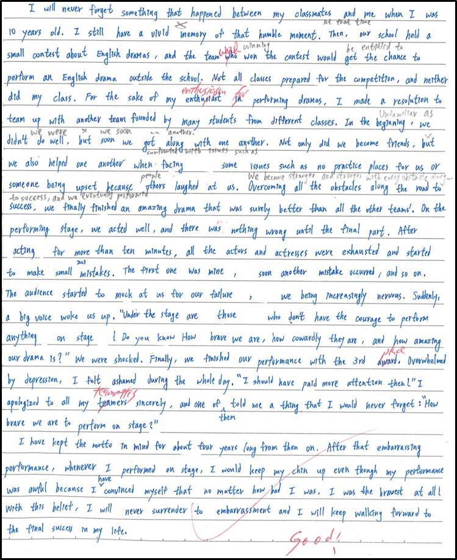

# Composition 1

***

## Something that I Won't Forget

### _`BEFORE`_

&#x20;       I will never forget something that happened between my classmates and me when I was 10 years old. I still have a vivid memory of that humble moment. Then, our school held a small contest about English dramas, and the team which won the contest would get the chance to perform an English drama outside the school. Not all classes prepared for the competition, and neither did my class. For the sake of my enthusiasm for performing dramas, I made a resolution to team up with another team founded by many many students from different classes.

&#x20;       In the beginning, we didn't do well, but soon we got along with one another. Not only did we become friends, but we also helped one another when facing some issues such as no practice places for us or someone being upset because others laughed at us. Overcoming all the obstacles along the road to success, we finally finished an amazing drama that was surely better than all the other teams'. On the performing stage, we acted well, and there was nothing wrong until the final part.

&#x20;       After acting for more than ten minutes, all the actors and actresses were exhausted and started to make small mistakes. The first one was mine, soon another mistake occurred, and so on. The audience started to mock at us for our failure, we being increasingly nervous. Suddenly, a big voice woke us up. "Under the stage are those who don't have the courage to perform anything on stage! Do you know how brave we are, how cowardly they are, and how amazing our drama is?" We were shocked. Finally, we finished our performance with the 3rd place. Overwhelmed by depression, I felt ashamed during the whole day. "I should have paid more attention then!" I apologized to all my teammates sincerely, and one of them told me a thing that I would never forget: "How brave we are to perform on stage?"

&#x20;       I have kept the motto in mind for about four years long from then on. After that embarrassing performance, whenever I performed on stage, I would keep my chin up even though my performance was awful because I have convinced myself that no matter how bad I was, I was the bravest at all! With this belief, I will never surrender to embarrassment and I will keep walking forward to the final success in my life.

***

### _**`AFTER`**_

&#x20;       Never will I forget the embarrassing moment happened between my classmates and me when I was 10 years old. It remains a vivid and unforgettable memory in my mind. At that time, my school held a small contest about English dramas, and the team winning the contest would be entitled to perform an English drama outside the school. My school didn't ask all classes to attend the event, though, and hence only some classes prepared for it. My class, neither. To feed my desire for performing dramas, I resolved to team up with some "homeless" students who came from different classes that didn't prepare for the drama, either.

&#x20;       Unfamiliar as we were, we soon got along and even carried one another through difficulties we encountered such as no practice places for us. We discussed the issue for a couple of minutes and finally reached a consensus that we would practice the drama together in the English classroom after school. Practice makes perfect. We eventually created a wonderful drama that no other team could beat. On the performing stage, we acted very well at first, leaving the audience stunned in awe of our performing skills, and our confidence grew bigger and bigger with the applause between every act.

&#x20;       We were all exhausted after performing for more than 10 minutes. Despite our best efforts, we started to forget the lines. The first mistake was made by me, and it surely ruined the whole performance. Soon, another mistake occurred, and I could see the audience wrinkling and feeling confused, some of which even started to mock at us for our failure. We felt depressed and became increasingly nervous. Suddenly, a voice woke us up, rescuing all the sinking teammates from the failure marsh. "Under the stage are those who dare not perform on stage! We are much braver than them! Do you remember that our drama is the best of all the teams'?" We were shocked and stopped performing for 5 seconds, during which silence swallowed the whole room. Then, we restarted the drama, completed it successfully, and got deafening applause at last!

&#x20;       We were the 3rd place since the last act of our drama was messed up. I was overwhelmed by depression, for I was the one who destroyed the whole performance. "I should have paid more attention at that time!" I apologized to all my teammates sincerely. Surprisingly, they didn't feel angry, and one of them even told me a thing that I would never forget: "Don't feel ashamed! We are the best, so we can perform on stage!"

&#x20;       I have kept the motto in my mind for 4 years long from then on. With that impressive experience, whenever I stood on stage to give a speech to my classmates, I would always keep my chin up even though my performance was awful because I had convinced myself that however bad I was, I was the best at all! With the inspiring belief, I will never surrender to any embarrassment. Instead, I will keep walking forward the royal road to the final success in my life.
