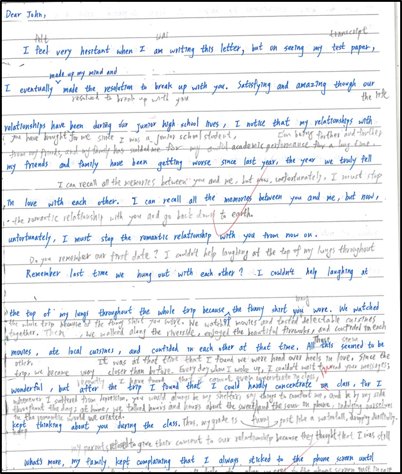

# Composition 2

***

## A Dear John Letter

### _**`BEFORE`**_

Dear John,

&#x20;       I feel very hesitant when I am writing this letter, but on seeing my test paper, I eventually made up my mind and made the resolution to break up with you. Satisfying and amazing though our relationships have been during our junior high school lives, I notice that my relationships with my friends and family have been getting worse since last year, the year we truly fell in love with each other. I can recall all the memories between you and me, but now, unfortunately, I must stop the romantic relationship with you from now on.

&#x20;       Remember last time we hung out with each other? I couldn't help laughing at the top of my lungs throughout the whole trip because of the funny shirt you wore. We watched movies, ate local cuisines, and confided in each other at that time. All this seemed to be wonderful, but after the trip I found that I could hardly concentrate in class, for I kept thinking about you during the class.

&#x20;       What's more, my family kept complaining that I always sticked to the phone screen until it was too late. Overcome by fatigue, I even began to take a nap during class. My homeroom teacher usually lost his temper, hit the table, and scolded me right away. Soon I realized that all I had to do was focus on studies, so I couldn't spend as much time as I used to do on you anymore.

&#x20;       We can still maintain our relationships, but we shouldn't be on intimate terms. There's no denying that leaving you makes me sad; however, we have to face the reality instead of indulging ourselves in the romantic life we have shared with each other. Tearfully ending the letter, I would like to thank you and give you my best wishes.

Love,\
Sally.

***

### _**`AFTER`**_

Dear John,

&#x20;       I felt very hesitant when I was writing this letter, but on seeing my transcript, I eventually made up my mind and resolved to break up with you. Satisfying and amazing though the life you have brought for me since I was a junior school student, I notice that I'm being farther and farther from my friends, and my family has scolded me for my awful academic performance for a long time. I can recall all the memories between you and me, but now, unfortunately, I must stop the romantic relationship with you and go back down to earth.

&#x20;       Do you remember our first date? I couldn't help laughing at the top of my lungs throughout the whole trip because of the funny shirt you wore. We watched movies and tasted many delectable cuisines together. Then, we walked along the riverside, enjoyed the beautiful fireworks, and confided in each other. It's was at that time that I found we were head over heels in love. Since the trip, we became way closer than before. Every day when I woke up, I couldn't wait to read your messages; whenever I suffered from depression, you would always be my shelter, say funny things to comfort me, and be by my side throughout the day; at home, we talked hours and hours about the sweet and the sour on phone, indulging ourselves in the romantic world we created. These seem to be wonderful, but recently I have found that I cannot even concentrate in class, for I keep thinking about you during the class. Thus, my grade is just like a waterfall, dropping drastically.

&#x20;       What's more, my parents refused to give their consent to our relationship because they thought that I was still too young to have a boyfriend, and it was absolutely not worthwhile to glue my eyes to the phone screen until late at night just in case I missed any update you made. Sometimes I would even stay up the whole night and hence take a nap during class. My homeroom teacher usually lost his temper, hit the table, and gave me a stern talking-to about my grave mistake right away. Soon I realized that all I had to do was focus on studies, so I should not spend as much time as I used to do on you anymore.

&#x20;       We can still maintain a normal relationship, but we shouldn't be on intimate terms. There's no denying that leaving you makes me sad; however, this is how cruel the reality is. Were you me, you would make the same determination, wouldn't you? Tearfully ending the letter, I would like to thank you and give you my best wishes.

Love,\
Sally.
