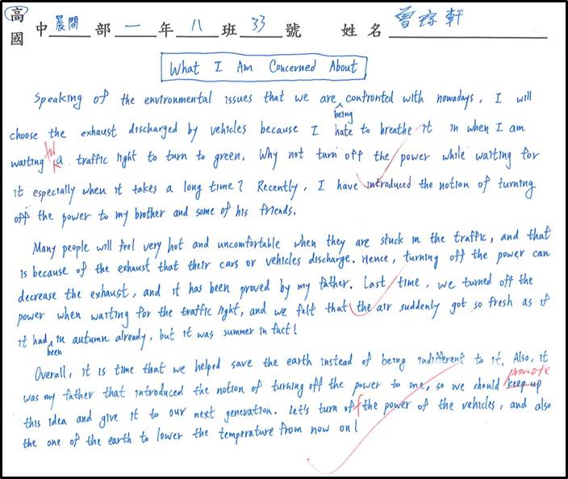

# Composition 3

***

## What I Am Concerned About

### _**`BEFORE`**_

&#x20;       Speaking of the environmental issues that we are being confronted with nowadays, I will choose the exhaust discharged by vehicles because I hate to breathe it in when I am waiting for a traffic light to turn to green. Why not turn off the power while waiting for it especially when it takes a long time? Recently, I have introduced the notion of turning off the power to my brother and some of his friends.

&#x20;       Many people will feel very hot and uncomfortable when they are stuck in the traffic, and that is because of the exhaust that their cars or vehicles discharge. Hence, turning off the power can decrease the exhaust, and it has been proved by my father. Last time, we turned off the power when waiting for the traffic light, and we felt that the air suddenly got so fresh as if it has been in autumn already, but it was summer in fact!

&#x20;       Overall, it is time that we helped save the earth instead of being indifferent to it. Also, it was my father that introduced the notion of turning off the power to me, so we should promote this idea and give it to our next generation. Let's turn off the power of the vehicles, and also the one of the earth to lower the temperature from now on!

***

### _**`AFTER`**_

&#x20;       Speaking of the environmental issues that we are being confronted with nowadays, I will choose the exhaust discharged by vehicles. For one thing, it will heat up everything around it, making people uncomfortable and even faint. For another, the exhaust contains many poisonous substances that may cause cancers.

&#x20;       The first problem can be easily solved by turning off vehicles' power. It requires a little time to turn on the power again, so this method can only be applied when you are waiting for the traffic light, especially when it takes quite a lot of time to turn green. Otherwise, you are likely to receive an annoying response from other riders, which may account for a small quarrel. In fact, it was my father that introduced this concept to me, and I have also promoted this way to my brother and his friends as well. It was quite hot last summer, and when my father took me out for a ride, I felt very uncomfortable while we were waiting for the traffic light beside many vehicles, but when we rode forward a little and turn off the power, I felt totally different: the air was so cool and fresh as if it had been autumn already! My father claimed that it was because of the exhaust the vehicles discharged that caused the environment to become increasingly hotter, and this notion had been proved by my previous experience with him.

&#x20;       The other problem can be settled by doing a regular check of your vehicle. Although the government has urged people to have their vehicles checked every year, many people are still reluctant to do it. Accordingly, the government should encourage them by rewarding them with bonus money if they adhere to the regulations. Moreover, the government should impose stricter punishments such as doubled fines on them or even suspending their driving licenses.

&#x20;       Overall, it is high time that we helped save the earth instead of being indifferent to it, and we should promote the ideas mentioned-above to others and give them to our next generation. Turn off your vehicle's power and have your vehicle checked regularly, and let's heal our vulnerable earth from now on. Remember, a small everyday effort can mean a lot to the whole world!
