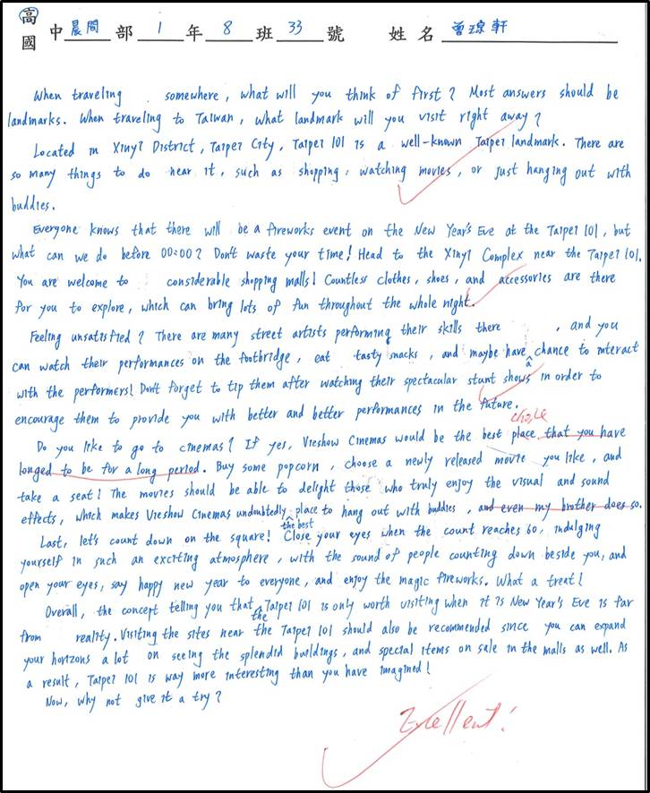

# Composition 4

***

## A Tourist Attraction in Taiwan that I Would Recommend

&#x20;       When you plan to travel somewhere, where will you think of first? Undoubtedly, landmarks will be most people's answers. When traveling to Taiwan, what landmark will you visit right away?

&#x20;       Located in Xinyi District, Taipei City, Taipei 101 is a well-known landmark in Taipei. There are so many things to do near it, such as shopping, watching movies, or just hanging out with buddies.

&#x20;       Everyone knows that there will be a fireworks event on New Year's Eve at Taipei 101, but what can we do before 00:00? Time is money, so just don't waste your precious time! Let's head to the Xinyi Complex near Taipei 101. You are welcome to considerable shopping malls! Countless clothes, shoes, and accessories are there for you to explore, which can bring lots of fun to you throughout the whole night.

&#x20;       Feeling unsatisfied? Don't worry. There are many street artists performing their skills on the street, and you can watch their performances on the footbridge, eat tasty snacks, and maybe have a chance to interact with the performers! Don't forget to tip them after watching their spectacular stunt shows to encourage them to provide you with better performances in the future.

&#x20;       Do you feel like going to cinemas? If yes, Vieshow Cinemas would be the best choice. Buy some popcorn, choose a newly released movie you like, and take a seat! The movies should be able to delight those who truly enjoy the visual and sound effects, which makes Vieshow Cinemas undoubtedly the best place to hang out with your buddies.

&#x20;       Last, let's count down on the square! Close your eyes when the count reaches 60, indulge yourself in such an exciting atmosphere with the sound of people counting down beside you, open your eyes, say "happy new year" to everyone, and enjoy the magic fireworks. What a treat!

&#x20;       Overall, you will have an impressive experience after visiting Taipei 101. In addition, the splendid buildings near Taipei 101 and special items on sale inside them can also expand your horizons a lot. As a result, Taipei 101 is way more interesting than you have imagined!

&#x20;       Now, why not give it a try?
