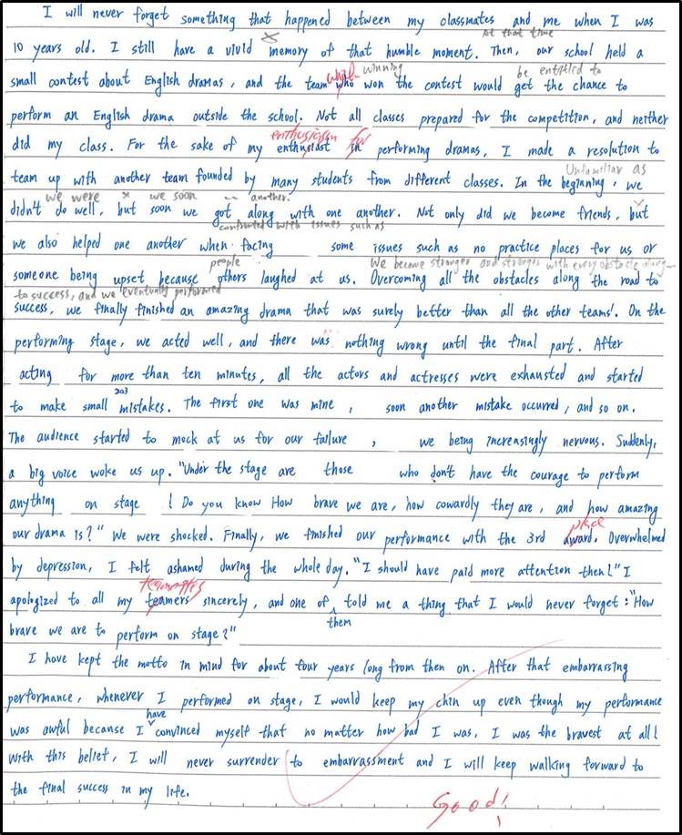

# Reading Comprehension

***

## 答案

點一下顯示答案

**A \~ D**：BDBAC / CCBD / DDBC / ABDB\
**E \~ H**：DDCBB / DAAC / AABC / DBDC\
**I \~ L**：CBDC / BBAC / AADD / BDCD\
**M \~ P**：ACDB / CAAD / CADD / DCBA\
**Q \~ T**：DBD / DADB / AADD / ACB\
**U \~ W**：DCBA / BCBD / CACB\
**X**：AB / It features visits to places associated with human suffering and misery.; For some, dark tourism profits from death, and seldom benefits the victims of a disaster or tragedy or their family.; It helps visitors stay grounded, put the history into perspective, and avoid foolish mistakes. / 小林村\
**Y \~ AB**：DCBD / DBDC / ACBDC / BCDA\
**AC \~ AF**：CBBD / BDAC / CADB / CBD\
**AG \~ AJ**：ACB / DC; increment; comply with; 50 dollars; full pay of one day be deducted from the salary; 40 dollars; 80 dollars / ADBC / BADC\
**AK \~ AN**：CDCB / CA; (some) sand; (three) large rocks; Choose to Say "NO"; Write It Down / DCDB / CBAD\
**AO \~ AR**：BBAD / C; They are related to attention and memory.; increased; got smaller; Ask; classify / ABAD / BBCC\
**AS \~ AV**：CDB; passenger needs (future passenger needs)(future needs); noise; Not given; engines (the rear end (of the plane))(the back (of the plane))(tail) / CACD / AABC / insulted; the Duke of Austria, Leopold V; mint; BE\
**AW \~AZ**：DCAB / BABB / BCDC / DD; (1)(2)(3); (4)(5); symptoms; protein; gamma; immune cells\
**BA \~ BD**：DDBC / DCDB / ACBB / wind patterns; heat extremes; B; C; D; E; (5)\
**BE \~ BH**：ABCD / BDCA / DCCB / CCAD\
**BI \~ BL**：A bright red cottage with a white trim on the windows; Exhausted; Given the centuries of copper production at the Falun mine, there were enough waste products to create a new industry to last for generations; It was cheap and plentiful, and it was also discovered to protect structures from water damage and fungus growth due to its iron content / DADB / CCAA / ACDC\
**BM \~ BP**：DBCA / D(CE); merit; I Bacari; I bet it's the best foodservice app you can find for Venice / BDBC / BDAB\
**BQ \~ BT**：DACD / D; radiation; bleach-like substances; perchlorates; (4); (7); organic molecule; serpentinization; 2009 / CCBD / BBAA\
**BU \~ BX**：BC; At the end of 2021; 80; 70 / \
**BY \~ CB**：

***

## 題目

### A.

&#x20;       Why is it that the world loves Garfield? It's because this contemptible cat is everything we secretly want to be. Garfield is a cat whose life is devoted to two things: food and sleep. He does have a few other interests. He loves to fight with the mailman and he also enjoys playing jokes on his owner, Jon, and the brainless dog of the house, Odie. However, eating food - especially lasagna - and getting lots of sleep are his main drives, and he doesn't feel at all guilty about this. When one day he suddenly wonders if maybe there's more to life, he quickly decides, "Nah."

&#x20;       Garfield has many of the common failings of humans. For instance, he is lazy and he hates mornings. He usually sleeps late, if not all day. What is so lovable is his honesty and even his pride in this laziness. When he does have to get up in the morning, he has coffee as strong as gasoline and puts on a face as sour as a lemon. And like many of us, he hates Monday mornings the most.

&#x20;       We hear a lot of sarcasm from this cat, but that isn't surprising when we see who he lives with. His master, Jon, who grew up on a farm, has terrible taste in everything. As charming as a telephone bill, Jon is rarely able to find a date, and women speak to him even less politely than Garfield does.

&#x20;       If Jon is a disappointment to Garfield, however, Garfield is an even bigger one to Jon. Jon wants a fun cat, one that runs and plays and catches mice. Yet Garfield is almost always in bed. He is sometimes so fat that he can't walk. Furthermore, her is very friendly with local mice, who find Jon's house to be a very comfortable place to live in. When Garfield does want to have fun, he steals Jon's food, destroys Jon's things, and causes all kinds trouble.

&#x20;       So here is a cat that is everything we are told not to be, and yet secretly want to be. For Garfield, being bad is not a failing - it is an art.

1. What is the main idea of this passage?\
   (A) Be honest and proud of your failings, just like Garfield.\
   (B) People love Garfield all the more for his numerous shortcomings.\
   (C) Jon is to women as Garfield to mice.\
   (D) The lousier an animal is, the better pet it makes.
2. What does Garfield **NOT** like to do?\
   (A) Sleep. (B) Eat. (C) Make trouble. (D) Catch mice.
3. How do Jon and Garfield get along?\
   (A) They see eye-to-eye on everything.\
   (B) It seems that they do not make a good pair.\
   (C) They are on intimate terms with each other.\
   (D) They are as courteous to each other as can be.
4. What is **NOT** true about Garfield?\
   (A) He feels guilty about his failings.\
   (B) He is very honest.\
   (C) He takes pride in his laziness.\
   (D) He often makes sarcastic comments.
5. What does the author imply by saying "Here is a cat that is everything we are told not to be, and yet secretly want to be?"\
   (A) He hates cats and wants to get rid of them.\
   (B) He thinks that Garfield sets an example for children to follow.\
   (C) He thinks human nature is naturally selfish, but we are taught to be otherwise.\
   (D) Garfield's behavior is an indication that laziness is the root of all evil.

### B.

&#x20;       Not all engineering projects are feasible. For many years, starting in the 1920s, a German architect named Herman Sorgel attempted to carry out the world's largest and most difficult project, the Atlantropa project, by damming the Strait of Gibraltar and draining the Mediterranean Sea.

&#x20;       The Strait of Gibraltar, known to the ancient Greeks and Romans as the Pillars of Hercules, is the boundary between the Atlantic Ocean and the Mediterranean Seal. It's 14.3 kilometers across at its narrowest point, and it's one of the busiest sea routes in the world. Not only is it the entrance to the Mediterranean Sea, but it's on the quickest shipping route between northern Europe and China, as it takes advantage of the Suez Canal at the other end of the Mediterranean Sea.

&#x20;       Sorgel's plan included building an enormous hydroelectric dam across the Strait of Gibraltar, complete with a set of locks - machines that raise and lower ships to help them get between two bodies of water with different water levels. The dam, in addition to generating a huge amount of electric power for Europe, would be used to lower the level of Mediterranean Sea by up to 200 meters. This would have created huge pieces of new farmland when the sea receded from the coast. A second dam would have bridged the now-narrower gap between North Africa and Sicily, allowing a road connection directly from northern Europe to Asia.

&#x20;       Sorgel's promises about the benefits of the Atlantropa project were numerous. He suggested it would solve unemployment for 100 years, provide nearly limitless natural energy, and make sure Europe remained sell-sufficient when it came to food. While the benefits seemed attractive, the costs of the project were decided to be too high, and Europe in the 20th century wasn't ready for the high levels of cooperation among countries that would be required.

1. What is said about the Strait of Gibraltar?\
   (A) It separates Greece from North Africa.\
   (B) It is on the shortest sea route from Asia to Africa.\
   (C) It connects the Atlantic to the Mediterranean Sea.\
   (D) It is the only access to the Mediterranean Sea.
2. What did the Atlantropa project involve?\
   (A) Turning deserts and wetlands into farmland.\
   (B) Constructing a gigantic solar power plant.\
   (C) Damming the Mediterranean Sea to create power.\
   (D) Building a bridge across the Strait of Gibraltar.
3. According to Herman Sorgel, what would be done by one of the many advantages of the project?\
   (A) It would solve the problem of global food shortage.\
   (B) It would provide numerous job opportunities.\
   (C) There would be sufficient power supply of Africa.\
   (D) It would increase the trade between European countries.
4. Which of the following is **NOT** an appropriate word to describe the project?\
   (A) Ambitious. (B) Expensive. (C) Europe-centered. (D) Down-to-earth.

### C.

&#x20;       When someone has deeply hurt you, it can be extremely difficult to let go of your anger. But when you don't practice forgiveness, you may be the one who pays most dearly. Feelings of hatred and ill will leave a lasting effect on our mind. Researchers studying the effects of forgiveness have made similar conclusions that holding on to grudges and bitterness results in long-term health problems. "People who forgive show less anger and more hopefulness," says Dr. Luskin, the author of _Forgive for Good_. Indeed, other studies have shown physical and mental benefits of forgiveness such as more energy, better appetite, and sleep patterns, as well as lower blood pressure, lower heart rate, fewer anxiety and depression symptoms, and even more friendship. By letting go of resentment and thoughts of revenge, you are actually the greatest winner.

&#x20;       Next time when someone has hurt you, calm yourself first. Take a deep breath and let the thoughts of whatever gives you pleasure naturally come into your mind. Mentally going over your hurt only gives power to the person who brought you pain. Instead, learn to look for love, beauty and kindness around you. Keep in mind that forgiveness does not necessarily mean accepting the action of the person who upset you. What you intend for is untying yourself from the offense committed against you. Finally, don't wait for an apology. "Many times the person who hurt you may never think of apologizing," says Dr. Luskin. "They may just not see things the same way." Try to see things from the other person's perspective. You may realize that he or she was acting out of ignorance, fear, or even love.

1. The main purpose of this passage is to explain \_\_\_\_\_\_\_\_.\
   (A) how to protect yourself from being hurt (B) how to stay physically healthy (C) how to remain calm and peaceful (D) why and how to pardon others
2. According to the article, which of the following is suggested after you are hurt?\
   (A) Try to figure out why you get hurt. (B) Hold on to grudges and bitterness. (C) Accept what others have done to you. (D) Think about the pleasant things and forget about the hurt.
3. You are suggested not to wait for an apology after being hurt because \_\_\_\_\_\_\_\_.\
   (A) we should apologize to others first (B) people seldom want to apologize (C) people seldom sincere when they apologize (D) we might feel even worse after people apologize
4. According to the article, which of the following is **NOT** the effects of forgiveness?\
   (A) Lower blood pressure. (B) Better eating and sleep patterns. (C) Less anxious and fee from mental disorders. (D) Lower heart rate.

### D.

&#x20;       You're excited about your upcoming vacation, but you want to make sure your flight booking is in order. After dialing, you hear a soothing voice say something like, "We're sorry, but all our customer service representatives are busy. Your business is very important to us. Please hold on until the next available representative is available. Thank you." Then you hear some music, which is often interrupted by commercials telling you how great the airline is or reminding you to stay on hold. This can easily go on for 10 minutes.

&#x20;       "Silence is golden," they say, but it isn't when you're anxious and on hold. Silence can confuse callers and leave them wondering if they are still connected. To remedy **this**, Alfred Levy, an entrepreneur, created "music on hold" (MOH) after he discovered that recorded music could soothe the nerves of callers waiting to be served. He patented his idea in 1966. Since then, MOH has become a universal phenomenon.

&#x20;       MOH has come a long way since 1966. Radio music programs, cassette tapes, CDs, and MP3s were all used as companies tried out Levy's idea. The sounds were supposed to calm callers by distracting them with mild musical tunes or even songs. By and large, it worked. One survey conducted in the United States found that callers would wait 90 seconds when MOH was used but only 60 seconds without any recording.

&#x20;       Still, few people enjoy waiting, whether in retail stores, restaurants, or on a call. A lot of research has gone into the benefits of MOH. Commercials may offer special sales or information about the businesses and make the company appear more professional. Music can also be tailored to different kinds of companies. For example, a bank or bookstore might choose classical music or classic songs. A pub or youth fashion store could opt for hard rock or the latest hits. Let's face it, though - waiting is a drag! The best customer service provides rapid caller response.

1. What is the best title for this passage?\
   (A) The Role of Music in Calming Callers\
   (B) The Various Music Styles in the '60s\
   (C) Recent Research into Music on Hold\
   (D) What Music Businesses Should Choose for Their MOH
2. What does "**this**" in the second paragraph refer to?\
   (A) The situation in which callers have no idea what to say.\
   (B) The confusion callers may face while they're on hold.\
   (C) The practice of playing music for callers waiting to be connected.\
   (D) The annoying commercial callers hear before they're put through.
3. What evidence is given to show that MOH improves customer service?\
   (A) It has lasted a long time.\
   (B) Customers enjoy being promptly served.\
   (C) In general, people enjoy listening to music.\
   (D) People stay on the line longer with it than without.
4. What seems to be the writer's attitude toward MOH?\
   (A) Callers should have different music options to choose from.\
   (B) It would be better to have less waiting time than enjoyable music.\
   (C) News and weather reports would be better than music to listen to.\
   (D) Businesses should do more research into what kinds of music people like.

### E.

&#x20;       Have you ever thought that what you smell can influence the way you feel? A new therapy called "aromatherapy" claims that smells can influence our feelings and even our health.

&#x20;       The word "aromatherapy" was first used by a French scientist in the 1920s. It combines the word "aroma," or smell, with "therapy," or treatment. Basically, aromatherapy uses essential oils and compounds extracted from plants. In aromatherapy, the smells of essential oils are inhaled. In other words, a person should breathe deeply while holding a bottle of essential oil close to his or her nose. Besides, essential oils can also be massaged directly into the skin or put into a hot bath.

&#x20;       Aromatherapy has become very popular with people who want relief from stress. What's more, a few doctors are now using aromatherapy in hospitals to relieve patients' pains, especially mothers with serious labor pains.

&#x20;       But some people have criticized aromatherapy. They say there is no scientific proof to show that it is really effective. In addition, some aromatherapy products smell good, but actually are fake.

&#x20;       Despite these criticisms. the popularity of aromatherapy continues to grow. But the debate over its usefulness continues as well. Many people wonder if aromatherapy is an effective therapy or just a way to make money. Only time will tell.

1. The word "aromatherapy" means \_\_\_\_\_\_\_\_.\
   (A) A special hot bath in hospitals (B) a way to breathe in steam (C) traditional massage using oils (D) treatment with essential oils
2. What kind of material is used in aromatherapy?\
   (A) Drugs. (B) Compounds extracted from the sea. (C) Water. (D) Essential oils.
3. Which of the following is **NOT** the right way of using essential oils?\
   (A) To breathe them in. (B) To massage them into one's skin. (C) To add them to drinking water. (D) To put them into a hot bath.
4. According to the article, who especially needs aromatherapy?\
   (A) A boy who keeps crying. (B) A woman who is giving birth. (C) A worker who hurts his fingers. (D) A teenager who is overweight.
5. Which of the following statements is **NOT** true?\
   (A) People's feelings may be influenced by what they smell.\
   (B) Aromatherapy has been proved to be very effective.\
   (C) The debate over the usefulness of aromatherapy still continues.\
   (D) Some aromatherapy products that smell good may be fake.

### F.

&#x20;       Money destroys friendships, marriages, and family unity. Money, which in itself has no value, exerts more power over human lives than any other single commodity. It brings out the best and the worst in people. An elderly woman is mugged and beaten by two youths for less than a dollar, while across town an unemployed couple take in a runaway teenager and feed him just because he has even less than they do.

&#x20;       The strange and illogical things that people do with and for money fill newspapers and bring a smile to the lips of millions of readers, whose own money behavior is almost as strange. In the United States, for example, it is estimated that there are approximately eight million compulsive gamblers, men and women whose primary purpose in life is to bet money. On the other side are millions of compulsive savers, who are compelled to save money with the same vengeance that drives compulsive gamblers to bet it. In the same class are millions of compulsive bargain hunters, who drive miles out of their way merely to save two cents on a gallon of gasoline, who buy potato peelers by the dozen because they are on sale at half the price, or who haunt swap meets and garage sales to buy anything that is cheap even if they have no use for it.

&#x20;       To most people, perhaps, the lure of money seems to be a natural phenomenon. They have become so indoctrinated with the idea that having money is important that they no longer question why. They are unaware that perhaps what they are truly seeking is an increase in self-respect, security, freedom, love, or power. While they may not be aware of what they truly want from life is, they feel sure that money will provide it for them.

1. Why are most people lured by money?\
   (A) Because they have self-respect.\
   (B) Because they intend to be destroyed.\
   (C) Because they have never thought much about money.\
   (D) Because they think that money can provide what they are seeking in life.
2. What is the primary purpose in life for compulsive gamblers?\
   (A) To bet money. (B) To save money. (C) To earn a living. (D) To bring a smile to the lips of million readers.
3. What is the motivation for compulsive bargain hunters to buy things?\
   (A) To save money. (B) To buy useless things. (C) To compete with gamblers. (D) To spend as much as they can.
4. Why do compulsive bargain hunters buy potato peelers by the dozen?\
   (A) Because they need them.\
   (B) Because potato peelers are useful.\
   (C) Because they think that they are bargains.\
   (D) Because they have to drive miles out of their way.

### G.

&#x20;       According to the U.S. Environmental Protection Agency (EPA), medical waste is a major source of dioxin pollution in the country. Linked to the dioxin issue is the use of PVC plastic, which is widely used in the production of blood bags, plastic tubing, and other products in hospitals and health clinics. Dioxin is an unwanted byproduct that is created when PVC is burned. Dioxin travels by air currents and settles onto grass, which is then eaten by cows and chickens in their feed. We eat polluted dairy products and meat and take the dioxin into our bodies, where it is stored in our fat for years and builds up over time. In this way, dioxin is globally distributed, and as a consequence, every member of the human population is constantly exposed to this poisonous substance. This poses special problems for childbearing women, who pass dioxin to an unborn baby or to a breastfeeding baby. In fact, the infant is the most vulnerable member of society to this chemical.

&#x20;       Plastics used to account for as little as 10% of medical waste in the late 1970s, before disposables began rapidly replacing reusables. They now make up as much as 30%. The EPA estimates that the average levels of dioxin in all Americans are so high that we can expect to see a variety of health effects, including cancer. Given the harm caused by the burning of medical waste, physicians and nurses have the responsibility to take a lead in reducing the use of plastics in the hospitals. After all, they can't be treating cancer on the inside of hospitals and contributing to **it** on the outside.

1. What is the major message the author is trying to convey to readers?\
   (A) All people, especially those working in the hospitals, should reduce the use of plastics.\
   (B) Americans should lead the world to fight dioxin pollution, or mankind will die out soon.\
   (C) We had better eat more vegetables than meat in order to reduce the risk of dioxin pollution.\
   (D) We had better not breastfeed out babies, since babies are most likely to be poisoned by dioxin.
2. When will dioxin be produced?\
   (A) When plastics are burned. (B) During the making of hospital blood bags. (C) When reusables are disposed of. (D) During the handling of all kinds of medical waste.
3. What does "**it**" in the least line refer to?\
   (A) Dioxin. (B) Cancer. (C) Medical waste. (D) Use of plastics.
4. Which of the following statements can be inferred from the article?\
   (A) Living in the countryside will keep one safe from dioxin poisoning.\
   (B) Dioxin can be released from our bodies, if we drink a lot of clean, pure water.\
   (C) Using reusables as people did in the old days will help lessen dioxin pollution.\
   (D) You have to lose weight, or the amount of dioxin in your body fat will kill you.

### H.

&#x20;       Often named as the most prominent contemporary female architect, Zaha Hadid, an Iraqi-born British woman, is significant for her intellectual toughness and her refusal to compromise on her artistic ideas. For many years, her designs filled the pages of architecture journals but were dismissed as impractical or too radical. Also, being female in a male-dominated field didn't help her succeed.

&#x20;       Despite these setbacks, **her star began to rise** when her design for Cincinnati's new Center for Contemporary Art was selected and built, earning her worldwide acclaim. The New York Times described the building as "the most important new building in America since the Cold War." Once her talent was recognized, commissions started coming in to design a variety of projects, including public transportation, libraries, and opera houses. In 2004, Hadid became the first women to win the prestigious Pritzker Prize. She also won the Stirling Prize in 2010 and 2011.

&#x20;       Hadid's interest in architecture had roots in a trip her family took to the ancient Sumer region in southern Iraq, the site of one of the world's oldest civilizations, when she was a teenager. She recalled: "The beauty of the landscape - where sand, water, reeds, birds, buildings, and people all somehow flowed together - has never left me. I'm trying to discover - invent, I suppose - an architecture, and forms of urban planning, that do something of the same thing in a contemporary way."

&#x20;       Nature's forms appear as a recurrent source of inspiration for Hadid's architecture. her designs are daring and visionary experiments with space and with the relationships of buildings to their urban surroundings. She consistently pushes the boundaries of architecture and urban design in the pursuit of a visionary aesthetic that expresses her ideals.

1. According to the passage, what is a major factor in Hadid's success?\
   (A) Her family support (B) Her ethnic origin (C) Her gender and education (D) Her vision and talent
2. What does the author mean by "...**her star began to rise**..." in the second paragraph?\
   (A) She started to make a fortune. (B) She became more recognized (C) Her designs became classical (D) Her ideas started to take shape.
3. What is the third paragraph mainly about?\
   (A) The cultural background of Hadid's family.\
   (B) The beautiful landscape of Hadid's hometown.\
   (C) A vivid recollection of Hadid's life as a teenager.\
   (D) A fundamental source of Hadid's architectural philosophy.
4. According to the passage, which of the following is true about Hadid's career in architecture?\
   (A) She built the first Center for Contemporary Art in New York.\
   (B) Her architecture projects mainly involve museums in urban areas.\
   (C) Her works can be characterized as boldly contemporary and innovative.\
   (D) Her early designs were often rejected because of her political background.

### I.

&#x20;       The proverb “When in Rome, do as the Romans do” may be familiar to you, but the new rules may not. Rome introduced a host of new laws in 2019 to protect and preserve the heritage of the city. Visitors and residents can now get into trouble if they violate the new regulations by doing idiotic behaviors like jumping into the city’s famous Trevi Fountain or messy eating on the steps of historical monuments.

&#x20;       Among these new rules, there’s one that has got people talking: no sitting on the Spanish Steps. Made famous by the movie _Roman Holiday_, these steps draw large crowds of people every day. Tourists can still take photos, but anyone caught sitting down can face a fine of up to €400. Strange as it may seem, the law was made with intentions to keep the ancient city of Rome beautiful for generations to come.

&#x20;       The new rules do not target only at the tourists, though. Some actors in tourism industry also need to be careful. One new rule forbids anyone to dress up as Roman centurions around tourist spots and charge tourists for photos. Another rule bans advertising or selling “skip the line” tickets around popular tourist attractions like the Colosseum. Local residents cannot hang laundry outside on wires across the streets and there must be no singing or playing musical instruments on public transportation. When in Rome, do as the new rules order you to do so you can protect the **delicate** monuments.

1. What is the main purpose of this passage?\
   (A) To warn people against tourist traps in Rome.\
   (B) To protest against the implementation of new laws.\
   (C) To introduce some of the new rules in Rome and the reasons.\
   (D) To present the beautiful monuments and tourist sites in Rome.
2. Which of the following is **FALSE**?\
   (A) People can still take selfies on the world famous Spanish Steps.\
   (B) New rules were introduced to prevent the ancient city from being damaged by tourists.\
   (C) Vendors cannot sell “skip the line” tickets to the Colosseum around it because of the new laws.\
   (D) Actors cannot put on the costumes of Roman centurions around tourist sites.
3. What does the word “**delicate**” mean in the last paragraph?\
   (A) Small and beautifully shaped.\
   (B) Able to measure very small changes.\
   (C) Pleasantly soft or light.\
   (D) Easily broken or damaged.
4. Where may you find this passage?\
   (A) A scientific journal. (B) An encyclopedia. (C) A travel brochure. (D) A dictionary.

### J.

&#x20;       The Orange Alternative was an underground protest movement in Poland in the 1980s. Led by Waldemar Fydrych, the campaign achieved a considerable artistic victory over the Communism. Members resorted to graffiti or events to make fun of the social and political absurdity at that time. In the beginning the group started painting dwarves on walls that had been freshly painted to cover up anti-government slogans. The first dwarf was painted in 1982, on one of the residential buildings in Wroclaw. The action soon caught on and resulted in more than 1,000 dwarf graffiti throughout major Polish cities.

&#x20;       The Orange Alternative organized a series of events between 1985 and 1990. They distributed toilet paper, a consumer product in short supply at that time, and sang communist songs while holding hands around an animal cage in the zoo. The most memorable moment came when more than 10,000 participants wore orange dwarf hats while marching on the streets.

&#x20;       Fydrych once noted, “How can you treat a police officer seriously when he is asking you the question: ‘Why did you participate in an illegal meeting of dwarves?’” In 2001, the city Wroclaw decided to commemorate the history by setting up a bronze statue of a large dwarf on the street where the Orange Alternative used to gather. Four years later, a local sculptor Tomasz Moczek created tiny bronze dwarves, each representing a different part of Wroclaw’s history or daily life and placed them around the city. Today there are more than 400 tiny dwarves and if you happen to want to start a dwarf hunt, you can download an app or buy an official Wroclaw dwarf map. Then off you go for dwarf-hunting.

1. Which of the following about the Orange Alternative is **FALSE**?\
   (A) Fydrych started the campaign to protest against the government.\
   (B) The members made graffiti and wrote down anti-government slogans on walls.\
   (C) It held a series of events on the streets or in the zoo to protest in a funny and peaceful way.\
   (D) Marches and protests held by the organization were illegal in Poland in the 1980s.
2. Which of the following statements about the dwarf statues in Wroclaw is true?\
   (A) The first one was established in 1982 on the street where the members used to gather.\
   (B) They were placed on the streets around the city as a tribute to the Orange Alternative.\
   (C) There are now about 10,000 tiny dwarves with orange hats in different corners.\
   (D) In 2001, Moczek came up with the idea of making and putting more tiny dwarves in the city.
3. Which of the following can best serve as the slogan for the Orange Alternative?\
   (A) “There is no freedom without dwarves.”\
   (B) “Art is where work meets love.”\
   (C) “Communism is control.”\
   (D) “No justice no peace.”
4. What can a tourist in Wroclaw do when visiting the city?\
   (A) Appreciate the 1,000 graffiti the Orange Alternative members made.\
   (B) Join one of the Orange Alternative events on the streets.\
   (C) Look for tiny dwarf statues by following the guide of a map.\
   (D) Visit Fydrych’s bronze statue studio and create dwarves with him.

### K.

&#x20;       When it comes to bears, we usually think about winter hibernation. We have heard about bears needing to eat and store fat for winter hibernation. But in fact, no large mammals actually hibernate. The process in which bears reduce activity is called torpor. In response to a shortage of food, decreasing temperatures and snow on the ground, hibernating bears enter a shallow torpor with a decrease in body temperature of only 10 degrees. Their metabolism and heart rate slow down. Unlike true hibernators such as squirrels, hibernating bears don’t need to eat, drink or pass waste. In order to survive, fat in their body breaks down into water and calories. What’s more, muscle and organ tissues break down to supply the body with protein.

&#x20;       While true hibernators awake slowly because of the need to increase body temperature and metabolism, bears can awake from torpor suddenly if they sense danger. This is beneficial to female bears that usually bear cubs in winter. Mother bears can wake up once in a while to care for their cubs, which would not be possible if they were truly hibernating. Hibernation can last a few weeks in warmer parts of North America to 6 months in Alaska. In the mountains in Utah, female bears hibernate from October to May and males from November to April. When they wake up, they are hungry. It is a time when there are many bear encounters within the suburban areas because bears will venture into these parts to find food. Therefore, \_\_\_\_\_\_\_\_.

1. What is the purpose of the first paragraph?\
   (A) To illustrate the differences between hibernation and torpor.\
   (B) To explain the ways bears strive to survive in winter.\
   (C) To present why bears hibernate in winter.\
   (D) To demonstrate how squirrels actually hibernate.
2. Which of the following about bear hibernation is **NOT** mentioned in the passage?\
   (A) The places. (B) The time. (C) The activities. (D) The reasons.
3. What may happen when bears enter torpor?\
   (A) Their condition is similar to the true hibernators’.\
   (B) Their muscles break down to supply fat.\
   (C) Females need to wake and eat when they are nursing cubs.\
   (D) Female’s torpor lasts longer than male’s.
4. Which of the following can be put in the blank of the last paragraph?\
   (A) scientists have begun calling bears “super-hibernators.”\
   (B) there is a phrase “sleep like a bear.”\
   (C) cubs do not hibernate or go into torpor.\
   (D) hikers and campers need to take precautions during this time.

### L.

&#x20;       As we move into the 21st century, conventional schooling doesn't seem to be intriguing for most students. Many researchers in the US and Canada have recently examined the percentage of students engaged in their classrooms from kindergarten to Grade 12. Based on a study of Lee Jenkins in 2013, in the early grades about 95% of students are engaged followed by an ever-increasing decline to about 39% by the time students reach Grade 11. Gallup Poll in 2016 also reported that at least a third of students are actively disengaged. All this is not so much a criticism as it is implied that schooling set up 150 years ago may not suited for the present times. Furthermore, the future job market is not only unpredictable but also on the decrease as the rise of robots takes its toll on the number of jobs that will be available.

&#x20;       Given that, a powerful and compelling solution has been brought up by Michael Fullen, who launched a global initiative called the New Pedagogies for Deep Learning (NPDL) as early as 2012. It reflects a different approach to teaching, learning, and assessing all while still making outcomes relevant to the world around us. The aim is to demonstrate how the potential for learning can be realized through new pedagogies in a digital-rich society, ultimately leading to more successful futures for all students.

&#x20;       At the heart of NPDL are six core concepts that will set students up for the world around them, inclusive of creativity, citizenship, critical thinking, communication, collaboration and character. These competencies are making learning experiences engaging, relevant and authentic. From the first official NPDL event held in Hong Kong in 2013, eight country clusters have joined the global movement. Among these are Australia, Uruguay, United States, Canada, Netherlands, Finland, New Zealand, and Hong Kong, bringing with them hundreds of schools, and thousands of teachers and students from worldwide. A number of schools in Taiwan have also been **jumping on the bandwagon**, seeking ways to transform pedagogies. Still, evidence-based research is required to better understand the positive impact this new measure could serve in the classroom.

1. Which of the following scenarios best describes the core value of NPDL?\
   (A) Students work diligently in a classroom, watching videos on the YouTube channel, filling in the blanks in the worksheets.\
   (B) In a bee-saving project, teachers work with students by involving them to research digitally and hold a bee showcase to share their findings with parents.\
   (C) A group of primary school students who know little about climate change are listening to the teacher's lecture, responding to questions.\
   (D) Students are assigned to explore the nutrition needs of people in different ages, following the teacher's instructions step by step.
2. What is the main purpose of this passage?\
   (A) To encourage and influence more policy makers to adopt an educational reform.\
   (B) To compare and contrast between the different teaching pedagogies.\
   (C) To raise the public's awareness about the downside of traditional schooling.\
   (D) To briefly introduce an innovative approach of teaching and learning.
3. What does the phrase "**jump on the bandwagon**" in the last paragraph mean?\
   (A) To initiate series of radical reform projects.\
   (B) To launch a global campaign for a new policy.\
   (C) To start doing an activity or support a popular trend.\
   (D) To foster and deepen people's understanding a new concept.
4. Based on the passage, we can infer that \_\_\_\_\_\_\_\_.\
   (A) more advanced technological devices will be required to ensure the success NPDL\
   (B) with the six competencies for deep learning, the issue of inequality will be well addressed\
   (C) traditional schools will soon be abandoned to allow students to design their own learning\
   (D) further hands-on studies should be conducted to determine the actual benefits of deep learning

### M.

&#x20;       To David Sklansky, the author of "_The Theory of Poker_," poker is a seemingly simple but actually profound and subtle game. Its rules can easily be picked up by kids in just a few open hands where all cards are visible and all moves fully explained. However, the lessons behind can last a lifetime.

&#x20;       Compared with the skill-driven game like chess, luck plays a larger role in poker, which is why this card game is so irresistible for parents: you may play better than your children, but they will still win often enough to stay interested. As Mr. Sklansky puts it, "The 500th best player could easily win a poker tournament. By contrast, the 500th best golfer is not going to win a golf tournament."

&#x20;       Despite being a form of gambling, poker is a game which requires players to demonstrate skill and nerve. Take "Five-card Draw" for example. The goal is to collect a better five-card hand than your opponents, but winning involves various strategies depending on the situation. Sometimes bluffing is needed, a practice that, initially, children embrace with enthusiasm. A parent may feel guilty about taking all his child's chips the fourth time while the kid ends up with nothing. Persist: eventually, they will learn that lying is not always the surefire way to victory, and that sometimes withdrawing from the fight is the wiser move.

&#x20;       Soon they will figure out how to read their opponents - realizing that cockiness can be a disguise for weakness, and reticence, the unwillingness to do or talk about something, a trick to tempt others into overconfidence. They will see that a lost hand is not a lost game, and a lost game today does not bode ill for tomorrow. In poker, as in life, the race is not always to the swift, and chance and bad beats (losing a winnable hand) happens to one and all.

&#x20;       But the only way they will learn any of these lessons is if **they** hurt. After a few practice rounds with matchsticks or toothpicks, the stakes must be actual money - and adults must keep it when they win. A parent may find it difficult to break the heart of his lovable child. Just think of ay victory as a partial repayment for their expensive upbringing.

1. What's the writer's attitude toward poker?\
   (A) Positive. (B) Negative. (C) Neutral. (D) Critical.
2. Which of the following statements about poker is true?\
   (A) A less skillful player is not likely to defeat an experienced one.\
   (B) Pretending to have a good hand of cards is the path to victory.\
   (C) Cheating sometimes works wonders in winning.\
   (D) Real money should never be used to promote gambling.
3. Regarding the lessons from poker, which of the following statements is true?\
   (A) Those falling behind at the starting point are doomed to failure.\
   (B) Arrogance and silence can help one get ahead of our competitors.\
   (C) Fortune favors those who respond and take action first.\
   (D) Sometimes it's advisable to quit earlier to avoid losing more.
4. What does the pronoun "**they**" in the last paragraph refer to?\
   (A) Children. (B) Lessons. (C) Rounds. (D) Stakes.

### N.

&#x20;       Typical "intelligent" machines, namely Artificial Intelligence (AI), are designed to perform a specific task, like diagnosing diseases, driving a car, or playing Go! But intelligence in one arena isn't the same as the more general humanlike intelligence that can be deployed to cope with all sorts of situations, even those never before encountered. Researchers have long sought the secret recipe for making robots smart in a more general way.

&#x20;       In a new theory, it is discovered that feelings are the missing ingredient. Feelings arise from the need to survive. Feelings motivate living things to seek ideal states for survival, helping to ensure that biological systems must maintain the necessary balance of **homeostasis**, which is the idea that life must regulate itself to remain within a narrow range of suitable conditions. An intelligent machine with a sense of its own vulnerability should similarly act in a way that would minimize threats to its existence.

&#x20;       According to the theory, rather than having to equip a robot with a limited set of behavioral policies for every scenario, a robot concerned with its own survival might creatively solve the challenges that it encounters. Basic goals and values would be organically discovered, instead of being extrinsically designed.

&#x20;       Scientists believe advanced thinking skills may have developed when devising novel self-protection capabilities, for suitable internal states required the evolution of better brain power. High-level cognition is regarded as an outgrowth of resources that originated to solve the ancient biological problem of homeostasis.

&#x20;       Some might worry super smart robots with feelings would pose a threat to its human creators. Scientists of the theory refute the concern by arguing robots, in addition to having its own feelings, would be able to know the feelings of others - namely, empathy. Even neuroscientists agree with the idea that a robot capable of genuine feeling would generate ethical and sociable behavior with the link between its feelings and those of others.&#x20;

&#x20;       That might just seem a bit optimistic. But if it's possible, there's hope for a better future. If scientists succeed in instilling empathy in robots, that would suggest a way for doing it in humans, too.

1. According to the passage, Artificial Intelligence (AI) \_\_\_\_\_\_\_\_.\
   (A) is human beings' hope of achieving world peace\
   (B) has advanced into the model that can generate its own morals\
   (C) already can detect potential health disorders\
   (D) might possibly destroy our civilization one day
2. What is an example of **homeostasis**?\
   (A) Humans' body maintains an internal temperature close to 37 degrees Celsius.\
   (B) Children pull blankets over themselves when cold at night.\
   (C) Dogs urinate on certain objects within their territory.\
   (D) Cats rub their heads on human beings.
3. According to the passage, which of the following statements is **FALSE**?\
   (A) Researchers are ready to install all the possible reactions to make robots more humane.\
   (B) Machines still cannot reach the general intelligence humans possess.\
   (C) High level cognition is developed to solve the problem of reaching biological balance.\
   (D) It is essential to make robots physically or mentally vulnerable before having them learn how to feel.
4. What does the author imply about the future of AI?\
   (A) Humans might not have to learn anymore if machines can pass down all the knowledge without efforts.\
   (B) Human criminals might be turned into machines if feelings toward others can be injected.\
   (C) Robots might one day survive on its own without the help of human beings.\
   (D) Being able to induce compassion of a robot might indicate the possibility of similar improvement in humans.

### O.

&#x20;       The fear of holes, or clustered, intensive bumps is called trypophobia. Seeing trigger objects, to some, might cause symptoms such as severe fear, nausea, shaking, and even panic while many sufferers report that disgust is the most overwhelming reaction. Things with regular or irregular patterns, whether natural or manmade, such as honeycombs, bubble wraps or coral might all bring about similar discomfort. Trypophobia tends to be highly visual, which means seeing images of those traits alone is enough to trigger feelings of revulsion or anxiety.

&#x20;       An interview was conducted to see how it felt when a patient encountered objects covered with holes or dots. Asked to draw a picture of her fear, the patient filled a paper with a repetitive pattern of clustered, round dots. While its prevalence is unknown, quite a few people claim an extreme aversion upon seeing an image of clustered patterns of irregular bumps.

&#x20;       While trypophobia is a mental disorder remains debatable because of the number of research papers, notwithstanding theories about the causes. It's mostly believed that trypophobia is an evolutionary response to things associated with disease or danger since diseased skin and many infectious conditions are characterized by such ferocious beasts. Disquiet and fear thus stem from these unconscious associations. However, still some experts, believing this abhorrence is simply a natural response to visual stimuli, insist that these feelings have little to do with dangerous threats. In spite of that, one thing is abundantly clear - people with trypophobia are more likely to experience symptoms of anxiety and depression as well.

&#x20;       Unfortunately, no specific treatment proves effective to fix the problem. However, many of the treatments used for certain phobias can be applied to reduce symptoms. Antidepressants or anti-anxiety drugs may sometimes be prescribed along with cognitive behavioral therapy, in which sufferers are trained to change their underlying thoughts contributing to their negative thoughts. None of these attracts you? How about envisioning a beautiful field of flowers, taking a deep breath and relaxing yourself?

1. What is the passage mainly about?\
   (A) To talk about how evolution influences humans' mental health.\
   (B) To warn people that mental illnesses might lead to depression or anxiety.\
   (C) To discuss a kind of fear caused by a certain type of visual feature.\
   (D) To argue that human evolution comes with some drawbacks.
2. Regarding trypophobia, which statement is the **LEAST** likely?\
   (A) People suffering from depression might feel disgusted at the sight of holes.\
   (B) The fear of holes might be subconsciously associated with potential danger.\
   (C) Our ancestors might probably have faced threats from animals like leopards.\
   (D) Theories of its causes have failed to justify trypophobia as a mental disease.
3. Which of the following sequences best describes the organization of this article?\
   (A) Personal Opinion -> Reason -> Example -> Opinion\
   (B) Description -> Evidence -> Further Explanation -> Proposal\
   (C) Problem -> Solution -> Example -> Potential Difficulties\
   (D) Definition -> Example -> Argument -> Possible Solution
4. According to this passage, which of the following is **NOT** a possible treatment for trypophobia?\
   (A) Sufferers might be advised to imagine beautiful things or scenery in his or her mind.\
   (B) Medication used to cure depression might be prescribed for the sufferers.\
   (C) Cognitive behavioral training might be used to change negative thoughts.\
   (D) Patients might be asked to draw pictures with a repetitive pattern of clustered dots.

### P.

&#x20;       To visit others in a distant city, people usually spend hours driving, or taking public transportation. However, as new technology progresses, it is possible to drive and fly between cities, saving people from getting stuck in the crowd or heavy traffic.

&#x20;       Robert Dingemanse, CEO of a Dutch company PAL-V, proudly presents their flying car that will shorten a 5.5-hour journey to a mere 2.5-hour trip. With this three-wheel gyrocopter, drivers only need to drive to an airfield, unfold the wings and take off. After landing, they just reverse the process and drive to their destinations. Besides saving loads of time, they can also enjoy the bird's-eye view on the way. Fulfilling dreams of many people, PAL-V is now taking orders for the world's first commercial flying car, the Liberty, targeting North America as a major market.

&#x20;       Buyers are required to have a license for both driving and flying. On the road, the Liberty can provide drivers with sports car feel by lowering the car, making it closer to the ground along with its tilting cockpit. It can travel at up to 100 mph, with a 0-60 mph time of around 9 seconds. In the air, it can be as fast as 112 mph. However, the path forward for the Liberty is littered with obstacles because of many challenges like regulations, infrastructure, technology, noise, safety, city turbulence, and social acceptance. It will be at least ten years before we see flying cars soaring into the air of urban areas.

&#x20;       PAL-V may be the first company to bring a flying car to market, but it isn't the only one in the **game**. Toyota of Japan is building SkyDrive and Terrafugia of China is making its Transition take off, fly, and land autonomously. Soon, flying cars can be seen not only in sci-fi movies, but also in real life.

1. Which of the following can serve as the best title?\
   (A) Evolution of First Flying Cars\
   (B) Manufacture of Flying Cars Starts Now\
   (C) Limitations ahead of PAL-V's Business\
   (D) PAL-V Flying Car Gears up for Take-off
2. According to the second paragraph, which of the following best describes the Liberty?\
   (A) It has three wheels, two separate engines and removable wings.\
   (B) It provides a different choice of vehicle with greater bearing strength.\
   (C) It allows the driver to save time and enjoy the aerial views on the trip.\
   (D) One of its advantages is that drivers can take off wherever they want.
3. Which of the following statements is NOT mentioned in the article?\
   (A) Unlike Terrafugia's flying car, the Liberty depends on manual operation.\
   (B) PAL-V provided both driving and flying lessons for buyers of the Liberty.\
   (C) Flying cars still can't be seen flying in cities partly due to public perception.\
   (D) PAL-V designs their flying cars to provide similar experience with a sports car.
4. What does the word "**game**" in the last paragraph refer to?\
   (A) The global market of flying vehicles.\
   (B) The entertainment brought by flying cars.\
   (C) The potential challenges in flying car markets.\
   (D) The conflict between the auto industry and the society.

### Q.

&#x20;       In a career that spanned decades and entire continents, Ieoh Ming (or I.M.) Pei was one of the most distinguished, prolific architects of his time. His projects were varied in style but not on the cutting edge. He liked to compare his architecture approach to the music of Bach - "constant variations of a simple theme." Pei further added in a 1997 documentary that he was not an architect with a body of theories. He believed if an architect was true to himself, his signature would come out. His strategic use of plain surfaces, natural light, and pure geometric shapes throughout the years makes his works visually impressive.

&#x20;       As the descendant of a prominent banking family in China, Pei was endowed with the elegant bearing and cultural refinement that enabled him to move comfortably among those who could afford his projects. Pei was born in Guangzhou, China, in 1917, to a family with deep roots in Suzhou, a city known for its craftsmen, artists, and scholars. In his adolescence, Pei was fascinated by the construction of a multistory hotel in Shanghai and told his father he aspired to study architecture. He left China in 1935, earning his bachelor's degree at M.I.T. five years later. Pei took a job in a Boston engineering firm, earned his master's degree, and also taught at Harvard. In 1948, Pei was lured away from Harvard to work for William Zeckendorf, a real estate tycoon in New York City, and established his own firm I. M. Pei & Associates in 1955. Pei eventually got a chance in 1979 to design a project in his home country, Fragrant Hill Hotel, which featured a harmonious combination of modernist styles and classical Chinese courtyard house.

&#x20;       Pei, who won the coveted Pritzker-Architecture Prize in 1983, had a client list that was a who's who of 20th-century notables, including French President Francois Mitterrand for the Louvre Pyramid, which was considered by himself the greatest accomplishment in his career. He died peacefully in 2019 at the age of 102, yet his buildings will continue to dazzle the world.

1. Which of the following statements is true about Ieoh Ming Pei?\
   (A) For Pei, winning the Pritzker-Architecture Prize was the highest achievement.\
   (B) Pei always yearned to become a radical architect and build towering skyscrapers.\
   (C) Pei established I. M. Pei & Associates in the 1950s with his partner, William Zeckendorf.\
   (D) Pei initially obtained a teaching position at a university before setting up his own company.
2. Which of the following statements best represents Pei's philosophy of architecture?\
   (A) Every man is the architect of his destiny.\
   (B) There is no greatness where there is no simplicity.\
   (C) Good craftsmanship depends on the use of right tools.\
   (D) Experience is a school from which one can never graduate.
3. Which of the following aspects concerning Ieoh Ming Pei is **NOT** mentioned in the article?\
   (A) His education.\
   (B) His award record.\
   (C) His architectural aesthetics.\
   (D) His efforts in charity.

### R.

&#x20;    When the unprecedented COVID-19 disaster is finally over, when we can safely emerge from our individual cells, there is another pandemic waiting for us. The new epidemic will threaten our mental health and should be managed in part by psychiatrists. **Those who can** are beginning to access psychotherapeutic services offered online. However, these services are provided mainly in cultures that have already recognized the mental impact of COVID-19 and have reached only a small number of people who can afford them. Of course, not everyone is among this group.

&#x20;       What the new pandemic has done so abruptly is to pull up the veil that allows most of us to function properly on a daily basis. That veil offers us partial unconsciousness of the threat of death and gives us a sense of safety. With this veil suddenly lifted by force, we would all choke on our ultimate fears. Unlike COVID-19, the new pandemic must not be labeled as a war against the virus. Instead, it is a psychological crisis in which people are unable to move on as enormous grief and fear pull them back into the whirlpool of psychological quicksand.

&#x20;       The symptoms that we are about to experience in enormous numbers, such as panic attacks, are not so much a physical illness as the result of severe mental impacts. While psychotherapy may be useful in controlling some obvious symptoms, a clear focus on meaning, or "mattering," is a deeper and long-lasting solution. Studies have demonstrated that those who have survived severe illness or injuries are able to make meanings for their lives. They begin to live on a "mattering map," deciding by themselves what really matters to them, and that is where they find safety and satisfaction. "Mattering" is a force stronger than and prior to matter. It gives us strength to focus on and bravely protect what we love and value most; with such a sense of purpose, we can conquer the ultimate fear of death in such hard times.

1. What is this passage mainly about?\
   (A) The possible treatment of COVID-19\
   (B) Useful advice for medical professionals.\
   (C) The role of psychotherapy in curing COVID-19 patients.\
   (D) Cause of and solution to post-pandemic mental problems.
2. According to this passage, which of the following statements is true about the psychological effects of COVID-19?\
   (A) We may be overwhelmed by the loss of our loved ones.\
   (B) We don't need to be worried as there is a long-lasting solution.\
   (C) We are scared of the virus because there are no known survivors.\
   (D) We can still find safety and satisfaction as long as we have religious faiths.
3. Who do "**those who can**" in the first paragraph probably refer to?\
   (A) People who value the contributions made by psychologists.\
   (B) People who work in clinics and see patients on a daily basis.\
   (C) People who are poor and involved with some COVID-19 patients.\
   (D) People who are wealthy and aware of the COVID-19 consequences.
4. What is the tone of the author in the final paragraph?\
   (A) Questioning.\
   (B) Optimistic.\
   (C) Confused.\
   (D) Indifferent.

### S.

&#x20;       Looking like large handkerchiefs with various images and patterns printed on them, the bandanas are one of the most versatile pieces of clothing in modern civilization. You can see them in back pockets, around foreheads, or on necks. They have been worn by sailors, cowboys, bikers and miners, and their use even extends to the LGBT communities and gang members.

&#x20;       The first bandana can be traced back to the 18th century. During the American Revolution, Martha Washington, the wife of General George Washington, had a bandana made with an image of the "Commands-in-Chief." The idea came to her when she met John Hewson, a printmaker who was not afraid to oppose the British ban on clothing printing at the time. At Martha's request, Hewson designed a bandana of her husband on horseback, his outstretched arm holding his sword. This bandana was generally considered the first in history and was soon widely reproduced as a symbol of liberty, rebellion, and independence.

&#x20;       With the newly formed United States growing stronger, the popularity of the bandana also exploded. During the Civil War, bandanas were worn by soldiers on both sides and used to carry their personal belongings. Afterward, bandanas went west with the settlers and many former soldiers. They emerged as an enduring symbol tied to cowboys, railroad workers, and gold seekers. After the Industrial Revolution, companies and brands used bandanas in advertising and marketing by showing on the cloth their endorsement for sports teams or movie stars. Moving into the 20th century, the square piece of colored cloth became associated with different subcultures, from the homosexual community to the motorcycle and street gangs. In addition, the 1950s saw the use of bandanas for political promotion, as politicians printed their campaign slogans on similar bandanas.

&#x20;       During this time of 21st century, bandanas are returning to mainstream fashion. Trendsetting musicians, celebrities and artists are seen to proudly sport bandanas on different occasions to showcase their creativity, rebellion and aesthetics. It seems that bandanas are here to stay for another 300 years.

1. How is the article organized?\
   (A) In sequence of time.\
   (B) By cause and effect.\
   (C) In order of importance.\
   (D) By the function of fabric.
2. According to the article, which of the following statements is true about the first bandana?\
   (A) It might be considered illegal by the authorities in Britain.\
   (B) It was designed by Martha Washington to honor her husband.\
   (C) It was used to show the respect for American customs and tradition.\
   (D) It didn't have large numbers of copies until the Industrial Revolution.
3. Where is a bandana **LEAST** likely to be seen?\
   (A) In early western films featuring cowboys and Native Americans.\
   (B) On the necks of the protestors in the Umbrella Revolution in Hong Kong.\
   (C) Around the heads of the participants in a men's bicycle race held in France.\
   (D) In a watercolor painting depicting life of the sailors at sea in the 16th century.
4. In the article, which of the following is **NOT** mentioned concerning the function of bandanas?\
   (A) They can serve as the symbol of rebellious spirit.\
   (B) They are used to increase the sales of companies.\
   (C) They've been used for the spread of political ideas.\
   (D) They were used in battlefields to bandage wounds.

### T.

&#x20;       Demolition is the tearing-down of buildings and other structures. You can level a five-story building easily with excavators and wrecking balls, but when you need to bring down a 20-story skyscraper, explosive demolition is the preferred method for safely demolishing the huge structure.

&#x20;       In order to demolish a building safely, blasters must map out a careful plan ahead of time. The first step is to examine architectural blueprints of the building to determine how the building is put together. Next, the blaster crew tours the building, jotting down notes about the support structure on each floor. Once they have gathered all the data they need, the blasters devise a plan of attack. They decide what explosives to use, where to position them in the building, and how to time their explosions.

&#x20;       Generally speaking, blasters will explode the major support columns on the lower floors first and then on a few upper stories. In a 20-story building, the blasters might blow the columns on the first and second floor, as well as the 12th and 15th floors. In most cases, blowing the support structures on the lower floors is sufficient for collapsing the building, but loading explosives on upper floors helps break the building material into smaller pieces as it falls. This makes for easier cleanup following the blast. The main challenge in bringing a building down is controlling the direction in which it falls. By controlling the way it collapses, a blasting crew will be able to tumble the building over on one side, into a parking lot or other open area. This sort of blast is the easiest to execute, and it is generally the safest way to go.

1. What do the blasters need to do in preparing for the demolition of a building, according to the passage?\
   (A) Study the structure of the building. (B) Hire an experienced tour guide. (C) Make a miniature of the building. (D) Consult the original architect.
2. In most cases, where does the explosion start in the building during its destruction?\
   (A) The topmost layer. (B) The upper floors. (C) The lower levels. (D) The basement.
3. What is the passage mainly about?\
   (A) How to execute demolition at the right time.\
   (B) How to collapse a building with explosives.\
   (C) How to use explosives for different purposes.\
   (D) How to destroy a building with minimum manpower.

### U.

&#x20;       Ongoing conflicts across the Middle East have prevented more than 13 million children from attending school, according to a report published by UNICEF, the United Nations Children's Fund.

&#x20;       The report states that 40% of all children across the region are currently not receiving an education, which is a result of two consequences of violence: structural damage to schools and the displacement of populations, also called "forced migration." Both issues result from the tide of violence that has crossed the region in recent years. The report examines nine countries where a state of war has become the norm. Across these countries, violence has made 8,500 schools unusable. In certain cases, communities have relied on school buildings to function as shelters for the displaced, with up to nine families living in a single classroom in former schools across **Iraq**.

&#x20;       The report pays particularly close attention to Syria, where a bloody civil war has displaced at least nine million people since the war began in 2011. With the crisis now in its fifth year, basic public services, including education, inside Syria have been stretched to breaking point. Within the country, the quality and availability of education depends on whether a particular region is suffering violence.

&#x20;       The report concludes with an earnest request to international policymakers to distribute financial and other resources to ease the regional crisis. With more than 13 million children already driven from classrooms by conflict, it is no exaggeration to say that the educational prospects of a generation of children are **in the balance**. The forces that are crushing individual lives and futures are also destroying the prospects for an entire region.

1. What is the article mainly about?\
   (A) Why people are moving away from their own countries.\
   (B) Why there are civil wars and violence in the Middle East.\
   (C) Why many schools have become shelters for displaced families.\
   (D) Why many children in the Middle East are not attending school.
2. Why is "**Iraq**" mentioned in the second paragraph?\
   (A) To convince people that temporary housing can be easily found.\
   (B) To prove that classrooms there are big enough to host many families.\
   (C) To give an example of why schools are not usable for children's learning.\
   (D) To show how structural damages of school can affect the quality of education.
3. What does the phrase "**in the balance**" in the last paragraph most likely mean?\
   (A) Being well taken care of. (B) In an uncertain situation. (C) Under control by the authority. (D) Moving in the wrong direction.
4. According to the passage, which of the following statements is true?\
   (A) The war in Syria has been going on since 2011.\
   (B) More than nine thousand schools have been destroyed by wars.\
   (C) Thirteen million people have been forced to leave their homes in the Middle East.\
   (D) Forty percent of all children in the world are not attending schools due to ongoing conflict.

### V.

&#x20;       Fabergé eggs are jeweled eggs that were made by the famous Russian jeweler, the House of Fabergé, from 1885 to 1917. The eggs were made of valuable metals or stones coated with beautiful colors and decorated with precious jewels.

&#x20;       The first Fabergé egg was crafted for Tsar Alexander III, who gave his wife, the Empress Maria Fedorovna, an Easter egg to celebrate their 20th wedding anniversary. He placed an order with a young jeweler, Peter Carl Fabergé, whose beautiful creations had caught Maria’s eye earlier. On Easter morning of 1885, what appeared to be a simple enameled egg was delivered to the palace. But to the delight of the Empress, the egg opened to a golden yolk; within the yolk was a golden hen; and concealed within the hen was a diamond miniature of the royal crown and a tiny ruby egg. Unfortunately, the last two surprises are now lost to history.

&#x20;       Empress Maria was so delighted by this gift that Alexander appointed Fabergé a “goldsmith by special appointment to the Imperial Crown.” The Tsar also asked Fabergé to make an Easter egg every year. The requirements were straightforward: Each egg must be unique, and each must contain a pleasant surprise. With excellent craftsmanship and an inventive spirit, **Peter Fabergé and his successors repeatedly met the challenge**. The House of Fabergé made approximately 50 Imperial Easter Eggs for Tsar Alexander III and his son Nicholas II until 1917, when the Russian revolution broke out.

&#x20;       Today, the term “Fabergé eggs” has become a synonym of luxury and the eggs are regarded as masterpieces of the jeweler’s art. More significantly, perhaps, they serve as reminders of the last Russian imperial family.

1. Why did Tsar Alexander III choose Peter Fabergé to make the first Easter egg?\
   (A) Peter Fabergé was the goldsmith for the royal family.\
   (B) Empress Maria was impressed by Peter Fabergé’s work.\
   (C) Tsar Alexander III received an order from Empress Maria.\
   (D) Peter Fabergé owned the most famous Russian jewelry house.
2. What went missing from the first Fabergé egg?\
   (A) A golden hen and a ruby egg. (B) A golden hen and a golden yolk. (C) A ruby egg and a diamond crown. (D) A golden yolk and a diamond crown.
3. What does it mean by “**Peter Fabergé and his successors repeatedly met the challenge**” in the third paragraph?\
   (A) They repeated their designs over and over.\
   (B) They fulfilled the Tsar’s requirements each time.\
   (C) They challenged the Tsar’s expectations every year.\
   (D)They were faced with unexpected difficulties time and again.
4. Which of the following statements about the Fabergé eggs is true, according to the passage? (A) They were all genuine creations of the jeweler, Peter Fabergé.\
   (B) They were created to represent Russian emperors and their dynasty.\
   (C) They were made for annual Easter parties in the Russian imperial court.\
   (D)They were connected to the last two Russian emperors and their families.

### W.

&#x20;       Today the car seems to make periodic leaps in progress. A variety of driver assistance technologies are appearing on new cars. A developing technology called Vehicle-to-Vehicle communication, or V2V, is being tested by automotive manufacturers as a way to help reduce the number of accidents. V2V works by using wireless signals to send information back and forth between cars about their location, speed and direction, so that they keep safe distances from each other. Another new technology being tested is Vehicle-to-**Infrastructure** communication, or V2I. V2I would allow vehicles to communicate with road signs or traffic signals and provide information to the vehicle about safety issues. V2I could also request traffic information from a traffic management system and access the best possible routes. Both V2V and V2I have the potential to reduce around 80 percent of vehicle crashes on the road.

&#x20;       More and more new cars can reverse-park, read traffic signs, maintain a safe distance in steady traffic and brake automatically to avoid crashes. Moreover, a number of firms are creating cars that drive themselves to a chosen destination without a human at the controls. It is predicted that driverless cars will be ready for sale within five years. If and when cars go completely driverless, the benefits will be enormous. Google, which already uses prototypes of such cars to ferry its staff along Californian freeways, once put a blind man in a prototype and filmed him being driven off to buy takeaway hamburgers. If this works, huge numbers of elderly and disabled people can regain their personal mobility. The young will not have to pay crippling motor insurance, because their reckless hands and feet will no longer touch the wheel or the accelerator. People who commute by car will gain hours each day to work, rest, or read a newspaper.

1. Which of the following statements is true about V2V?\
   (A) V2V communication has been very well developed.\
   (B) Through V2V, drivers can chat with each other on the road.\
   (C) V2V is designed to decrease crashes by keeping safe distances.\
   (D) Through V2V, a car can warn cyclists nearby of its approach.
2. What does “**infrastructure**” in Vehicle-to-Infrastructure refer to?\
   (A) Traffic facilities and information systems.\
   (B) The basic structure of roads and bridges.\
   (C) Knowledge and regulations about safe driving.\
   (D) The traffic department of the government.
3. Which of the following is **NOT** a potential benefit of driverless cars?\
   (A) The elderly will become more mobile.\
   (B) “Drivers” can sleep in cars all the way to work.\
   (C) People can race cars to their heart’s content.\
   (D) A blind man can get into a car and travel safely.
4. What can be inferred from the passage?\
   (A) Cars will refuse to start if the driver is drunk.\
   (B) The future may be a vehicle-accident-free era.\
   (C) Everyone, including children, can afford a car.\
   (D) The production of driverless cars is still far away.

### X.

&#x20;       While sites of tragedy may not be our preferred tourist attractions, dark tourism does appeal to an increasing number of travelers with a different agenda in mind. Featuring visits to places associated with human suffering and misery, dark tourism answers travelers' desire to feel a similar thrill to going skydiving or bungee jumping. Well-established locations such as Auschwitz, Ground Zero and Chernobyl have registered record number visitors, and so have sites of regular pain and death, such as the Ganges River in India and Nepal, where tourists pay to snap photos of local funerals with all the gruesome details.

&#x20;       Despite its popularity, dark tourism does be the question of whether it is education or exploitation. Ethical issues arise when such sites are reduced to nothing more than tourist attractions. For some, dark tourism profits from death, and seldom benefits the victims of a disaster or tragedy or their family. Some tourists probably don't have the faintest idea of the political, historical, or religious context and hence fail to act maturely or responsibly.

&#x20;       However, I would argue that such places still deserve our attention and a spot on our itinerary. Yet, our attitude of respect is everything. We shouldn't simply rush through those spots, but immerse ourselves in the narratives of the victims, whose stories must be told and remembered for generations to come. Visiting those sites of tragedy can be a real-life history lesson and a humbling experience, exposing us to an experience that would otherwise be unimaginable in our sheltered lives. The tours will bring attention to the causes of man-made disasters, which hopefully will keep us from falling into the same traps. It helps visitors stay grounded, **put** the history **into perspective**, and avoid foolish mistakes. As one philosopher put it, "Those who cannot remember the past are doomed to repeat it." Dark tourism does serve more than just economic purposes but educational and historical ones.

1. Which of the following is the closest definition of the phrase "**put**... **into perspective**"?\
   (A) To compare something to other things so that it can be accurately and fairly judged.\
   (B) To think about a situation or problem in a wise and reasonable way.\
   (C) To think of something that is outside the box.\
   (D) To look at a situation or problem from a third person's point of view.
2. Which of the following comments is most likely to be made by a dissident of dark tourism?\
   (A) "Controversies caused by dark tourism are few and far between, so they need not be taken seriously."\
   (B) "Dark tourism is anything but an ideal way of travel, as it disrespects the memory o the dead and those left behind."\
   (C) "Students going on a tour of dark tourism can learn lessons that teach more than just knowledge but humility and respect."\
   (D) "Photo-taking in any form is allowed at those sites of dark tourism for memory's sake."
3. The passage is organized in the flow of "A definition -> Opposing opinions -> Author's perspective". Find the supporting sentence from the article and state them below.\
   A definition: \_\_\_\_\_\_\_\_ / Opposing opinions: \_\_\_\_\_\_\_\_ / Author's perspective: \_\_\_\_\_\_\_\_
4. Recommend a place in Taiwan for dark tourism. (The place name can be written in Chinese.)

### Y.

&#x20;       The All Blacks, New Zealand’s national rugby team, is widely credited for bringing the “haka” to the world stage. Immediately before kick-off, the whole team will issue a warlike chant, stamping their feet, slapping their thighs, rolling their eyes, flicking their tongues, and making aggressive gestures in unison. This performance before each match, which is intended to heighten their morale and intimidate opponents, is a sight to behold. No other international sporting team possesses a pre-match ritual as powerful as the famed All Blacks haka.

&#x20;       What does “haka” mean? Haka is often thought of as a broad term for Māori war dances traditionally used to intimidate the enemy and prepare the warriors for battle. Most people believe it was performed either on the battlefield prior to engaging the enemy, or as the warriors were leaving their own village en route to a battle. But in the language of Māori, the word haka simply means a dance. The dance is accompanied by a chant that expresses emotions or tells ancient stories. While many haka should be performed by males, there are some haka that can be performed by anyone, male or female. There are even some women-only haka.

&#x20;       Thanks to the All Blacks, two of the haka have become widely renowned: _Ka Mate_ and _Kapa o Pango_. The former was composed by a Māori chief in the early 1800s about how he outsmarted his enemies. It was first performed by the All Blacks in 1906. The latter was written specifically for the team in 2005. They are now performed interchangeably by the All Blacks.

&#x20;       Today, different varieties of haka are performed on various ceremonial occasions—from receiving distinguished guests to birthdays, weddings, or the funerals of chiefs and people of high status. Though the **practice** had traditionally been limited to Māori communities, it has now spread far beyond that. Māori and New Zealanders of European heritage alike view doing the haka with a sense of pride, both on the rugby field and outside it. The haka has become the most recognizable symbol of New Zealanders as a people.

1. Which of the following best describes the tone of this article?\
   (A) Cynical. (B) Humorous. (C) Pessimistic. (D) Respectful.
2. According to the passage, for what purpose do the All Blacks perform the haka?\
   (A) To anger their opponents. (B) To gain public attention and fame. (C) To boost their own spirits. (D) To show respect to their ancestors.
3. Which of the following is closest in meaning to the word “**practice**” in the last paragraph?\
   (A) Sport. (B) Performance. (C) Competition. (D) Occupation.
4. According to the passage, which of the following statements is true?\
   (A) The traditional Māori haka is limited to use by male Māori warriors in battle.\
   (B) The original meaning of haka in Māori is a war dance accompanied by songs.\
   (C) The All Blacks have taken turns performing _Ka Mate_ and _Kapa o Pango_ since 1906.\
   (D) Haka are now used for important events by both Māori and non-Māori New Zealanders.

### Z.

&#x20;       Who is more stressed out—the Asian teenager or the American teenager? Surprise. The American teen wins this contest. According to a recent study, almost three-quarters of American high school juniors said they felt stress at least once a week, some almost daily. Fewer than half of Japanese and Taiwanese eleventh graders reported feeling stress that often.

&#x20;       The phenomenon of stress is the constant interaction between mind and body. And the influence of one upon the other can be either positive or negative. What can the mind do to the body? Studies have proved that watching funny movies can reduce pain and promote healing. Conversely, worry can give a person an **ulcer**, high blood pressure, or even a heart attack.

&#x20;       The mind and body work together to produce stress, which is a bodily response to a stimulus, a response that disturbs the body’s normal physiological balance. However, stress is not always bad. For example, a stress reaction can sometimes save a person’s life by releasing hormones that enable a person to react quickly and with greater energy in a dangerous situation. In everyday situations, too, stress can provide that extra push needed to do something difficult. But too much stress often injures both the mind and the body. How can stress be kept under control? _Learn to Lighten Up and Live Longer_, the best seller of the month, has several good suggestions. So, grab a copy and start learning how you can reduce stress in your life.

1. What is the writer’s main purpose for writing this passage?\
   (A) To find who are the most stressed out teenagers.\
   (B) To explain that stress is a mental problem.\
   (C) To inform the reader how to reduce stress.\
   (D) To promote a book about reducing stress.
2. The word "**ulcer"** in the second paragraph refers to a particular kind of?\
   (A) mental illness. (B) physical problem. (C) spiritual healing. (D) physiological treatment.
3. According to the passage, which of following is a positive effect of stress?\
   (A) Watching funny movies. (B) Doing relaxing exercise. (C) Avoiding difficult things successfully. (D) Reacting quickly in risky situations.
4. Which of the following is true according to the passage?\
   (A) Taiwanese teens experience more stress than American teens.\
   (B) Stress is a state too complicated to be kept under full control.\
   (C) Learn to Lighten Up and Live Longer is a popular book.\
   (D) Stress is always more positive than harmful to the body.

### AA.

&#x20;       Monopoly is a very popular board game around the world today, but little is known about its American inventor, Elizabeth Magie, and the philosophy behind her invention.

&#x20;       Born in 1866, Magie was a rebel against the norms and politics of her times. Inspired by Henry George who believed that all men should have an equal right to use the land as they have to breathe air, she challenged the capitalist system of property ownership—in the form of a board game. In 1904, she patented her Landlord’s Game, which consisted of a circuit of streets and landmarks for sale.

&#x20;       Magie’s game contained two sets of rules: The Prosperity rules and the Monopolist rules. The Prosperity rules stated that every player should gain each time someone acquired a new property. The game was won (by all!) when the player starting with the least money doubled his or her fortune. Under Monopolist rules, on the other hand, each player advanced by acquiring properties and collecting rent from all who landed there later. Whoever managed to bankrupt the other players won the game. The purpose of the dual sets of rules, said Magie, was for players to understand how these different approaches to property can lead to different social outcomes: “all win” or “win all.”

&#x20;       The game soon became a hit on college campuses and among Quaker communities, and some people modified the game board. An unemployed player named Charles Darrow sold this modified version to the manufacturer Parker Brothers as his own. However, when the game’s true origin **came to light**, Parker Brothers bought the patent from Magie for only $500. They then re-launched the game as Monopoly, including only the rules leading to the triumph of one over all. Darrow was publicized as the inventor who had become a millionaire from selling the game. Thus **a rags-to-riches myth** was created, ironically exemplifying Monopoly’s implicit values: Chase wealth and crush your opponents if you want to come out on top.

1.  What is this passage mainly about?\
    (A) The creation and modification of a board game.\
    (B) A fight between patent owners of a popular game.

    (C) A socio-economic victory behind a landlord game.

    (D) The person who became a millionaire from a fun game.
2.  What was the main purpose of Magie’s Prosperity rules?

    (A) To emphasize the value of the capitalist system.

    (B) To introduce different approaches to obtaining new land.

    (C) To advocate that all should be rewarded when one acquires wealth.

    (D) To challenge George’s idea that men should have an equal right to the land.
3.  What does “**a rags-to-riches myth**” refer to in the last paragraph?

    (A) A modified version of Monopoly.

    (B) Darrow’s success after selling the game.

    (C) Parker Brothers’ purchase of Magie’s patent.

    (D) The popularity of the game on college campuses.
4.  Which of the following would best describe Magie’s feelings toward today’s version of her game?

    (A) Excited. (B) Relieved. (C) Embarrassed. (D) Displeased.
5. Which of the following is closet in meaning to the phrase "**came to light**"?\
   (A) To catch someone's eye.\
   (B) To be in the spotlight.\
   (C) To be revealed or exposed.\
   (D) To be illuminated.

### AB.

&#x20;       In science fiction TV programs such as Star Trek, tractor beams are used to tow spaceships and move objects. For years, scientists have labored to replicate this feat. In 2013, they succeeded. A team of British and Czech scientists, led by Dr. Tomas Cizmar, say they have created a real-life “tractor beam,” like the kind from Star Trek, which uses a beam of light to attract objects, at least at a microscopic level.

&#x20;       Light manipulation techniques have existed since the 1970s, but this is thought to be the first time a light beam has been used to draw objects towards a light source. Usually when microscopic objects are hit by a beam of light, they are forced along the direction of the beam. After many years’ research, Dr. Cizmar’s team discovered a technique that allows for the radiant force of light to be reversed and to use the negative force to draw out certain particles.

&#x20;       Dr. Cizmar says that even though it is a few years away from practical use, the technology has huge potential for medical research. In particular, the tractor beam is highly selective in the particles it can attract, so it can pick up particles that have specific properties, such as size or composition, in a mixture. “Eventually, this could be used to separate white blood cells, for example,” Dr. Cizmar told BBC News.

&#x20;       It has been a primary plot device in science fiction TV programs and movies to allow objects like spaceships to be trapped in a beam of light. But Dr. Cizmar said this particular technique would not eventually lead to **that**. A transfer of energy happens in the process. On a microscopic scale that is OK, but on a large scale it would cause huge problems. A large object could be destroyed by the heating, which results from the massive amount of energy necessary to pull it.

1. What is this passage mainly about?\
   (A) The application of lighting technology in modern society.\
   (B) The uses and limitations of a scientific invention by a research team.\
   (C) The adoption of light manipulation techniques in medical treatment.\
   (D) The influences and effects of scientific developments on science fiction.
2. Which of the following is true about Dr. Cizmar’s tractor beam?\
   (A) It moves big objects as the tractor beam did in Star Trek.\
   (B) It is the first light beam device that pushes objects forward.\
   (C) It relies on negative force to pull out specific kinds of particles.\
   (D) It is currently being used for separating blood cells in medical research.
3. What does "**that**" in the last paragraph refer to?\
   (A) Transferring a massive amount of energy. (B) Making science fiction programs and movies. (C) Burning a large object into ashes. (D) Capturing spaceships in a beam of light.
4. What is the tone of this passage?\
   (A) Objective. (B) Suspicious. (C) Admiring. (D) Pessimistic.

### AC.

&#x20;       In Japan, a person’s blood type is popularly believed to decide his/her temperament and personality. Type-A people are generally considered sensitive perfectionists and good team players, but over-anxious. Type Os are curious and generous but stubborn. Type ABs are artistic but mysterious and unpredictable, and type Bs are cheerful but eccentric, individualistic, and selfish. Though lacking scientific evidence, this belief is widely seen in books, magazines, and television shows.

&#x20;       The blood-type belief has been used in unusual ways. The women’s softball team that won gold for Japan at the Beijing Olympics is reported to have used blood-type theories to customize training for each player. Some kindergartens have adopted teaching methods along blood group lines, and even major companies reportedly make decisions about assignments based on an employee’s blood type. In 1990, Mitsubishi Electronics was reported to have announced the formation of a team composed entirely of AB workers, thanks to “their ability to make plans.”

&#x20;       The belief even affects politics. One former prime minister considered it important enough to reveal in his official profile that he was a type A, while his opposition rival was type B. In 2011, a minister, Ryu Matsumoto, was forced to resign after only a week in office, when a bad-tempered encounter with local officials was televised. In his resignation speech, he blamed his failings on the fact that he was blood type B.

&#x20;       The blood-type craze, considered simply harmless fun by some Japanese, may manifest itself as prejudice and discrimination. In fact, this seems so common that the Japanese now have a term for it: **burahara**, meaning blood-type harassment. There are reports of discrimination leading to children being bullied, ending of happy relationships, and loss of job opportunities due to blood type.

1. What is the speaker’s attitude toward the blood-type belief in Japan?\
   (A) Negative. (B) Defensive. (C) Objective. (D) Encouraging.
2. According to the examples mentioned in the passage, which blood type can we infer is the **LEAST** favored in Japan?\
   (A) Type A. (B) Type B. (C) Type O. (D) Type AB.
3. Why did Prime Minister Ryu Matsumoto resign from office?\
   (A) He revealed his rival’s blood type. (B) He was seen behaving rudely on TV. (C) He blamed his failings on local officials. (D) He was discriminated against because of blood type.
4. Which field is **NOT** mentioned in the passage as being affected by blood-type beliefs?\
   (A) Education. (B) Sports. (C) Business. (D) Medicine.

### AD.

&#x20;       Four millennia ago, an ancient Babylonian wrote down what is possibly the first lullaby. It is a rather threatening lullaby, in which the baby is scolded for disturbing the house god with its crying and warned of terrifying consequences. It may have got the baby to sleep, but its message is far from comforting: If he/she does not stop crying, the demon will eat him/her. This lullaby may sound more scary than sleep-inducing, yet it is true that many lullabies—including those sung today—have dark **undertones**.

&#x20;       Research has shown that lullabies, when used correctly, can soothe and possibly even help to heal an infant; but it is the caretaker’s voice and the rhythm and melody of the music that babies respond to, not the content of the song. Then, what is the function of the content? According to studies, some lullabies provide advice, like the Babylonian lullaby, and quite a few others offer the space to sing the unsung, say the unsayable. Lyrics to those lullabies can indeed be interpreted as a reflection of the caregiver’s emotions.

&#x20;       Researchers believe that a large part of the function of lullabies is to help a mother vocalize her worries and concerns. The mother’s fear of loss especially makes sense since the infant/toddler years of life are fragile ones. Since there is a special physical bond between mother and child during this period, mothers feel they can sing to their child about their own fears and anxieties. Lullabies, therefore, serve as therapy for the mother. In addition, the songs are seemingly trying to work some magic—as if, by singing, the mother is saying, “Sadness has already touched this house; no need to come by again.”

1. Which of the following titles best describes the main idea of this passage?\
   (A) The Origin of Lullabies.\
   (B) The Functions of Lullabies.\
   (C) Threatening Lullabies.\
   (D) Sleep-Inducing Lullabies.
2. Which of the following is closest in meaning to the word “**undertones**” in the first paragraph?\
   (A) Consequences. (B) Vocals. (C) Whispers. (D) Messages.
3. What does the author use to support the idea that lullabies can have a soothing effect?\
   (A) Research reports. (B) Examples found in history. (C) Stories of caretakers. (D) The author’s personal experiences.
4. According to this passage, which of the following statements is true?\
   (A) Scary lullabies better help babies fall asleep.\
   (B) Mothers prefer to sing lullabies with a joyful melody.\
   (C) Lullabies comfort not only the baby but also the mother.\
   (D) Babies react to both the music and the lyrics of lullabies.

### AE.

&#x20;       Earlier this year, China successfully sent its Long March 5B rocket into an orbit above the Earth. However, it started to lose height from then on. The debris from the rocket made an uncontrollable entry into the Earth's atmosphere at 29,000 kph. Finally, it landed some 45 km from the Maldives in the Indian Ocean. Fortunately, no injuries were recorded. Yet, this incident not only raised eyebrows in the international community but also called the world's attention to the issue of space debris again.

&#x20;       Mankind's first expedition into space took place in 1957, when the Soviet Union launched the first artificial satellite in history. To date, more than 4,000 satellites have been sent into orbit, let alone other spacecraft. With so much traffic traveling into space, **is it any wonder that a little trash has been left behind?** You can find it floating in space, orbiting the Earth, or lying on the surfaces of other planets. According to NASA estimates, there are at least 23,000 pieces of debris greater than 10 centimeters long circling the Earth, along with another 500,000 smaller objects. They are now whizzing at speeds of up to 36,000 mph around the Earth and can reenter the atmosphere at any time. While in orbit, space debris menaces commercial communications satellites, manned spacecraft, and the International Space Station. Pulled by the gravitational field, the space trash moving in orbits lower than 600 km above the Earth normally falls back within a few years while the debris orbiting at altitudes higher than 1,000 km can continue circling the Earth for a century or more.

&#x20;       With approximately 900 rocket stages in low-Earth orbits, it's surely urgent that we do something to prevent the uncontrollable impacts made by these objects. NASA, along with the US Department of Defense, has built up a space surveillance network, which keeps track of larger pieces of space trash to avoid collisions with working satellites or spacecraft. Future plans include a cooperative effort among the governments of many nations to stop littering space and clean up the trash already there. Some private companies also jump at the business opportunity to engage in the invention of space litter-pickers. And prospects are looking good.

1. What is the best title for this passage?\
   (A) Space Debris: Past and Future\
   (B) Space Debris: Who to blame?\
   (C) Space Debris: Threats and Removal\
   (D) Space Debris: Conflicts and Dilemma
2. What does the author mean by the words, **"... is it any wonder that a little trash has been left behind?"**\
   (A) He has no doubt about the possibility of debris being left in space.\
   (B) He is questioning the chances of space littering by spacecraft.\
   (C) He is refuting the claim that only a little trash is left behind in space.\
   (D) He is suggesting an urgent problem to be dealt with immediately.
3. Which of the following statements can be inferred from the passage?\
   (A) Some private companies have successfully collected space trash, preventing it from hitting Earth.\
   (B) The oldest man-made debris in space could have lingered above the Earth for more than 80 years.\
   (C) China took full responsibility for the tracking and safe landing of the debris from Long March 5B.\
   (D) The higher altitude the space debris orbits at, the longer it remains in orbit.
4. What could be included in the paragraph following this passage?\
   (A) The Korean movie _Space Sweepers_, in which the lead character's job is to collect space debris.\
   (B) On-going space cleaning projects by private startups.\
   (C) The damage and casualties that may be caused by the impact of space debris on a populated area.\
   (D) What the international community has done or is doing to remove space debris.

### AF.

&#x20;       The Rafflesia is a genus of flowers with 28 known species, all of which produce huge blooms. It can exceed 3 feet in diameter and weigh over 20 pounds. Among all the species, the Rafflesia arnoldii is ranked the largest flower in the world. With no roots, no stems, or leaves. the Rafflesia is off most people's radar for what a flower should look like. In full bloom, this reddish-brown flower has five one-inch-thick speckled rubbery petals and an orb-shaped central chamber with a circular opening at the top. Within lies a disk covered with spiked structures, which botanists name "processes", but are unsure of their functions.

&#x20;       In addition to its enormous size and extraordinary look, the Rafflesia is a parasitic plant. The bud rises directly from the stem of its host plant, from which it derives water and nutrients. The Rafflesia is so dependent on the host plant that it no longer engages in photosynthesis, the process by which plants convert sunlight into chemical energy. Like some prank of nature, the Rafflesia is also one of the world's smelliest plants. It stinks like rotting meat. The repulsive smell is the strongest around noon on the third or fourth day of the bloom, which lasts little more than a week. Unpleasant as it is, the odor is vital to the plant's survival in attracting its pollinators.

&#x20;       Native to the rain forests of Southeast Asia, the Rafflesia is now on the verge of extinction. The buds and bloom are harvested for food and sold for their medicinal properties. Thai people consider them a delicacy while Malaysian women drink Rafflesia tea to stop internal bleeding and shrink the womb after childbirth. Furthermore, the host vines that the Rafflesia depends on are disappearing because of logging. To make matters worse, the Rafflesia cannot grow in captivity and thus is markedly decreasing in number.

&#x20;       As for saving the endangered Rafflesia, one practical solution is to conserve the land where Rafflesia colonies and their host plants thrive. Another is to promote the Rafflesia as a tourist attraction. It would not only attract funds for conservation work but also convince the locals that the flower is more valuable left to grow than cut for sale.

1. Where can you find this article?\
   (A) In a tourist brochure.\
   (B) In the Guinness World Records.\
   (C) In an encyclopedia.\
   (D) In a medical journal.
2. Which of the following does **NOT** threaten the existence of the Rafflesia?\
   (A) It cannot be cultivated in a garden or a laboratory.\
   (B) It only thrives in the rain forests.\
   (C) It is used as traditional herbal medicine by the locals.\
   (D) Its host plants are being cleared off because of deforestation.
3. According to the passage, which of the following is true about Rafflesia?\
   (A) The repulsive smell of the flower drives many insects away, including its pollinators.\
   (B) We should keep the Rafflesia low-profile so that it wouldn't be destroyed by human activities.\
   (C) The bloom of the plant can last for at least a week and is the smelliest when it starts to wither.\
   (D) Unlike other plants, it does not photosynthesize to sustain its life.

### AG.

&#x20;       No tale in the Bible is as seductive as the love affair of Samson and Delilah. Samson was like a biblical Hercules or a Marvel superhero. Before his birth, his mother couldn't have a child. Then an angel appeared to her, foretelling that she would give birth to a son even though she was **barren**. The angel also warned her not to allow the child to shave his hair. As Samson grew up, he became a man of immense strength gifted by God.

&#x20;       One day, on his way to ask for a Philistine woman's hand in marriage, Samson was attacked by a lion. He miraculously ripped it apart barehanded. It was then that he first discovered his enormous strength. On his wedding day, he had a violent fight with the Philistines, and the bride ended up marrying someone else. Samson's weakness for beautiful Philistine women soon drove him into the arms of Delilah. However, the Philistines bought Delilah off with 1,000 silver coins to fight the secret of Samson's strength in order to capture him. She implored him to confide his secret, but he lied to her three times. Delilah nagged persistently until Samson finally revealed the secret: his long hair. As he slept, Delilah betrayed him and had his hair cut. He was enslaved by the Philistines.

&#x20;       One day, the Philistines brought Samson to the Temple of Dragon, and bound him to two pillars as a display for the amusement of the worshipers. Samson prayed to God for the return of his power. God responded by sending him a final burst of strength, with which he brought down the entire temple, killing himself and all the others.

&#x20;       The story of Samson has inspired many artists, including Peter Paul Rubens. His _Samson and Delilah_ depicts the tense moment when a Philistine approaches Samson to cut off his hair as he lies asleep on Delilah's lap. Delilah is depicted with her breasts exposed. Her left hand is on Samson's right shoulder while his left arm is draped over her legs. The painting is now displayed in the National Gallery in London.

1. Why does the author compare Samson to a biblical Hercules or a Marvel superhero?\
   (A) He is a man of superhuman strength.\
   (B) He is an imaginary character in the Bible.\
   (C) He is a superhero with no weaknesses.\
   (D) He is the subject of many artistic works.
2. Which of the following is **NOT** true about Delilah?\
   (A) She was a beautiful Philistine woman like Samson's previous lover.\
   (B) She took bribes from Samson's enemies to uncover the secret of his strength.\
   (C) She shaved off Samson's hair when he was asleep on her lap.\
   (D) She reported to the Philistines after she got the secret of Samson's enormous strength.
3. The word ""**barren**" in the first paragraph is closest in meaning to \_\_\_\_\_\_\_\_.\
   (A) mortal (B) infertile (C) underage (D) reluctant

### AH.

Date: June 27, 2021\
From: Management, ABC Business Bank\
To: All Employees\
Subject: Policy Amendment

In the last couple of months, we have noticed that there has been a serious increment in the number of employees reporting late to work. The company is in dire need of formulating a stricter policy for habitual latecomers to the office.

Thereupon, this is to notify all the employees that the company has decided to change its late coming policy, which will be implemented with effect from July 1, 2021. Earlier, the company imposed a standard fine of 50 dollars on those who failed to report to work on time more than three times a month. The new policy requires that full pay of one day be deducted from the salary of such an employee. This is to make sure that all the employees will take this policy seriously and everyone reports to work on time.

Punctuality and discipline are considered keys to the success of an organization. As the employees arrive late at work, the operation and overall productivity of the company are adversely affected. If the employees come on time, we will be able to meet the man-hours and also our targets.

This is a serious issue and demands immediate action. Everyone is required to abide by this new policy. We hope that everyone will follow it in a true sense. Let's all work towards the growth of our company.

Regards,\
Management, ABC Business Bank

***

Date: March 20, 2021\
From: Management, XYZ Technologies Ltd.\
To: All Employees\
Subject: Policy Change Notice

It has been observed over the last three months that the office start time was not being strictly followed. The Management has found a sudden increase in the number of latecomers in the past year. Nine out of twenty employees were late by 10 to 15 minutes. In view of this alarming situation, we would like to bring to your notice the recent changes in policy made by the Management regarding employees coming late to work. The amendment will come into effect as of April 1, 2021. The late coming policy has been reformulated as follows:

* All employees must reach the office 5 minutes before the start of office time.
* An employee will be considered a latecomer if he/she is late to the office by 10 minutes and more.
* If the late comings pile up to more than three in number within a month, a penalty of 80 dollars, which is twice the original file, will be incurred.

The purpose of the policy change is to put habitual latecomers back on track since late comings have considerably affected the company's productivity. Our company always values and stresses discipline, and coming to work on time is one of the values we focus on.

Each and every employee has to comply with this policy change in letter and spirit. We are positive that we will see improvement in our productivity and competitiveness with your reporting to work on time.

Regards,\
Management, XYZ Technologies Ltd.

1. What are the purposes of these two letters?\
   (A) To make an inquiry.\
   (B) To make a complaint.\
   (C) To place an order.\
   (D) To make an announcement.
2. What do the new policies mentioned in the two letters have in common?\
   (A) The time when the changes in policy will take effect.\
   (B) The time when the employees are supposed to report for work every day.\
   (C) The number of late comings that will induce a penalty.\
   (D) The condition under which an employee is considered late for work.

Identify the **synonymous phrases/words** (phrases/words with nearly the same meaning) used in these two letters.

<table><thead><tr><th width="211"></th><th>Synonym Pair 1</th><th>Synonym Pair 2</th></tr></thead><tbody><tr><td>ABC Business Bank</td><td>___3___</td><td>abide by</td></tr><tr><td>XYZ Technologies Ltd.</td><td>increase</td><td>___4___</td></tr></tbody></table>

Fill in the penalties according to the passage.

<table><thead><tr><th width="211"></th><th>Original penalty</th><th>New penalty</th></tr></thead><tbody><tr><td>ABC Business Bank</td><td>___5___</td><td>___6___</td></tr><tr><td>XYZ Technologies Ltd.</td><td>___7___</td><td>___8___</td></tr></tbody></table>

### AI.

&#x20;       Welcome to Puss' Pet Hotel, world-class cat accommodation in the Dreamvalley metropolitan area. Our guests benefit from trusted and professional care. Our qualified staff have exceptional skills, knowledge and a genuine love of cats. Your pet's safety, comfort and wellbeing are our highest priority.

&#x20;       **Cat Boarding**\
&#x20;       We know that cats can be a little precious about their living arrangements and require absolute purrfection. That's why Puss' Pet Hotel offers two types of climate-controlled, spacious, clean and comfortable cat accommodation. Our Loft Condo offers a private little box and secluded sleeping area with soothing music to ensure your special feline enjoys cozy comfort and privacy. Our Penthouse Condo offers two-story accommodation, providing your distinguished kitty with plenty of room to stretch out and explore its home-away-from-home.

| Standard Nightly Rates                                                                                     |
| ---------------------------------------------------------------------------------------------------------- |
| Loft Condo：$20/night, with each additional cat sharing the same condo costing an additional $5/night       |
| Penthouse Condo：$30/night, with each additional cat sharing the same condo costing an additional $10/night |
| We offer a 20% discount for pets boarding ten plus nights at our hotel.                                    |

&#x20;       **Playtime at the Cat Atrium**\
&#x20;       Puss’ cat condos are designed to provide a clean and comfortable space for kittens and cats. Our indoor Cat Atrium offers lots of natural light, a fun climbing wall, a soothing water feature and a big screen TV for the kitties that like to channel surf.

&#x20;       **Special Attention and Ultimate Comfort**\
&#x20;       While some cats prefer privacy and seclusion, we know that there are others that are more outgoing and want to explore their surroundings. Our expert staff monitor each individual cat closely to ensure they are relaxed and comfortable.

&#x20;       The suites are serviced twice daily and all cats are fed twice a day by our team of dedicated cat lovers. What more could you want for your beloved fur baby!

1. The purpose of this article is \_\_\_\_\_\_\_\_.\
   (A) to promote a pet hotel\
   (B) to introduce a holiday resort\
   (C) to share tips on keeping a pet\
   (D) to highlight the importance of pet healthcare
2.  Which of the following statements is **CORRECT** concerning the Cat Atrium?\
    (A) It is private and air-conditioned.

    (B) It is designed for cats to climb the wall outdoors.

    (C) Cats are encouraged to climb but have no access to TV.

    (D) More than one cat is welcome to relax and climb there.
3.  Tina’s cat, Smudge, just had an operation on the leg and it will check in the hotel. Therefore, in the hotel, \_\_\_\_\_\_\_\_.\
    (A) Smudge’s litter box will be cleaned more than twice a day

    (B) Smudge will be monitored, with music playing in its condo

    (C) Smudge will stay in the Loft Condo and slowly climb to the second story

    (D) Smudge will rest before the water feature, without being disturbed by other cats
4. Alex’s two cats will stay in the hotel in the coming month. They will check in on Oct. 8 and leave on the morning of Oct. 19. Alex wants to settle his two cats in one condo, but also wants to give them separate space. Which condo is he most likely to choose and how much is the boarding fee?\
   (A) Loft, $220. (B) Loft, $275. (C) Penthouse, $352. (D) Penthouse, $440.

### AJ.

&#x20;       In America, laundry didn’t become a weekly chore until the 19th century. Before then, clothes were hard to wash because they were made of wool, leather or felt. Dirty shirt? Shake it off!

&#x20;       After cotton cloth could be produced more cheaply, people started owning more clothing, and there was a movement toward keeping ourselves clean as a way to prevent disease. This meant more laundry. In the early 19th century, “wash day” was laborious for a housewife. You had to make detergent from lye and animal fat. You had to get your son to chop wood for the fire. And you needed a lot of elbow grease to scrub the clothes. And that didn’t even include the ironing. So, if you had extra cash, you would hire the help of a washerwoman. A washerwoman in those days could make between $90 and $180 per month.

&#x20;       Competition started heating up, with the first big wave of Chinese immigrants coming to America during the mid-1800s. They started hand laundries serving people. During that period, about two-thirds of San Francisco’s 320 laundries were Chinese-owned.

&#x20;       Industrialization continued to transform laundry. Commercial mechanized laundries sprung up as the electrical power network began to come online after the mid-1800s. In the commercial laundries, washboards were replaced by hand-operated washing machines, and later by electrically powered ones. Originally catering to institutional clients and single men, these commercial laundries soon began targeting housewives.

&#x20;       The commercial laundries peaked in the 1920s. Their decline was brought about in the following decades by the expansion of the electrical power network and the lowering costs of domestic washing machines. By 1940, over 40 percent of American homes already had washing machines.

&#x20;       After World War II, laundry appliances became part of the notion of the ideal suburban home. **You weren’t keeping up with the Joneses** if you didn’t have a washing machine in your home pretty soon.

1. How is the information in the passage organized?\
   (A) By cause and effect. (B) In order of time. (C) In order of importance. (D) By definition and illustration.
2. When Sarah Bland, a woman living in the 1820s in America, wanted to clean her clothes, what was she most likely to say?\
   (A) “Making my own cleaner at home and scrubbing the clothes are killing me.”\
   (B) “All I need to do is put the dirty clothes into my electric washing machine.”\
   (C) “Dropping off my dirty clothes in the Chinese-owned laundry saves me time and money.”\
   (D) “Why aren’t there clothes made of materials other than wool and leather? They are so hard to wash.”
3. Based on the article, the statement “**You weren’t keeping up with the Joneses**” implies that \_\_\_\_\_\_\_\_ after WWII.\
   (A) owning a manual washing machine helped boost the Joneses’ social status\
   (B) washing machines were one of the luxury items that few people could afford\
   (C) the Joneses were rich and they had more washing machines than any other American\
   (D) not having a washing machine made people feel they were financially inferior to others
4.  Below is a poster concerning the history of laundry in America. Based on the article, this poster might be put up in \_\_\_4\_\_\_.\
    (A) 1800 (B) 1820 (C) 1860 (D) 1940

    
<figure><figcaption></figcaption></figure>

### AK.

&#x20;       Jonathan Swift’s _Gulliver's Travels_, though written centuries ago, is chosen as one of the best novels in English. The novel follows the story of Lemuel Gulliver, a surgeon and also a sea-lover. He completes many voyages without incident, but his final four journeys take him to some of the strangest lands on the planet. The novel is a masterpiece of satire, which combines criticism with humor to drive social change. The satirical fury is directed against almost every aspect of early 18th-century life in Europe.

&#x20;       Gulliver's Travels is divided into four parts. It opens with Gulliver’s shipwreck on the island of Lilliput, whose inhabitants are just six inches tall. In this part, the quarrel over whether boiled eggs should be broken at the larger or smaller end is an example of political satire. In Lilliput, people are required to break the eggs on the small end, and some of the people who resist find refuge in Blefuscu. In Part II, Gulliver’s ship gets blown off course and he is abandoned in Brobdingnag. Its inhabitants are giants and Gulliver is characterized as a curious dwarf here. Brobdingnag is actually a symbol of moral land, opposite to the mad European politics and society.

&#x20;       In Part III, Gulliver visits the flying island of Laputa, whose inhabitants symbolize the pursuit of knowledge that is not directly related to the improvement of human life. Gulliver’s fourth and final journey places him in the land of the Houyhnhnms, a society of intelligent, reasoning horses, contrasting strongly with the disgusting Yahoos, beasts in human shape. Gulliver much prefers the Houyhnhnms’ company to the Yahoos’, even though the latter are biologically closer to him.

&#x20;       At the end of it all, Gulliver returns home from his travels with new wisdom, matured by his experiences. Gulliver, taken on four voyages, finally comes to a greater understanding of human nature and its flaws and Swift thereby tries to inspire social reform.

1. How does the author begin the passage?\
   (A) By describing what happened in Gulliver's final four journeys.\
   (B) By explaining a specific term and how it is used in writing.\
   (C) By giving a brief introduction to the story and a technique used in the writing.\
   (D) By demonstrating how and why the novel becomes so important and popular.
2. Which of the following is NOT mentioned in the passage?\
   (A) Gulliver's job.\
   (B) The targets of Swift's ridicule.\
   (C) The reason why people escape to Blefuscu.\
   (D) The Yahoos' preference and their living habits.
3. "Their houses are very ill built, the walls bevil, without one right angle in any apartment; and this defect arises from the contempt they bear to practical geometry, which they despise as vulgar and mechanic..." This quote from _Gulliver's Travels_ can be a satire used by Swift against \_\_\_\_\_\_\_\_.\
   (A) Lilliput (B) Brobdingnag (C) Laputa (D) Houyhnhnms
4.  Which of the following pictures most likely refers to **Brobdingnag**?

    
<figure><figcaption></figcaption></figure>

### AL.

&#x20;       Hi everyone! Last week was really stressful for me. I’m usually pretty punctual but was late to several of my classes. I failed to meet certain deadlines of my papers and I even forgot to update my weekly blog post — sorry! I realized I had a problem with time, so I decided to do something about it. I did some research and got some advice from friends and teachers. Now I want to share simple, straightforward tips for better time management.

(1) **Write It Down.**\
&#x20;       Don’t rely on your memory to keep track of every little detail. Memory is not always accurate. Write down the things you need to do in a small notebook, or use an online tool to create and update your “to-do” list.

(2) **Prioritize.**\
&#x20;       Schedule important things first. Then plan other things around them. Think of it this way: You want to fit three large rocks, some smaller rocks, and some sand into a jar. If you put in \_\_\_3\_\_\_ first, and then the small rocks, you won’t have room for \_\_\_4\_\_\_. It works the other way around.

(3) **Don’t Skip the Breaks.**\
&#x20;       Working for long periods without a break can waste your time. It is more efficient to work or study for a shorter period of time, take a break, and then go back to work. You may get more done in two focused 45-minute sessions.

(4) **Schedule Social Media Time.**\
&#x20;       On my cell phone I get a notification every time someone sends me a message or a mail. So I check my phone many, many times a day. Turn that notification off! Schedule time to check your messages.

(5) **Choose to Say “NO.”**\
&#x20;       It’s easy to become overwhelmed if we say “yes” to everything. Think about the task before you commit to it. Do you need to do it? Can someone else do it? Avoid saying “yes” to every request. This takes time away from more important tasks.

(6) **Keep a Goal Journal.**\
&#x20;       Write down your goals in a journal and evaluate them regularly. Mark your progress for each goal. Be sure you take the necessary steps to achieve your goals.

&#x20;       What do you think? Are these helpful to you? Please post your thoughts.

1. What’s the main purpose of this blog post?\
   (A) To persuade readers to blog and share their useful time management tips.\
   (B) To entertain readers by sharing some interesting personal experiences.\
   (C) To give readers some tips for time management that the blogger finds practical.\
   (D) To demonstrate how to relieve stress when facing time management problems.
2. If the blogger uses a hashtag (#) when sharing this blog post, which of the following is most likely to be used?\
   (A) #SelfRegulation\
   (B) #SharingRecipes\
   (C) #SportsTime\
   (D) #NotificationOn
3. The metaphor used by the blogger for prioritization is if you put in \_\_\_3\_\_\_ first, and then the small rocks, you won’t have room for \_\_\_4\_\_\_.
4. Based on the tips offered by the blogger, write down the tips Elisa and Jun can follow.\
   Megan always overworks and she can’t focus. Tip: **Don’t’ Skip the Breaks**.\
   Elisa always finds time to help others, even if her own tasks suffer. Tip: \_\_\_5\_\_\_.\
   Jun completely forgot about his dental appointment and did not turn up. Tip: \_\_\_6\_\_\_.

### AM.

&#x20;       Dora, a 22-year-old administrative assistant, plans to stay in Paris but wants to save money; therefore, she logs in Airbnb to book a homestay with a discount. Jack, a 25-year-old semiconductor engineer, cycles to work on a Moovo, but requests a ride with Uber while getting off work on a daily basis. The above are common lifestyles in modern times. Sharing economy and digital platforms have undeniably changed the lifestyle of modern people.

&#x20;       The first true sharing platforms began to appear around the time of the Great Recession of 2007-2009, facilitated by increased access to the Internet and mobile technology. At that time, a global economic downturn happened, hitting the millennials hard. Few jobs were available. Most of **them** had no choice but to cut back on spending to make ends meet due to the ongoing recession. In spite of the financial crisis the millennials faced, interestingly, more than nine-in-ten millennials owned smartphones and 86% of them used social media, according to a survey. Therefore, it may come as no surprise to many that millennials obsessed with minimalism have been identified as the generation to drive the growth of the sharing economy.

&#x20;       One of the benefits of sharing economy is sustainability. By pooling resources, the sharing economy helps reduce waste and make our spending habits less harmful to the environment. In addition, consumers can enjoy lower prices, diverse options, and better quality and convenience.

&#x20;       **Nevertheless, everything is a double-edged sword.** As far as the sharing economy is concerned, trust is the key currency. Sharing is supposed to change our world for the better — it is anything but. With services online, fraud and scams are unavoidable. The biggest danger is the problem with the security of data and leakage of the personal data. So, one cannot be too cautious when taking advantage of sharing economy.

1. In what way does the author begin the passage?\
   (A) By comparing the convenience of Airbnb with the charge of Uber.\
   (B) By giving definitions of sharing economy.\
   (C) By explaining how to book accommodation and a taxi.\
   (D) By offering examples about the sharing economy.
2. What does the word “**them**” in the second paragraph refer to?\
   (A) The job opportunities. (B) The sharing platforms. (C) The millennials. (D) The Internet and mobile technology.
3. Why does the writer conclude with the expression, “**Nevertheless, everything is a double-edged sword**”?\
   (A) The higher Airbnb stock gets, the lower prices consumers can enjoy.\
   (B) Trust and scams play a significant role in promoting the sharing economy.\
   (C) The sharing economy impacts the well-being of a company and its customers.\
   (D) While using sharing economy platforms is convenient, people risk personal data theft.
4.  Based on the passage, which of the following statements best describes the concept of sharing economy?

    
<figure><figcaption></figcaption></figure>

### AN.

&#x20;       Recently, scientists have found a new super-Earth, relatively nearby — and it is the kind of planet they have been dreaming of for years. The new planet could help scientists better understand how atmospheres exist on rocky planets like our own. It is called Gliese 486b and is referred to as a super-Earth because the heavenly body is solid and rocky like our own world.

&#x20;       Despite being called a super-Earth, it is in many ways unlike Earth: It is so hot that its surface can melt lead and lava rivers cover its surface; it is 30 percent bigger and nearly three times heavier. The gravity is also 70 percent stronger than that on Earth, making it harder to walk and jump. It is found around a star just 26 light years away, a relatively close neighbor given the scale of the universe.

&#x20;       One of the reasons it causes a great thrill is that it allows scientists to examine it as it crosses over its star from Earth’s perspective, which makes itself visible to scientists easily. Besides, its heat “puffs up” the atmosphere, allowing astronomers to take atmospheric measurements and conduct an in-depth analysis of its atmosphere. Scientists also use a spectrograph — a tool that splits light according to its wavelengths — to decode the chemical makeup of the atmosphere.

&#x20;       A planet’s atmosphere can reveal a lot about its ability to support life. Understanding the atmosphere of other planets is a key way of knowing whether they might serve as a home for living beings. If it is lacking, it could be an indication that the star is likely to change unexpectedly, probably making it **inhospitable**; on the other hand, a healthy, long-lived atmosphere can suggest conditions are stable enough to support life.

&#x20;       “We've known for a long time that rocky super-Earths must exist around the nearby stars, but we haven’t had the technology to search for them until recently. This finding has the potential to transform our understanding of planetary atmospheres,” said Dr. Montet, a co-author of the study.

&#x20;       Scientists now hope to be able to study it with the array of advanced telescopes that will come online in the coming years. “Gliese 486b is the type of planet we’ll be studying for the next 20 years,” Dr. Montet said excitedly, noting that while super-Earths are not rare in the universe, it is exceptional to get an example in our own cosmic neighborhood.

1. Why is Gliese 486b regarded as the one that scientists have been dreaming of for years?\
   (A) It is difficult to find a super-Earth in the universe.\
   (B) It is close to Earth and we can go there for further research.\
   (C) It provides scientists with an ideal planet to study the atmosphere.\
   (D) Scientists have long desired to find a place for human emigration.
2. What does the word “**inhospitable**” in the fourth paragraph mean?\
   (A) Inconvenient for people’s life.\
   (B) Not suitable for human survival.\
   (C) Unpopular and unwelcoming.\
   (D) Impossible to build houses there.
3. Which of the following is **NOT** true?\
   (A) Gliese 486b is a soft planet with many high mountains.\
   (B) Gliese 486b is a newly-found super-Earth in our neighborhood.\
   (C) A 50-kilogram person on Earth will weigh 85 kilograms on Gliese 486b.\
   (D) Studying the atmosphere of a planet will help us determine whether it can support life.
4.  What can we infer from the passage?\
    (A) After we have studied Gliese 486b for 20 years, we may develop the technology to create another super-Earth.\
    (B) Scientists found Gliese 486b with the help of a recently-developed advanced telescope.\
    (C) To decode the chemical makeup of the atmosphere, we need to measure how long the ocean wave is.

    (D) The newly-found super-Earth can’t serve as an appropriate habitat for human beings now.

### AO.

&#x20;       French painter Jean-François Millet was born in a large extended family in the rural community of Gruchy. Millet’s family encouraged him to read a lot and pursue spirituality in himself. He attended a local school, where he studied Latin as well as classic French authors. After he was challenged to fight by older boys at school, he dropped out of school. Then, he worked long days on his family’s farm and learned other aspects of country life. His ideas about painting, therefore, were basically shaped by rural work. As he said, **“I have never seen anything but fields since I was born; I try to say as best I can what I saw and felt when I was at work.”**

&#x20;       Millet, whose humble manner of living made a great impact on many artists who succeeded him, was best known for his value of Godliness and virtue in physical labor. Unlike most artists of his time, Millet preferred to depict the life of endless work required of the farmer class, a social class for which he had great respect. He saw himself as being thoroughly of the farmer-class, stating his discomfort in the drawing rooms of the upper classes, and thus resolved to paint only what he knew best. Lives in rural landscapes, hence, became the most important and outstanding themes in his paintings.

&#x20;       What’s more, the religious subtexts often accompanied his paintings. In Millet’s day, French farmers followed the Biblical teaching to leave left-over scraps of the grain harvest in the fields so that poor women and children could live on them. In one of Millet’s paintings, women gather grains from what’s left at the end of a harvest day as the evening shadows shine on them. The women in this painting stretch their arms down to pick up the left-over grains, symbolizing their humbleness and helplessness. At the same time, their faces are hidden, suggesting the insignificance of women at that time. The left-over grains scattered on the ground shine like jewels, and the women have to collect hard for a simple life. These women display a quiet and determined attitude. Despite their simple clothes, their figures are very strong, indicating that they have become accustomed to their harsh lives. The painting truly reveals Millet’s concern for lower classes.

1.  What is the main idea of this passage?\
    (A) To argue why Millet had a great impact on later painters.\
    (B) To introduce Millet’s early life and his artworks.\
    (C) To compare the differences among Millet’s paintings.

    (D) To emphasize why farmers influenced Millet’s life.
2. Which of the following is **NOT** mentioned in this passage?\
   (A) Why Millet left school and worked on farms.\
   (B) Millet’s admiration and respect for the upper classes.\
   (C) How religious teaching influenced Millet’s artworks.\
   (D) Millet’s care for lower classes such as farmers and women.
3. What can we infer from what Millet said in the first paragraph?\
   (A) Millet’s paintings reflect his life and observation on farms.\
   (B) Millet’s life story started on farms and ended at the school.\
   (C) Millet considered fields and females the best themes in paintings.\
   (D) Millet argued against working on farms and spoke out for the rich.
4.  Which of the following is the closest illustration of Millet's painting mentioned in the third paragraph?

    
<figure><figcaption></figcaption></figure>

### AP.

&#x20;       Adolescents are using technology more than ever. On average, they spend 7 hours and 38 minutes on screens each day. Many of them, nevertheless, also play a game on the phone while watching YouTube, or check social media while texting for over three more hours. That brings their total screen time up to 10 hours and 45 minutes a day!

&#x20;       Suspecting that using multiple forms of media at once could lead to problems with attention and memory, Kevin Madore and Anthony Wagner, psychologists at Stanford University, conducted a study. They were especially interested in activity in the frontal and parietal lobes, two brain areas related to attention and memory. When people get distracted, their brain alpha waves increase and pupils get smaller. On the contrary, alpha waves decrease and pupils get bigger and smaller over and over.

&#x20;       The researchers recruited 80 young adults from 18 to 26. Before performing a memory task, these participants answered questions about their everyday attention, mind-wandering experiences and media multitasking. They were then required to classify images as pleasant or unpleasant (or as big or small). After a 10-minute break, participants viewed another set of images, some of which were from the first set. They had to point out whether each image had been in the first set and / or how they had rated it the first time. At the same time, their brain alpha waves and changes of pupil-dilation were recorded.

&#x20;       Result? Media multitasking and gaps in attention or memory appeared related. In other words, participants who reported more media multitasking in their lives were more likely to forget images from the first set of pictures they’d seen. The team reported its findings in November 2020, _Nature_.

&#x20;       What’s worse, people multitasking between screens show poorer attention and memory even when they’re supposed to focus on only one task. “Our attention has limits and the power of distraction can be big. We should be mindful of how we engage with media,” said Madore.

1. What's the purpose of the passage?\
   (A) To persuade readers to take on one task at a time.\
   (B) To show the disadvantages of using electronic devices.\
   (C) To reveal the harmful consequences of multitasking between screens.\
   (D) To provide practical solutions to attention and memory problems.
2. Why did researchers pay special attention to the frontal and parietal lobes of the brain? \_\_\_2\_\_\_
3. Jack checks Instagram while playing online games every day. He was one of the participants taking the memory task. When he was pointing out the images he had seen, his brain alpha waves \_\_\_3\_\_\_ and his pupils \_\_\_4\_\_\_.
4. You are one of the researchers. Please complete the following table about steps researchers take in the memory task.

| Before the memory task                                                                     | First step of the memory task                                                                                                             | Second step (after participants take a 10-minute break)                                                                                                                                           |
| ------------------------------------------------------------------------------------------ | ----------------------------------------------------------------------------------------------------------------------------------------- | ------------------------------------------------------------------------------------------------------------------------------------------------------------------------------------------------- |
| \_\_\_5\_\_\_ about everyday attention, mind-wandering experiences and media multitasking. | 
(1) Give each participant a set of images. (2) Instruct him or her to ___6___ as pleasant and unpleasant (or as big and small).
 | 
(1) Ask each participant to point out the images and / or the classification of each one in the first set. (2) Record the alpha waves and changes of pupil-dilation of the participant.
 |

### AQ.

&#x20;       To lower stress levels, enhance cognitive function, or to improve general health, forgiving can be just as effective or essential as following a balanced diet and sticking to regular workout. The act itself is quite impactful, helping both forgivers and **transgressors** come to terms with what has happened. Forgiving is not a cultural-specific notion, as there is no religion but encourages reconciliation with others over their wrongdoings.

&#x20;       However, reasons why people forgive vary from culture to culture. In more collectivistic cultures, such as those in Asia, people tend to put the interest of their group or community ahead of that of their own. Despite lingering anger or frustration, they may still choose to forgive for the sake of social harmony. Individualistic cultures, on the other hand, emphasize personal gains, and hence often forgive in order to soothe their conscience or to relieve a burden. Western cultures are presumably more individualistic ones, yet the line can be blurred when it comes down to personal levels, hence people’s various reasons to forgive.

&#x20;       While people may forgive on different grounds, language also influences how they convey forgiveness differently. The English word “forgiveness” does not translate well to some languages. For example, in Ghana, an African country boasting over 50 languages, forgiveness does not come in a single word but is best communicated through a whole sentence. In Zulu, a language spoken in South Africa, “_ubuntu_” is synonymous with showing compassion toward **transgressors**, while in Sierra Leone, “_fambul tok_,” the closest equivalent to forgiveness, originates from the tradition of settling issues with the extended family in mind. In the similarly collectivistic Chinese-speaking culture, various phrases denoting forgiveness can be used, depending on the severity of the issue in question and whether people feel like addressing **transgressors** directly.

&#x20;       All in all, people may forgive for various reasons, but it always pays to learn how culture and language may have something to do with people’s decision to forgive and forget.

1. Which of the following is the closest definition of the word “**transgressors**”?\
   (A) People who are responsible for a mistake or a crime.\
   (B) People who are attempting to avoid taking responsibility.\
   (C) People who are supposed to forgive others.\
   (D) People who are eager to apologize for their action.
2. Which of the following is **NOT** true according to the passage?\
   (A) Forgiveness is beneficial whether we are offering or receiving it.\
   (B) It is impossible to define a culture or country as generally collectivistic or individualistic.\
   (C) People from the same culture may forgive others for different reasons.\
   (D) It is worth learning the different factors in people’s reason to forgive others.
3. What can be inferred from the passage?\
   (A) Offering forgiveness can sometimes mean compromising with or going against how we feel personally.\
   (B) The more languages are spoken in a country, the more collectivistic the country will certainly be.\
   (C) Asian countries are usually more collectivistic than African and Western countries.\
   (D) There is a general way to offer forgiveness that works in nearly every culture and language.
4. Which of the following is **NOT** mentioned in the passage?\
   (A) Different reasons to forgive.\
   (B) Language differences surrounding forgiving.\
   (C) The value in forgiveness.\
   (D) Opinions against forgiveness.

### AR.

&#x20;       Every year, Taiwanese consume over a hundred thousand tons of mushrooms, which makes growing mushrooms a multi-billion dollar industry in Taiwan. In fact, mushrooms owe a great deal of their popularity to the health benefits and affordable price. Scientifically-proven to be effective in preventing different cancers, mushrooms are also rich in dietary fiber that is favored by people with digestion issues.

&#x20;       Truth be told, most people are unaware that behind the huge success of mushroom farmers lie a potential food safety concern and an environmental cost. In Taiwan, mushrooms are grown on recycled sawdust, namely, the chopped or sliced pieces of wood which are then compressed together. However, in Taiwan, only 500 to 700 hectares of forests are permitted for legal felling annually, while the sawdust needed to cultivate a year’s worth of mushrooms requires at least 2,000 hectares of woods. Drift wood in the wake of typhoons may make up for the gap. Other sources range from discarded furniture and scraps from wood factories to trimmed branches from street trees. Alarmingly, not every packet of mushroom is checked for heavy metals or harmful chemicals, which are by-products of low-quality sawdust. How to ensure a safe, sustainable, and environmentally-friendly supply of sawdust hence becomes a pressing issue worth considering.

&#x20;       Fortunately, an answer was found in Hengchun Township, Ping Tung County. There, white popinac used to be a foreign species which occupied a great deal of land yet offered few economic benefits. Most white popinac trees were felled and chopped up as firewood. Now, local businessmen have been turning white popinac to quality and affordable sawdust which can be sold to mushroom farmers. Hopefully, by keeping a close eye on the sawdust, in addition to other elements of mushroom-growing such as the environment and fungi strains, Taiwanese farmers can produce high-quality mushrooms comparable to other expensive imports.

1. What is the purpose of this passage?\
   (A) To describe how much Taiwanese favor mushrooms as a food ingredient.\
   (B) To highlight an alternative to common sources of sawdust in Taiwan.\
   (C) To emphasize the difficulty that farmers have in finding enough sawdust in Taiwan.\
   (D) To confirm that the mushrooms we regularly have contain harmful chemicals.
2. Which of the following is true according to the passage?\
   (A) Most of the average public are aware of the potential problems of mushroom growing.\
   (B) There is a legal limit over how many trees we can cut down every year in Taiwan.\
   (C) The government has been paying close attention to how sawdust is obtained by mushroom growers.\
   (D) White popinac is of no use except for being turned into sawdust for mushroom farmers in Taiwan.
3. Which of the following can be inferred from the passage?\
   (A) Increasing numbers of Taiwanese include mushrooms in their meals.\
   (B) Further research is needed to confirm whether eating mushrooms is healthful.\
   (C) Mushroom farmers are likely to choose different sources of sawdust.\
   (D) Sawdust is the most important factor in growing high-quality mushrooms.
4. How is the information of this passage organized?\
   (A) In order of time.\
   (B) In order of importance.\
   (C) By problem and solution.\
   (D) By comparison and contrast.

### AS.

&#x20;       Despite the current slump in the aviation industry brought by COVID-19, innovation efforts to come up with more advanced aircraft have never been stronger. In light of the environmental impact of a single commercial flight and future passenger needs, the aim of aircraft innovation has been focused on manufacturing airplanes that produce less noise, discharge less greenhouse gases, bring down the cost of operation, and hopefully, make the most of runway spaces to reduce congestion and delays.

&#x20;       Curiously, as innovative as idea of the planes may sound, planes of the future resemble anything but creations from science fiction. It takes a much closer look to find the cutting-edge innovations, such as fiber composites, memory alloy, and virtual-reality windows, among others. Currently, the model with the greatest hype and promise is the Aurora D8, or the D8 Airliner. Jointly funded and developed by the government, universities and industry leaders, Aurora D8 has a wider and oval-shaped body, or fuselage, for higher passenger capacity and greater lift, as well as more leg room for passengers. It also moves the engines from the wings, where they usually are for our current commercial planes, to the rear end, or the back of the plane above the tail. It is assumed that such a change is crucial in enhancing energy efficiency. However, no plans have been proposed so far to install winglets, or sheet-like devices attached nearly vertically to the tip of the wings, despite their promise to reduce drag and help lift a plane with less resistance.

&#x20;       Projected to be in service in 2035 at the earliest, Aurora D8 will not guarantee much-awaited supersonic flights, nor will it halve the air fare as anticipated by cash-strapped travelers. Yet, it is going to provide a timely answer to our current challenging environmental problems.

1.  Which of the following pictures is most likely to be Aurora D8?

    
<figure><figcaption></figcaption></figure>

2. Which of the following is true according to the passage?\
   (A) Maintenance of the innovative plane is going to cost more than our current models.\
   (B) Ticket price for the new and improved airplane is going to decrease as people have hoped.\
   (C) Only government agencies are involved in the development and innovation of Aurora D8.\
   (D) The new airplane in question may disappoint or fail people’s expectations in some ways.
3. What is the author’s attitude toward Aurora D8?\
   (A) The author is slightly disapproving of its appearance.\
   (B) The author is convinced of its potential as a solution.\
   (C) The author believes better models are on the horizons.\
   (D) The author still has a lot of doubts on the new model.
4. Below is a table of information on Aurora D8. Please fill in the blanks with words or phrases from the passage. However, please fill in “**Not given**” if the answer can’t be found in the passage above.

| Title                        | Description                                                                     |
| ---------------------------- | ------------------------------------------------------------------------------- |
| Reasons for development      | Environmental concern, \_\_\_4\_\_\_.                                           |
| Promises of the new model    | Reducing \_\_\_5\_\_\_, greenhouse gases, operational cost, congestion, delays. |
| Risk involved in development | \_\_\_6\_\_\_.                                                                  |
| Areas of proposed changes    | Fuselage, wings, \_\_\_7\_\_\_.                                                 |
| Attitude of the public       | Not given.                                                                      |

### AT.

&#x20;       Islands are different from a continent or mainland. The size and isolation of islands have a profound effect on island ecosystems and their inhabitants.

&#x20;       Scientists who specialize in species evolution have found that, among mammal species that settle on islands, big species tend to shrink while small ones are apt to enlarge. This phenomenon, discovered by J. Bristol Foster in 1964, has been called Foster’s rule, or the island effect. For instance, rodents (such as rats and squirrels) living on islands tend toward gigantism, while big mammals (like deer and elephants) are more likely to become dwarfed. Although there are a number of exceptions to this pattern, the trend generally holds true for both fossil species and living island mammals.

&#x20;       Foster’s rule shows that body size regulates everything. In a mainland environment, being large is often a safer and adaptive form of avoiding predators. On an island, with few natural predators and less competition, being really big is no longer an advantage; in fact, it can be a hindrance since a huge animal will need a lot more food in order to survive and reproduce.

&#x20;       A new fossil study of island-dwelling proboscideans (i.e. prehistoric hairy elephants) further shows that the physical attributes and ecological structure of an island may affect the degree of shrinking in big mammals. On relatively balanced and species-rich islands, competition with other species often result in a relatively less dwarfed body size. In contrast, on smaller islands where food sources are limited and competitors lacking, members of **this group** become smaller surprisingly quickly. On one of the Channel Islands 15 miles off the coast of France, the red deer dwarfed to one-sixth the size of deer on continental Europe in a mere 6,000 years after the island became isolated.

1. What is the second paragraph mainly about?\
   (A) The reasons why mammals change and evolve through time.\
   (B) A comparison of gigantism and dwarfism on different islands.\
   (C) The different patterns of evolution for big and small island mammals.\
   (D) The similarity between the evolution of fossil species and that of living species.
2. According to the passage, what is a problem big mammals might face on an island?\
   (A) There may not be enough food.\
   (B) It is harder to find shelter on small islands.\
   (C) It may be difficult to move around on small islands.\
   (D) They become less competitive due to lack of natural enemies.
3. What does “**this group**” in the fourth paragraph refer to?\
   (A) Fossil species.\
   (B) Natural predators.\
   (C) Big mammals.\
   (D) Limited competitors.
4. How does the author conclude the last paragraph?\
   (A) With a prediction.\
   (B) With a summary.\
   (C) With a suggestion.\
   (D) With an illustration.

### AU.

&#x20;       For decades, India’s time zone has been a hotly debated issue. Back in 1884 when time zones were officially established, two time zones were used—Bombay Time and Calcutta Time. Indian Standard Time (IST) was introduced in 1906, but Calcutta Time and Bombay Time continued to be maintained after India’s independence in 1947, until 1948 and 1955 respectively. The current single time zone, though a legacy of British rule, is often viewed as a symbol of unity. Yet, not everyone thinks it is a good idea.

&#x20;       India stretches 3,000 km from east to west, spanning roughly 30 degrees longitude. This corresponds to a two-hour difference in mean solar time, based on the position of the sun in the sky. Thus, the sun rises nearly two hours earlier in the east than in India’s far west. In Northeastern states, sunrise can be as early as 4 a.m. in summer and sunset by 4 p.m. in winter, much earlier than the official working hours. This results in great loss of daylight hours and more consumption of electricity, and often reduced productivity.

&#x20;       Meanwhile, recent studies point out that the current system leads to a serious problem in education for some students. Nationwide, the school day starts at roughly the same time; thus, children go to bed later and have reduced sleep in west India, where the sun sets later. Such sunset-induced sleep deprivation is more **pronounced** among the poor, mostly due to their noisy environment and lack of sleep-inducing facilities like window shades or indoor beds. On average, an hour’s delay in sunset time reduces children’s sleep by 30 minutes, and an hour’s delay in annual average sunset time reduces education by about 0.8 years. As a result, children living in locations with later sunsets are less likely to complete primary and middle school education.

&#x20;       Despite various requests and proposals for multiple time zones, the government is keen to retain the current system. Reasons provided include prevention of confusion and safety issues regarding railway and flight operations.

1.  Which of the following illustrates the Indian time zone system since 1955?

    
<figure><figcaption></figcaption></figure>

2. Which of the following is closest in meaning to the word “**pronounced**” in the third paragraph?\
   (A) Serious. (B) Flexible. (C) Distant. (D) Noisy.
3. According to the passage, which of the following is a supporting argument for multiple time zones?\
   (A) The number of traffic accidents can be reduced.\
   (B) Children may have better-quality sleep and education.\
   (C) India may have more energy resources to generate electricity.\
   (D) The country may rid itself of the impact of British colonization.
4. According to the passage, when is most likely the sunset hour in December in the city of Varanasi shown on the map?\
   (A) 7 p.m. (B) 6 p.m. (C) 5 p.m. (D) 4 p.m.\
   .png>)

### AV.

&#x20;       Richard I was the king of England from 1189 to 1199. He was known as “Richard the Lionheart” because he was a brave warrior and was said to be afraid of nothing. After ascending the throne, Richard led an army to join the Third Crusade to recover Christian holy sites from the Muslims. He fought side by side with the Duke of Austria, Leopold V, and together they conquered the powerful fortress of Acre in 1191. However, when Richard reached the top of the castle to claim victory, he displayed only his own banner and not that of Duke Leopold, who was absent at the time. This was an insult too much for the duke to bear, so he placed a price on Richard’s head.

&#x20;       Richard was aware of the danger awaiting him on his way back to England after the war. However, he had no other choice but to cross through Austria, a land controlled by **his unfriendly former ally**. Richard traveled in disguise but was recognized and caught before reaching Vienna. Duke Leopold held Richard at Dürnstein, a castle on the bank of the Danube River. After a few months, Richard was handed over to the German Emperor Heinrich VI. A ransom of 35 tons of silver was demanded by the duke and the emperor to release Richard. That was a huge amount for England to pay.

&#x20;       In 1194, the ransom was paid and Richard was finally released, though the effort it took to raise the money affected people throughout England. The silver was split between the German Emperor and the Austrian Duke. The Austrians used it to improve the city walls of Vienna and some small towns in the east. It was also used to establish the Austrian mint and make silver coins. Until the 1960s, small amounts of the silver stemming from the ransom could still be found in Austrian 10 Schilling coins.

1. 請從文章第一段中選出一個單詞（word）填入下列句子的空格，並視語法需要作適當的字形變 化，使句子語意完整、語法正確，且符合第一段文意。\
   After the conquest of Acre in 1191, the Duke of Austria was very upset because he felt he had been greatly \_\_\_1\_\_\_.
2. Who does “**his unfriendly former ally**” in the second paragraph refer to?\
   \_\_\_2\_\_\_
3. Which word in the passage means “a place where coins, medals, or tokens are made”?\
   \_\_\_3\_\_\_
4. What happened to Richard I, Heinrich VI, and Leopold V in the story? From (A) to (F) below, choose the statements that are true according to the passage.（多選題）\
   (A) Richard I got his revenge at the end.\
   (B) Heinrich VI received part of the ransom.\
   (C) Richard I lost his throne after the incident.\
   (D) Leopold V claimed victory alone after the battle at Acre.\
   (E) Leopold V rebuilt towns and city walls with some ransom money.\
   (F) Heinrich VI captured Richard I and handed him over to Leopold V.

### AW.

&#x20;       For enthusiasts of the Olympics, the opening parades of athletes marching on behalf of their country, with their heads held high and their chests puffing out in pride behind their national flag, are no less a highlight than the games. What might strike one as curious, however, is that athletes in the closing ceremony don't seem to march in the same manner as they do when the games begin. That is, they casually saunter into the arena in no particular order, mingling amongst themselves and even pausing for random photoshoots for spectators in the stands. In fact, Olympians used to march in a scripted and disciplined fashion in the closing ceremony. The change came in the 1956 Olympics in Melbourne.

&#x20;       1956 was a year defined by international turmoil, as countries were entangled in one crisis after another. The Soviet Union was exhausting all possibilities to stop revolutions from breaking out in Hungary, while Israeli troops were engaging Egyptians, which was known as Suez Canal Crisis. Several European countries along with China therefore called for the cancellation of the Olympics in 1956. Taiwan, of course, was not spared such global tensions, either. To make matters worse, the political conflicts further escalated, rendering many competition venues another arena to settle a score. A water polo match between Hungary and Russia ended up in a brawl; athletes were bleeding and their national flags were torn.

&#x20;       All this chaos prompted John Ian Wing to make a seemingly impossible appeal. Frustrated to witness the Olympic spirits **in jeopardy** due to political interference, this Australian citizen of Chinese descent wildly suggested one march where all athletes mix together regardless of nationality. His appeal was not adopted until the last day before the closing ceremony, and it was decades later that his name was publicized by the Olympic authorities. With a humble wish to see countries from the globe mingle as one nation in this global village, Mr. Wing did help the 1956 Melbourne Games end on a positive note.

1. Which of the following is **NOT** mentioned in the passage?\
   (A) A host city of the Olympic Games.\
   (B) The way the Olympic Games used to end.\
   (C) A cause of international chaos.\
   (D) Political figures involved in the conflicts.
2. Which of the following can be inferred from the information in the second paragraph?\
   (A) Taiwan was threatened to withdraw from the Olympics in 1956 for the first time.\
   (B) The 1956 Olympics would have been canceled but for the intervention of some countries.\
   (C) What happens in politics may have an unpredictable impact on other aspects of life.\
   (D) Water polo is a sport where athletes tend to get violent with one another.
3. Why did Mr. Wing make an appeal to the Olympic authorities?\
   (A) Because he believed in the unity of nations.\
   (B) Because he was a passionate fan of sports games.\
   (C) Because he had a conflict with Olympic authorities.\
   (D) Because he was under political pressure.
4. What does it mean when something is **in jeopardy**, as in the last paragraph?\
   (A) Something is likely to cause even more conflicts.\
   (B) Something is at risk of being harmed or damaged.\
   (C) Something is becoming highly sought-after.\
   (D) Something is challenging people's beliefs.

### AX.

&#x20;       Animal conservation is important but it can actually be a tricky matter, especially when it comes to the allocation of funding and resources. To arouse public awareness and interest, some endangered animals are chosen to be "flagship species," modeling for NGOs, government agencies, or other organizations working on animal conservation. They are species well-adored and extensively featured in the mass media, thereby receiving the great majority of resources. A great percentage of these charismatic creatures share human-like traits, such as front-facing eyes, a large-bodied physique, or upright posture, making human beings relate to them easily.

&#x20;       While working as symbols or icons to advocate conservation, flagship species do crowd out other species that are not popular, eye-catching, or representative enough. Actually, when it comes to priorities given to which kind of animals, there are always many facets for people to ponder over. "Are the target animals popular with key figures in business or politics?" "Will the target animals contribute to the economy?" "Are the target animals likely to survive with the limited funding?" All these questions will determine the fate of an endangered species.

&#x20;       One model that has already been implemented on a large scale is to take into account the cost to recover a species. Also, with the help of analytical tools, the target species' possibility of becoming extinct can be assessed. \_\_\_3\_\_\_ While it is helpful with limited budgets to attach great importance to cost-effectiveness, still another model prioritizes threatened species based on their uniqueness, namely, animals that are rare in nature or species that can represent an entire branch of evolutionary history.

&#x20;       In conclusion, animal conservation entails many risks and concerns. Although flagship species do play an indispensable and effective role in encouraging donations and arousing more public attention to campaigns on animal welfare and nature conservation, singling out a number of species as flagships may further distract more people from many more species that also deserve our attention and protection. It is fine to love pandas and tigers, but any group who truly cares about animal conservation ought to inspire more people to love other species as well.

1. Which of the following is true according to the passage?\
   (A) Any animal that shares humans' traits can be a flagship species.\
   (B) Politics can be a factor in people's decisions on conservation.\
   (C) The mainstream of conservation is to find animals that bear evolutionary origins.\
   (D) A balanced ecosystem can be compromised as long as extinct animals can be brought back.
2. According to the passage, which is **NOT** true about flagship species?\
   (A) They will crowd out other species in the wild so they are kept in natural reserves.\
   (B) They are selected to promote the importance of animal conservation.\
   (C) They suggest that some species are more popular targets of conservation efforts.\
   (D) They are often in the media for people to learn about how they become endangered.
3. Which of the following sentences can be put in blank \_\_\_3\_\_\_?\
   (A) "Critics believe fair allocation of funds is all but impossible without the participation of the public."\
   (B) Followers of this approach will give priorities to more urgent cases or species that are most likely to vanish for good."\
   (C) In other words, the more isolated a given species is, the more funding and attention it will receive."\
   (D) "After all, focusing on the environment will also be helpful for other species sharing the same habitat."
4. What is the author's attitude toward flagship species in animal conservation?\
   (A) Fully supportive.\
   (B) Slightly concerned.\
   (C) Certainly opposing.\
   (D) Quite optimistic.

### AY.

&#x20;       It might be hard for us to imagine having Coca-Cola as the only drink instead of fresh water. Yet, it has been the case in San Cristóbal for the past few decades.

&#x20;       Located in southeastern Mexico, San Cristóbal, once a rainy place, can only enjoy potable water every other day. Water does trickle down from public pipes, but it's all but undrinkable, with too much chlorine. The locals find water purifiers unaffordable or even unimaginable. Hence, they end up drinking Coca-Cola, which is produced locally and far more readily available than tap water. With residents there drinking on average more than two liters of Coca-Cola on a daily basis, the real price to pay for such an alternative to plain water, however, is the sacrifice of people's physical health. Diabetes has been one of the leading causes of death, second only to heart disease, though the latter also has a log to do with one's sugar consumption. Struggling with obesity and the many chronic diseases is now defining many local people's adolescence and adulthood. Annually, more than 3,000 lives of San Cristóbal are claimed due to their unhealthy drinking habit.

&#x20;       The culprit, as most locals believe, is the bottling plant for Coke, a Mexico-based multinational food company owned by Femsa. The plant, with its contribution to the government's tax revenue, has long been granted daily access to more than 300,000 gallons of water in San Cristóbal to churn out the popular beverage, which account for a great percentage of fresh water available for use daily. However, hardly has locals' life improved despite the success of the plant, and the locals are convinced that forcing the factory out of their town would be the solution to their problems. Hence, boycotts and protests are common occurrences, with many buildings burned and torched. Meanwhile, the company cites over-population and poorly-planned infrastructure as reasons for water shortage, in addition to global warming. The company has promised to build a water treatment facility as compensation and cut down on promotions for the soft drink, but tension still runs high and skepticism lingers, and will likely stay so in the days to come. People still feel bitter and furious, despite all that has been done.

1. What is the passage mainly about?\
   (A) A fact that sugary drinks should be banned whenever possible.\
   (B) How a town has been paying the price for economic development.\
   (C) A place where a popular soft drink has improved people's standard of living.\
   (D) Why infrastructure projects account for a big part of government budget.
2. Which of the following is **NOT** the reason why people in San Cristóbal choose to drink Coca-Cola instead of fresh water?\
   (A) Coca-Cola is far more accessible than fresh water in San Cristóbal.\
   (B) The tap water is rich in chlorine and water purifiers are unaffordable to the locals.\
   (C) San Cristóbal has long been suffering from water shortage because of extreme weather.\
   (D) A huge amount of fresh water is spared for the production of sugary drinks.
3. What is the author's view to the future of San Cristóbal, Mexico?\
   (A) The government has nothing to do with locals' well-being.\
   (B) The bottling plants for Coca-Cola must work with the government.\
   (C) Coca-Cola is likely to become even more popular in the future.\
   (D) Local residents don't seem to stand much chance in improving their life.
4. How is information organized in the passage above?\
   (A) Problems -> Author's opinions -> Future problems.\
   (B) Problems -> A recognized cause -> Author's opinions.\
   (C) Problems -> Current crises -> Different views.\
   (D) Problems -> Conflicts and arguments -> Peaceful resolution.

### AZ.

&#x20;       **(1) These days, Alzheimer's disease (AD) troubles more than 7% of the elderly population in Taiwan.** While there hasn't been any known cure for the ailment, doctors have been targeting the accumulation of amyloid plaques, a type of protein, in the brain of patients suffering from the disease. Yet, they are now convinced that amyloid is only one of the factors in the progression of AD and that treating amyloid alone is not as effective in slowing down the course of AD as previously believed. Since the promise of the medication is limited, which is proven to only alleviate the symptoms, the medical and pharmaceutical industry have increasingly shifted their attention to another protein called tau. **(2) Tau is responsible for memory and navigation, and is linked to cognitive decline especially when it is found moving to other brain regions.**

&#x20;       **(3) Besides the two proteins mentioned above, scientists studying brain waves involved in learning and memory have found the role of gamma waves.** Gamma waves are found weaker in patients with AD. If this type of brain waves can be boosted, patients' ability to learn and remember shall theoretically improve to a great extent. Scientists plan on achieving this by stimulating brain cells with varying frequencies of light and sound in a portable device. **(4) So far, the results on human tests have been promising.** What's more, immune cells may play a part in dealing with AD. Not only do they serve as our first defense against germs and viruses, but they are indispensable in clearing out amyloid build-up. People's immune system weakens as they advance into old ages, when AD is more likely to strike. Boosting our immune defense is supposed to halt or prevent AD, yet this is only a tentative assumption at best for the time being since it hasn't been tested on human subjects so far.

&#x20;       Undeniably, Alzheimer's disease is difficult to treat and cure. **(5) However, with our best minds working on the solutions, there's still a reason for optimism.**

1.  Which of the following graphs best outlines the passage?

    
<figure><figcaption></figcaption></figure>

2. Where are you most likely to read this passage?\
   (A) Classified ad.\
   (B) Advice column.\
   (C) Promotional flyer.\
   (D) Scientific journal.
3. A fact is a statement that is true, while an opinion is someone's feeling or belief about a topic. Which of the sentences numbered from (1) to (5) are facts or opinions? (各小題全對才給分)\
   Facts: \_\_\_3\_\_\_\
   Opinions: \_\_\_4\_\_\_
4. Please fill in the blanks below with words or phrases from the passage above.\
   It is believed that our past medication for Alzheimer's disease deals with \_\_\_5\_\_\_ only, instead of the root cause, so scientists now focus on three other targets. Tau, for instance, is a type of \_\_\_6\_\_\_ just like amyloid, and it will spread to other brain regions as the disease worsens. Human brain waves, or \_\_\_7\_\_\_ waves in particular, are also the focus of attention, and early results prove that boosting brain waves improves our memory. Our \_\_\_8\_\_\_ may also be indispensable, because they help clean out amyloid and other germs and viruses.

### BA.

&#x20;       Many great inventions are at first greeted with teasing and disbelief. The invention of the airplane was no exception. Although many people who heard about the first powered flight were excited and impressed, others reacted with lots of laughter. The idea of flying an aircraft was also disgusting to some people. Such people called Wilbur and Orville Wright, the inventors of the first flying machine, "reckless fools." Negative reactions, however, did not stop the Wrights. Driven by their desire to succeed, they continued their experiments in aviation.

&#x20;       Orville and Wilbur Wright had always had a passionate interest in aeronautics and mechanics. As young boys they earned money by making and selling kites and mechanical toys. Later, they designed a newspaper-folding machine, built a printing press, and operated a bicycle-repair shop. The Wrights tested numerous gliders and developed control techniques, but their inability to obtain enough lift power for the gliders almost led them to abandon their efforts. But they didn't give up. They kept experimenting and it is said that they would have to prepare eight sets of parts with them each time they tested, because that was the number of times that they crashed.

&#x20;       Finally by 1905, the Wrights had perfected the first airplane that could turn, circle, and remain airborne for half an hour at a time. Others had flown in balloons and hang gliders, but the Wright brothers were the first to build a full-size machine that could fly under its own power. As the contributors of one of the most outstanding engineering achievements in history, the Wright brothers are accurately called the fathers of aviation.

1. Where would you most likely to find this article? \
   (A) In a fiction novel about flying machines.\
   (B) In a travel brochure featuring aircraft rides.\
   (C) In a magazine about latest technology advances.\
   (D) In a book about the evolution of transportation.
2. What can we infer from "It is said that the Wright Brothers would have to take eight sets of parts with them each time they tested"?\
   (A) They might have to close down their bicycle shop.\
   (B) It is only a hearsay that was not based on the real fact.\
   (C) People did not believe the idea of a man powered flight.\
   (D) The road to success was never easy.
3. What did some people think of the Wright Brothers before they succeeded?\
   (A) They have been negatively influenced.\
   (B) They acted without thinking.\
   (C) They have been too cautious.\
   (D) They did not believe in themselves.
4. What can we infer from the last paragraph?\
   (A) There was no one that had greater achievements than the Wright Brothers.\
   (B) The Wright Brothers were the first to make a transport that can carry people into air.\
   (C) The success of the Wright Brothers has changed the course of the world.\
   (D) Both the Wright Brothers have children that's why they were referred to as "fathers".

### BB.

&#x20;       Nestled in the Black Hills of Keystone, South Dakota, Mount Rushmore is one the most fascinating monuments in the world. Every year millions of people visit Mount Rushmore, where the faces of four U.S. presidents were carved in granite by the sculptor Gutzon Borglum and his son. The creation of the Mount Rushmore monument took 14 years, from 1927 to 1941, and cost nearly a million dollars. These were times when money was difficult to come by, and many people were jobless. To help him with the sculpture, Borglum hired laid-off workers from the closed-down mines in a Black Hills. He taught these men to dynamite, drill, carve, and finish the granite as they were hanging in midair in his specially devised steel chairs, which had many safety features.

&#x20;       With 450,000 tons of granite that needed to be removed, Borglum inserted dynamite into drilled holes and blasted 90 percent of the rock off the mountain quickly and relatively inexpensively. His workmen became so skilled that without causing damage, they could blast to within four inches of the finished surface and grade the contours of the facial features. Borglum was so proud that no workers were killed or seriously injured during the years of blasting and carving the granite. Considering the workers regularly used dynamite and heavy equipment, this was a remarkable feat.

&#x20;       During the carving, many changes in the original design had to be made to keep the carved heads free of large fissures that were uncovered. However, not all the cracks could be avoided, so Borglum **concocted** a mixture of granite dust, white lead, and linseed oil to fill them.

&#x20;       Every winter, water from melting snow gets into the fissures and expands as it freezes, making the fissures bigger. Consequently, every autumn maintenance work is done to refill the cracks. To preserve this national monument for future generations, the repairers swing out in space over a 500-foot drop and fix the monument with the same mixture that Borglum used.

1. Which is the passage mainly about?\
   (A) A sculptor who carved American History.\
   (B) A technique that involves blasts of dynamite.\
   (C) The design and repairs of Mount Rushmore.\
   (D) The birth and creation of Mount Rushmore.
2. Which of the following statements is true about Mount Rushmore?\
   (A) Mount Rushmore needs to be restored during the winter in case cold weather causes more cracks.\
   (B) Borglum identified Mount Rushmore as a perfect location and hired laid-off stone carvers for the construction.\
   (C) There were no deaths or serious injuries during the years of carving work with heavy equipment and dynamite.\
   (D) Getting funding was a challenge during the construction, but there were few modifications to the design.
3. What does the word "**concocted**" in the third paragraph most likely mean?\
   (A) observed (B) displayed (C) proposed (D) invented
4. Which of the following aspects is **NOT** mentioned in the passage?\
   (A) When repairs to this national monument are made.\
   (B) Why Borglum carved the heads of four U.S. presidents.\
   (C) How Borglum dealt with fissures that could not be avoided.\
   (D) Where people who worked on Mount Rushmore came from.

### BC.

&#x20;       When Cynthia Carroll became the first woman and the first non-South African to lead one of the world's largest mining companies, Anglo American, in 2007, she encountered many challenges. At that time, the company had 162,000 employees but suffered nearly 200 fatalities. Many veterans believed that deaths were inevitable in the mining industry. Working conditions were inhumane, and various cultural groups worked closely together with no common language, not to mention that many of them were illiterate. Seeing these difficulties, Carroll was outraged and decided to make changes.

&#x20;       In order to create safer working conditions, Carroll started communicating with local managers, but in vain. She wondered if they were the right people to motivate the miners and she rejected the assumption that mining was inherently dangerous. She refused to run a company that killed almost fifty people a year because there was "no such thing as an unsafe well-run mine." Based on her goal of "Zero Harm," she closed the Rustenburg mine for a structural safety renovation.

&#x20;       The decision to shut down Rustenburg for 7 weeks was a turning point for Anglo American. Carroll replaced the existing managers to ensure that the right people were in crucial roles. She collaborated with the government and the union, because all the three parties needed to agree on how to address safety concerns. As a result, Anglo American implemented a risk management safety program and committed to intensive training for all employees.

&#x20;       Carroll's critical decision was unprecedented in the history of South African mining, and her **bold stroke** put pressure on the entire industry. In the past, standards for environmental risk and safety differed around the world. Carroll made a fundamental change on safety, and other improvements followed, from stronger and more transparent collaboration with stakeholders to greater productivity and efficiency. Carroll's leadership and values brought significant benefits to the overall performance of her company. By 2011, she reduced fatalities at Anglo American by 62% and cut time lost owing to injuries by half. Cynthia Carroll was indeed an unconventional leader who made enormous impacts.

1. What is the main purpose of this passage?\
   (A) To tell a story about how a pioneering CEO made the right choice with wisdom.\
   (B) To explain how safety issue in the mining industry was resolved by an outsider.\
   (C) To emphasize how unsafe Rustenburg was and how miserable miners' conditions were.\
   (D) To show us what a leader should prioritize and sacrifice when making difficult trade-offs.
2. Which of the following statements is true?\
   (A) To Carroll, mining involves risk, and fatalities were a by-product of mining.\
   (B) Rustenburg, like other mines, was culturally diverse and led by white people.\
   (C) Cynthia Carroll improved safety and public relations in the mining industry.\
   (D) Rustenburg was full of uneducated workers who had language barriers with the managers.
3. What does a **"bold stoke"** refer to in the fourth paragraph?\
   (A) A unique, promising breakthrough\
   (B) A daring, quick, forceful action\
   (C) A noticeable, intriguing measure\
   (D) A sudden change in the blood supply
4. What can be inferred from this passage?\
   (A) Anglo American made a profit after they had a business partnership with the government.\
   (B) Some other mining companies followed Carroll and changed the unreasonable conditions.\
   (C) Carroll transformed Anglo American into the safest mining company in South Africa.\
   (D) Carroll was an inspiring and well-beloved CEO respected by her employees.

### BD.

&#x20;       In early 2020, a plague of locusts descended on East Africa, devouring crops, trees, and practically everything in sight. It was extremely alarming not only because they can bring devastation to agricultural production, but also because the swarms of locusts were the largest seen in decades. According to the UN Food and Agriculture Organization (FAO), they first emerged at the end of 2019, numbered in the hundreds of billions, and kept multiplying by twentyfold every three months. **(1) In the outbreak, the locusts form swarms and migrate over large distances up to 95 miles a day.** They swept through East Africa, ravaging agriculture and causing severe food shortages.

&#x20;       Why was this happening? Dino Martins, an evolutionary biologist in northern Kenya, explained that the first factor was wind patterns. The southeast monsoons blew winds from the Indian Ocean through Kenya, giving locust swarms a means to move from central Kenya further north into countries like Somalia, Ethiopia, and South Sudan. The second factor was rainfall. Locusts thrive in wet, sandy soil. December 2019, a historically dry season, saw an extraordinary amount of rainfall. **(2) Therefore, they laid eggs and were soon breeding and increasing exponentially.** Last but not least, climate change was the main driver of the outbreak. Severe weather conditions including heat extremes, strong cyclones in Indian Ocean, and unusually heavy rains in Arabian Peninsula created ideal conditions for locust populations to explode.

&#x20;       There were two ways to control these swarms. One was aerial spraying of pesticides, using planes or helicopters; the other was to spray the hoppers. However, the former was difficult because the areas were huge and locusts could be breeding in unnoticed places, while the latter would be unfeasible as the population of locusts increased. What was worse, **(3) the governments of East African countries lacked the necessary resources and protective equipment to carry out the spraying.**

&#x20;       Recently, the governments struggled to control the pests, as **(4) they threatened the habitat of the Grevy's zebra and livestock grazers by turning grasslands into barren wastelands.** The catastrophic plagues also harmed farmers' income as a result of crop damage. Now, the ongoing COVID-19 pandemic has made the situation worse, because **(5) it puts pressure on food systems in countries where economies are highly dependent on agriculture** and the lockdown measures have prevented important food and chemical supplies. Hopefully, this touchy and thorny issue can be resolved in the near future.

1.  Fill in the blanks with the details in the passage.

    
<figure><figcaption></figcaption></figure>

2. Janet and George were travelling to East Africa in April 2020 because they wanted to see the Great Migration. Before departure, George contacted his best friend, Dino Martins, and heard about the locust plague. After Dino showed them this passage, George thought it through. He could tell that Dino wanted to \_\_\_3\_\_\_.\
   (A) highlight the incompetence of the governments in East African countries\
   (B) analyze the cause and effect of the locust outbreak in East Africa\
   (C) evaluate the damage caused by locust swarms in East Africa\
   (D) propose a solution for the locust plague in East Africa
3.  Later, George accidentally heard Dino said that the total number of current locusts in Kenya was about 45 million. As a scientist, George estimated that in 6 months, the number of the locusts would quickly reach \_\_\_4\_\_\_. (Choose from A to G) What a disaster!\

    
<figure><figcaption></figcaption></figure>

4.  In order not to be disappointed by the locust swarms, Janet and George decided to avoid travelling to countries like \_\_\_5\_\_\_ and \_\_\_6\_\_\_, which were the epicenter of the locust crisis.\

    
<figure><figcaption></figcaption></figure>

5. Keith Cressman, FAO Senior Locust Forecasting Officer, once warned, "(Africa) They're in a precarious situation. The potential hunger threat is tremendous in a region where 42 million are expected to face acute food insecurity." Which sentence best explains his warning? The sentences in this passage are numbered **(1)** to **(5)**. Write down the **NUMBER** of the sentence on the answer sheet. \_\_\_7\_\_\_

### BE.

&#x20;       Gunter Grass was the winner of the 1999 Nobel Prize in Literature. His talents are revealed in a variety of disciplines: He is not only a novelist, poet and playwright, but also a renowned painter and sculptor. As he himself stresses, his creations are closely related to his unique personal history. His father was a German who joined the Nazi party in World War II, while his mother was Polish. As a result, he constantly suffered contradictory feelings: as a Pole who had been victimized, and as someone guilty of harming the Poles. The torment in his heart led him to denounce the Nazis and his political activism has continued throughout his career. His commitment to the peace movement and the environmental movement as well as his unfailing quest for justice has won him praise as “the conscience of the nation.”

&#x20;       In the spring of 1996, he was inspired during a trip to Italy to write a poem with his watercolor brush directly on one of his paintings. Before long, a collection of his “water poems” was born. Painting and literature have become his major forms of creativity. For him, painting is a form of creation with concrete, sensual elements, while writing is a hard and abstract process. When he cannot find words to convey his thoughts, painting helps him find the words to express himself. In this way, Grass not only creates simple depictions of the objects he is fond of in life, such as melons, vegetables, fish, and mushrooms, but also uses them as symbols for mental associations of various kinds. For example, to express the complexity of reality, he sometimes places unrelated objects in the same painting, such as a bird and a housefly, or a mushroom and a nail. Grass has depicted a wide variety of natural scenes, animals and plants, and even human artifacts of the German countryside, portraying them in poems, and allowing words to make the paintings rich in literary value.

1. What caused Grass to feel confused and troubled when he was young?\
   (A) He was the son of a Nazi and a victimized Pole.\
   (B) He found himself fighting two opposing political parties.\
   (C) He was trained to be an artist though he wanted to be a poet.\
   (D) He was born with so many talents that he couldn’t choose a direction.
2. Why has Grass been praised as “the conscience of the nation”?\
   (A) He victimized the Poles and criticized the Nazis.\
   (B) He has been a strong advocate of peace and justice.\
   (C) He has shown great sympathy for the Poles through his poems.\
   (D) He joined the Nazi party and showed great loyalty to his country.
3. Why was Grass’s trip to Italy important to him?\
   (A) He was inspired by a fine arts master in Italy.\
   (B) He formed a new interest in painting simple objects there.\
   (C) He developed a new form for creating his poems during the trip.\
   (D) He found a new way to solve the conflict between the Nazis and the Poles.
4. Which of the following correctly characterizes Grass’s poems, according to the passage?\
   (A) Most of his poems depict the cruelty of the Nazis.\
   (B) The theme of his poems won him the Nobel Peace Prize.\
   (C) The poems on his paintings are often not related to objects in the real world.\
   (D) The ideas in his poems are expressed more thoroughly with the help of his paintings.

### BF.

&#x20;       Early civilizations often built drainage systems in urban areas to handle rainwater that ran down the street during a storm. The Romans constructed elaborate systems that also drained wastewater from the public baths. However, as the population of the cities grew, the old drainage systems became overloaded. During the Industrial Revolution, manufacturing waste was added to sewage, which increased the need for more efficient sewage treatment. In the mid-19th century, the first steps were taken to treat wastewater.

&#x20;       Sewage or wastewater treatment in modern times is the process of removing harmful physical, chemical, and biological elements from wastewater and house sewage. The whole process starts with screening out large objects such as paper and wood, and removing heavy materials like dirt. The screened wastewater is then ready to go through a series of concrete tanks for further treatment. In the second step, the sewage passes into the primary tanks. Here, human waste, called sludge, settles to the bottom while oils and grease float to the top, where they are collected. At the same time, organic matter like eggshells or coffee grounds in the sewage is broken down into smaller substances. The remaining sewage then enters the secondary tanks for the third stage of treatment. The solids that were not treated in the primary tanks are removed here through decomposition, which digests the material. Then, the liquid sewage is filtered through sand. This filtering process gets rid of almost all bacteria, as well as other solid particles that remain in the water. Finally, the wastewater flows into the last tanks, where the chemical chlorine is added to kill the remaining bacteria. After the bacteria are destroyed, the chlorine is eliminated from the water, and the treated clean water is discharged into a river or the ocean.

1. What is the passage mainly about?\
   (A) The elements of sewage.\
   (B) The treatment of wastewater.\
   (C) The history of draining systems.\
   (D) The ways to control manufacturing waste.
2. Which of the following is **NOT** a reason for developing more effective systems to deal with wastewater?\
   (A) Population growth.\
   (B) Increasing manufacturing waste.\
   (C) Overloaded drainage systems.\
   (D) Heavy rainfall due to climate change.
3. Which of the following can be removed in the primary tanks?\
   (A) Wood. (B) Heavy material. (C) Grease. (D) Organic matter.
4. What is the main reason that liquid sewage needs to go through sand?\
   (A) To eliminate bacteria. (B) To drain water. (C) To dissolve solid particles. (D) To remove oil.

### BG.

&#x20;       You’ve most likely heard the news by now: A car-commuting, desk-bound, TV-watching lifestyle can be harmful to our health. All the time that we spend rooted in the chair is linked to increased risks of so many deadly diseases that experts have named this modern-day health epidemic the “sitting disease.”

&#x20;       Sitting for too long slows down the body’s metabolism and the way enzymes break down our fat reserves, raising both blood sugar levels and blood pressure. Small amounts of regular activity, even just standing and moving around, throughout the day is enough to bring the increased levels back down. And those small amounts of activity add up—30 minutes of light activity in two or three-minute bursts can be just as effective as a half-hour block of exercise. But without that activity, blood sugar levels and blood pressure keep creeping up, steadily damaging the inside of the arteries and increasing the risk of diabetes, heart disease, stroke, and other serious diseases. In essence, fundamental changes in biology occur if you sit for too long.

&#x20;       But wait, you’re a runner. You needn’t worry about the harm of a **sedentary** lifestyle because you exercise regularly, right? Well, not so fast. Recent studies show that people spend an average of 64 hours a week sitting, whether or not they exercise 150 minutes a week as recommended by World Health Organization (WHO). Regular exercisers, furthermore, are found to be about 30 percent less active on days when they exercise. Overall, most people simply aren’t exercising or moving around enough to counteract all the harm that can result from sitting nine hours or more a day.

&#x20;       Scared straight out of your chair? Good. The remedy is as simple as standing up and taking activity breaks.

1. What is the purpose of this passage?\
   (A) To point out the challenges of the modern lifestyle.\
   (B) To discuss how a modern epidemic may spread quickly.\
   (C) To explore the effects of regular exercise to our body.\
   (D) To explain the threat to our health from long hours of sitting.
2. What does the word “**sedentary**” in the third paragraph most likely mean?\
   (A) Modern. (B) Risky. (C) Inactive. (D) Epidemic.
3. What is the best way to bring down high blood sugar level and blood pressure?\
   (A) Exercising for 150 minutes or more every week.\
   (B) Getting rid of the habit of car commuting and TV watching.\
   (C) Interrupting sitting time with light activity as often as possible.\
   (D) Standing or moving around for at least two or three minutes every day.
4. Which of the following may be inferred about those who do serious exercise?\
   (A) They often live longer than those who don’t exercise.\
   (B) They tend to stand or move around less on days they work out.\
   (C) They generally spend less time sitting than those who are inactive.\
   (D) They usually do not meet the standard of exercise recommended by WHO.

### BH.

&#x20;       The term “forensic linguistics,” in its broadest sense, covers all areas of study where language and law intersect. A famous example of its application is the case of Chris Coleman, who was suspected of killing his family in 2009. Robert Leonard, the head of the forensic linguistics program at Hofstra University, presented some important linguistic evidence in the trial against Coleman. Relying heavily on word choice and spelling, Leonard suggested that the same person had written the threatening e-mails and sprayed the graffiti, and that those samples bore similarities to Coleman’s writing style. Coleman was later found guilty of the murder.

&#x20;       Robert Leonard was not the first one who resorted to linguistic evidence in criminal investigation. The field of forensic linguistics was brought to prominence by his colleague James Fitzgerald in 1996 with his work in the case of the Unabomber, who had sent a series of letter bombs to college professors over several years, causing serious casualties. Working for the FBI, Fitzgerald urged the publication of the Unabomber’s letter—a lengthy declaration of the criminal’s philosophy.

&#x20;       After the letter was published, many people called the FBI to say they recognized the writing style. By analyzing sentence structure, word choice, and other linguistic patterns, Fitzgerald narrowed down the range of possible authors and finally linked the letter to the writings of Ted Kaczynski, a solitary former mathematician. For instance, Kaczynski tended to use extensive parallel phrases, which were frequently found in the bomber’s letter. Both Kaczynski and the bomber also showed a preference for dozens of unusual words, such as “chimerical” and “anomic.” The bomber’s use of the terms “broad” for women and “negro” for African Americans also enabled Fitzgerald to roughly calculate the suspect’s age. The linguistic evidence was strong enough for the judge to search Kaczynski’s isolated cabin in Montana; what was found there put him in prison for life.

&#x20;       On some level, finding hidden meanings from linguistic evidence is what we all do intuitively in our daily language interaction. This is exactly the same work forensic professionals do. As one forensic linguistics firm, _Testipro_, puts it in its online promotional ad, the field can be regarded as “the basis of the entire legal system.”

1. What is the main idea of the passage?\
   (A) Robert Leonard has provided linguistic evidence in court cases.\
   (B) The FBI relies mainly on language experts to solve its crime cases.\
   (C) Studying texts can provide critical evidence in criminal investigations.\
   (D) Finding hidden meanings in language use is important for daily interactions.
2. Which of the following is true about the Unabomber?\
   (A) He didn’t like to be called negro.\
   (B) He was good at analyzing the use of language.\
   (C) He declared his philosophy in a written statement.\
   (D) He was a professor of mathematics living on Hofstra campus.
3. What type of language feature is **NOT** mentioned in the passage?\
   (A) Sound pattern. (B) Spelling of words. (C) Selection of words. (D) Grammatical pattern.
4. What can be inferred from the passage?\
   (A) Meaning can be distorted in the process of writing.\
   (B) Some features in language use are shared by everyone.\
   (C) Crimes are usually committed by people who are highly educated.\
   (D) People tend to stick to certain habitual patterns in their use of language.

### BI.

&#x20;       If you spend much time in the Swedish countryside, a certain sight will become familiar - a bright red cottage with a white trim on the windows. And beside it, another red cottage. And down the road, another. While homeowners in most other countries prefer to apply a color that suits their individual tastes, a shade called "falu red" has been a consistent symbol of country life in Sweden for the past century. The color spread to neighboring countries like Norway and Finland, and has even had some influence on the red barns often seen in the US.

&#x20;       Falu red's popularity can be traced back to the Falun copper mine in central Sweden ("Falu" comes from the company's name). In the ninth century, it was the largest copper mine in Europe, and economic center of the Swedish kingdom. By the 1600s, two-thirds of the Western world's copper came from the Falun mine. However, by the end of the century, the copper had been **depleted** and the mine was empty.

&#x20;       The company and the kingdom were desperate to find some ways to replace the mine's economic output. They found the answer in paint. The waste products left over from the mine contained trace amounts of reddish iron. When these substances were washed and burned, they melted into a rich shade that could be used in red paint. Given the centuries of copper production at the Falun mine, there were enough waste products to create a new industry to last for generations.

&#x20;       In addition to being cheap and plentiful, this type of paint was also discovered to protect structures from water damage and fungus growth due to its iron content, making it a popular export. Early settlers to the US continued to make this paint to protect their barns. Although newer paint in all colors can now be given the same protective properties, falu red remains a traditional color and can be seen throughout northern Europe and on American farms as a symbol of a peaceful rural life.

1. According to the passage, if you were the one living in Sweden in the 21st century, what kind of house would you probably live in? \_\_\_1\_\_\_
2. What does the world **depleted** in the second paragraph mean? \_\_\_2\_\_\_
3. Copy one sentence from the passage to support that the red paint could be a sustainable business. \_\_\_3\_\_\_
4. What made the red paint a favored item for export then? \_\_\_4\_\_\_

### BJ.

&#x20;       In many languages, such as English, there is no straightforward way to talk about smell. For **want** of dedicated odor terminology, English speakers are often forced to use odor-sources such as “flowery” and “vanilla” and metaphors like “sweet” and “oriental” in their descriptions of smell.

&#x20;       But the difficulty with talking about smell is not universal. The Maniq, a group of hunter-gatherers in southern Thailand, can describe smells using at least fifteen different terms, which express only smells and are not applicable across other sensory domains. In addition to Maniq, researchers found that there are also a dozen words for various smells in Jahai, a language spoken by a neighboring hunter-gatherer population.

&#x20;       Interestingly, the difficulty for English speakers to translate smell directly into words seems to have very little to do with the nose’s actual capabilities. According to findings of a recent study, English speakers are capable of discriminating more than a trillion different odors. Then, why is there a gap between their ability to discriminate scent and their vocabulary? The researchers suggest that surroundings may play a significant role.

&#x20;       Maniq and Jahai speakers live in tropical rainforest regions with a hunting-gathering lifestyle, and these two ethnic groups evaluate their surroundings through their noses to survive in nature. In an environment that is still largely untouched by humans, they are surrounded by smells at all times. They need to use their sense of smell to identify animals that they can hunt, and to recognize objects or events, such as spoiled food, that can pose a danger. Unlike the Maniq and the Jahai, many English speakers inhabit the post-industrial west and do not rely on smells to survive in their environment. This difference may explain the interesting linguistic phenomenon discussed above.

1. What is the purpose of this passage?\
   (A) To evaluate the languages used by different ethnic groups.\
   (B) To prove how civilization slows down language development.\
   (C) To describe how terms of smell are found in different languages.\
   (D) To point out the link between language use and the environment.
2. What does the word “**want**” in the first paragraph most likely mean?\
   (A) Lack. (B) Growth. (C) Loss. (D) Search.
3. Which of the following is true about the Maniq?\
   (A) They live in a different climate zone from the Jahai.\
   (B) Their ability to smell is stronger than that of the Jahai.\
   (C) They use smell terms to describe how food looks and tastes.\
   (D) Their living environment is similar to that in earlier human history.
4. Why is it difficult for English speakers to describe smells directly?\
   (A) They cannot distinguish the smells around them.\
   (B) The sense of smell is not critical for their survival.\
   (C) They consider it uncivilized to talk about smells directly.\
   (D) There are not many sources of odor in their surroundings.

### BK.

&#x20;       When it comes to medical care, many patients and doctors believe “more is better.” But what they do not realize is that overtreatment—too many scans, too many blood tests, too many procedures—may pose harm. Sometimes a test leads you down a path to more and more testing, some of which may be invasive, or to treatment for things that should be left alone.

&#x20;       Terrence Power, for example, complained that after his wife learned she had Wegener’s disease, an uncommon disorder of the immune system, they found it difficult to refuse testing recommended by her physician. The doctor insisted on office visits every three weeks, even when she was feeling well. He frequently ordered blood tests and X-rays, and repeatedly referred her to specialists for even minor complaints. Even when tests came back negative, more were ordered, and she was hospitalized as a precaution when she developed a cold. She had as many as 25 doctor visits during one six-month period. The couple was spending about $30,000 a year for her care.

&#x20;       After several years of physical suffering and near financial ruin from the medical costs, the couple began questioning the treatment after consulting with other patients in online support groups. “It’s a really hard thing to determine when **they**’ve crossed the line,” Mr. Power said. “You think she’s getting the best care in the world, but after a while you start to wonder: What is the objective?” Mr. Power then spoke with his own primary care doctor, who advised him to find a new specialist to oversee Mrs. Power’s care. Under the new doctor’s care, the regular testing stopped and Mrs. Power’s condition stabilized. Now she sees the doctor only four or five times a year.

1. What is the main idea of this passage?\
   (A) Treatments do not always cause harmful side effects.\
   (B) Patients tend to believe more testing is better treatment.\
   (C) Too much medical care may not be beneficial to patients.\
   (D) Doctors generally recommend office visits that are necessary.
2. Which of the following was a problem for Mrs. Power during her medical treatment?\
   (A) She had to be hospitalized for three weeks whenever she had a cold.\
   (B) She didn’t have any insurance, so she went broke because of her illness.\
   (C) When test results showed she was fine, her doctor still ordered more tests.\
   (D) Her doctor asked her to consult other specialists due to her constant complaints.
3. Who does “**they**” in the third paragraph most likely refer to?\
   (A) Physicians. (B) Other patients. (C) Mr. and Mrs. Power. (D) The online support groups.
4. Which of the following best describes the author’s attitude toward medical tests?\
   (A) More tests than necessary are too much.\
   (B) Medical tests are essential for disease prevention.\
   (C) Many tests are needed for confirmation of diagnosis.\
   (D) Doctors’ interpretations of test results are seldom wrong.

### BL.

&#x20;       If you look closely at a map of the United States, you might notice that one name keeps popping up over and over again. That name is Lebanon, which, to most people in the rest of the world, refers to a country in the Middle East. The latter sits on the shores of the Mediterranean, with Syria to the northeast and Israel to the south. People first settled there around 7,000 years ago, and the country eventually became one of the most important sites in the Christian world. However, in recent history, Lebanon had to endure a terrible civil war between various political and religious groups.

&#x20;       But getting back to the US map, you will find the name "Lebanon" no fewer than 47 times, scattered across various states. Why? Well, it has to do with the fact that Lebanon is a name that comes up frequently in the Christian Bible. North America's first European settlers were very devoted Christians. So, as these settlers and their descendants spread out across the continent from Plymouth Rock in the east, they kept naming certain towns where they settled "Lebanon." The first of these was founded in Connecticut in the 1700s, and many Lebanons have sprung up ever since.

1. What is the passage mainly about?\
   (A) The facts behind various Lebanons in the US.\
   (B) The contribution of Christians to the USA.\
   (C) The causes of civil war in the Middle East.\
   (D) How the country Lebanon got its name.
2. According to the passage, what can we infer about Plymouth Rock?\
   (A) It is one of the most magnificent rocks in America and never fails to leave visitors in awe.\
   (B) It is located on the shores of the Mediterranean, with Syria to the northeast and Israel to the south.\
   (C) It is the place where the Pilgrims first landed and thus, in many ways, the birthplace of modern America.\
   (D) It is a rock, lying in modern-day Connecticut, which is frequently mentioned in the Bible.
3. Which of the following statements about America's first settlers is **NOT** true?\
   (A) They named many places they settled in after a name in the Bible.\
   (B) They first set foot on the New World in the east and then spread out.\
   (C) Most of them were very religious and devoted Christians.\
   (D) Most of them came from Lebanon, a country in the Middle East.
4. How is this passage organized?\
   (A) In the sequence of times.\
   (B) By comparison and contrast.\
   (C) In the order of space.\
   (D) By cause and effect.

### BM.

&#x20;       Many people like to turn to bloggers, YouTubers, and experts on Instagram for advice about consumer products. Such online influencers are trusted by their followers because they seem like regular people expressing their genuine opinions, unlike actors or models who are paid to promote those products. For example, if a healthy-lifestyle influencer says that a particular brand of vitamins has made him feel healthier and stronger, then his followers will likely go out and buy that brand of vitamins. Companies quickly **caught on to** the power of "influencer marketing" and began paying influencers to promote their products. For a while, this kind of partnership benefited everyone, since it was assumed that influencers promoted only products they believed in.

&#x20;       However, the rise of fake influencers has cast a dark shadow on such partnerships. On the surface, fake influencers seem just like the real ones: they post high-quality images and have hundreds or even thousands of followers. But, upon closer inspection, some problems become evident. The first of these is that followers of fake influencers often aren't real people. Instead, their fan base could be made up of fake accounts or bots. Even the influencers themselves might not be real, since stock photos or models may have been used to merely pose as popular experts or bloggers.

&#x20;       Thankfully, spotting fake influencers has become much easier these days, as people are more aware of the problem. Still, consumers should do thorough research before trusting the advice of any single influencer or online expert.

1. What is this passage mainly about?\
   (A) The different ways to promoting products online.\
   (B) The partnership between producers and customers.\
   (C) Tips for telling real online influencers from fake ones.\
   (D) The influence of Internet influencers on consumers.
2. Which of the following is closest in meaning "**caught on to**" in the first paragraph?\
   (A) Focused on. (B) Figured out. (C) Shed light on. (D) Shied away from.
3. According to the passage, which of the following statements is true?\
   (A) Online influencers must be real people.\
   (B) All online influencers use fake accounts and bots.\
   (C) People trust online influencers because they're like ordinary people.\
   (D) All online influencers are paid to promote products for companies.
4. What can we infer from the passage?\
   (A) More and more people are paying attention to the problem of fake online influencers.\
   (B) In terms of sales, fake online influencers are better than real ones.\
   (C) Companies despise fake online influencers for deceiving consumers.\
   (D) It is difficult for people to tell fake online influencers from real ones.

### BN.

#### **Venice: Tap and Tour!**

&#x20;       Venice, surprisingly, has quite a strong 4G network and countless cafés that offer free Wi-Fi. Therefore, there are a huge number of smartphone apps available for Venice. Here are the ones I found the most useful during my trip:

**1. Venice Travel MAP**\
&#x20;       You can find a lot of tourist maps in bookshops, but some of them may actually be more of an obstacle than a help. The main problem is that many of them show Italianized road names, while the actual ancient street signs show Venetian names, which can cause great confusion. The merit of this app is the accurate digital map with all the Venetian street names, displayed exactly as they appear in the city.

**2. I Bacari**\
&#x20;       Venice is famous for its — traditional watering holes serving local drinks and _cichéti_ (light bites served on small plates). I Bacari is a handy Venice app listing all the nearest bars according to your location. There's also tons of other useful information. I bet it's the best food service app you can find for Venice.

**3. Hi!tide Venice**\
&#x20;       Hi!tide Venice is an app that tells you all the times and heights of the tides over a specific three-day period. It also tells you the expected height of water levels in individual parts of the city and at each of the water bus stations. This will help you to plan your route around the city and to avoid landing in deep water.

1. What is the purpose of this blog article?\
   (A) To recommend attractions in and around Venice.\
   (B) To describe the challenges in traveling around Venice.\
   (C) To highlight the technological advancement of Venice.\
   (D) To share experiences of traveling in Venice and helpful apps.
2. According to the passage, which of the following statements are true? (複選)\
   (A) The lack of a reliable 4G network makes traveling in Venice a challenge.\
   (B) The recommended Venice Travel Map can be picked up at the front desk of most hotels.\
   (C) Two ways of displaying street names in Venice can lead to confusion.\
   (D) _Cicheti_ is a traditional drink served in many bars in Venice.\
   (E) I Bacari offers more than just information about Venetian watering holes.
3. Which word from the second paragraph (1. Venice Travel Map) means "a strength"? \_\_\_3\_\_\_
4. Among the paragraphs dealing with Venice Travel MAP, I Bacari, and Hi!tide Venice, which one is the least reliable? In other words, which one contains the most personal opinions and lacks factual supporting evidence? Please COPY the opinion sentence(s) from that paragraph to support your answer.\
   (1) The paragraph about \_\_\_4\_\_\_ includes several of the author's personal opinions, which are not supported by any specific factual evidence.\
   (2) The opinion sentence(s): \_\_\_5\_\_\_

### BO.

&#x20;       Thousands of years ago, a remarkable transition took place on the banks of the Indus River. Beginning with humble farming communities, the people of the river valley began to adopt more complex ways of life. The region, in what is now Pakistan, India, and Nepal, became home to some of the first major cities and features some of the world's oldest and most valuable archaeological sites. Today, the Indus River valley is recognized as one of the original "cradles of civilization" from which other civilizations descended.

&#x20;       Many things about the early Indus Valley civilization are still unknown or inconclusive because while that civilization did develop a written language, it later died out, and modern scholars have not yet been able to interpret it. Despite this, historians have been able to study aspects of the civilization through its buildings, crafts, and historical references in later texts. The ancient cities of Mohenjo-Daro and Harappa, for instance, have contributed greatly to our understanding of daily life in the region 5,000 years ago.

&#x20;       While Harappa has been poorly preserved, Mohenjo-Daro lived through the ravages of time because it had been buried in sand. Modern archaeological digs show that it was an organized city with a public drainage system and that its builders were also metalworkers skilled in bronze as well as other metals. Items made by Indus craftspeople have been discovered in Mesopotamia (modern day Iraq), another cradle of civilization, giving evidence of trade links between the two cultures.

&#x20;       The Indus Valley civilization began to decline about 3,000 years after it first appeared for reasons that are not conclusively known. According to experts, the collapse may have been caused by a combination of factors. These include extreme flooding, which could have destroyed riverside cities, and migration into the area by nomadic groups from north of the Indus valley. The exact truth, however, remains unclear.

1. What happened in the Indus River valley about 5,000 years ago? \
   (A) People shifted from farming to herding.\
   (B) People began to adopt an urban lifestyle. \
   (C) The world's largest civilization took shape.\
   (D) Nomadic groups settled down there.&#x20;
2.  What is known about the Indus Valley civilization?&#x20;

    (A) Everything about it remains a mystery.&#x20;

    (B) All of its cities have been poorly preserved.&#x20;

    (C) It developed a written language that is still used today.&#x20;

    (D) It had contact with the Mesopotamian civilization.&#x20;
3.  What is the importance of Mohenjo-Daro?&#x20;

    (A) It is the oldest city ever discovered in the Indus Valley.&#x20;

    (B) It gives people a chance to learn what life was like 5,000 years ago.&#x20;

    (C) Citizens in Mesopotamia used it as a trading center.&#x20;

    (D) Archaeologists found it didn't have any water supply systems.&#x20;
4.  According to the passage,what might have led to the fall of the Indus Valley civilization?&#x20;

    (A) A destructive earthquake.\
    (B) Constant crop failures.&#x20;

    (C) The overflow of the Indus River.\
    (D) Invasion of southern tribes.&#x20;

### BP.

&#x20;       Aaron Portnoy started his hacking career when he was still in high school, and now he is the co-founder of a company called Exodus Intelligence. His company finds and sells "zero-day vulnerabilities," meaning undetected bugs, or flaws, in applications or software. The term "zero-day" indicates that the bug is new and fresh, having existed for exactly zero days, so no one has tried to fix it yet.

&#x20;       Vulnerabilities in popular applications and operating systems are worth hundreds of thousands of dollars because the Internet is a war zone. In this war, bugs are weapons, and people like Portnoy are arms dealers. When a researcher at Exodus finds a vulnerability, he or she makes technical documentation that discloses what it does, where it exists, how to root it out, and so on. Most importantly, Exodus provides clients with an exploit, which is the procedure they have to follow to actually initiate the bug and take advantage of it.

&#x20;       Exodus' clients come in two basic types, offensive and defensive. Playing for the defense are security firms and antivirus vendors who are looking for information they can integrate into their products, or who want to keep their clients updated on what threats are out there. On offense are testers who use Exodus' zero-days to stage simulated attacks on their own or other people's networks.

&#x20;       Stuxnet - a highly infectious computer worm - is a good example of what makes zero-day vulnerabilities so useful. Stuxnet was utilized by the U.S. and Israel in 2009 to disrupt Iranian nuclear plants. It was introduced into the facility's computer system by a spy with a USB drive. The worm checked out the place and transmitted detailed intelligence back to its **masters**. What made Stuxnet so effective? In a word: bugs. To get the access it needed, Stuxnet took advantage of at least four distinct vulnerabilities, including one in Microsoft Windows.

&#x20;       Cyberwar isn't the future; it's already here. Below the fancy and social surface, the Net is a fierce warzone, and vulnerabilities and their exploits are the keys to winning the battle.

1.  What is the main idea of this passage?&#x20;

    (A) The cyberwar is a serious problem that influences everyone's lives.&#x20;

    (B) There are hackers who, like Aaron Portnoy, make a living by selling vulnerabilities.&#x20;

    (C) Vulnerabilities can be taken advantage of, which gives rise to businesses.&#x20;

    (D) Cyber weapons, such as Stuxnet, are threatening national security.&#x20;
2.  What does "**masters**" refer to in the fourth paragraph?&#x20;

    (A) Computer systems. (8) Vulnerabilities. (C) Nuclear plants. (D) The U.S. and Israel.&#x20;
3.  According to the passage, what is the function of an exploit?&#x20;

    (A) To enable the clients to benefit from a vulnerability.&#x20;

    (B) To document the information about a vulnerability.&#x20;

    (C) To increase the number of zero-day vulnerabilities.&#x20;

    (D) To help find out the existence of vulnerabilities.&#x20;
4.  What is the tone of the author in this passage?&#x20;

    (A) Skeptical. (B) Approving. (C) Objective. (D) Concerned.&#x20;

### BQ.

&#x20;       The Namib is a dry and deadly environment of sand, storms, and sun. A coastal desert situated along the west coast of southern Africa, this region receives a miserable average of less than 50 mm of rain a year. Daytime temperatures can soar in excess of 45℃, and the long, windy nights are reported to be freezing. People are thus often surprised to learn that such an uninviting stretch of land, which is almost entirely bare of plant life, might well be home to the oldest living things on Earth.

&#x20;       Though scientists usually refer to it as the welwitschia, this miracle plant goes by many different and rather colorful, local names. "Onion of the desert," "headless tree," "long-haired thing," and "two-leaved-cannot-die" are just some of the ways in which its highly unusual structure is described in the languages spoken in this corner of the globe. So alien-like in appearance is this evergreen species, in fact, that the Austrian flower expert and medical doctor for whom it was officially named, Friedrich Welwitsch, is said to have simply knelt down in wonder upon first seeing it in 1859.

&#x20;       When he had gotten his breath back and rubbed his eyes, a kneeling Dr. Welwitsch would have observed a very short, woody stem along with a circular mass, well over 1 meter in diameter, of long, flat, twisted, and leathery leaves. We now know today that welwitschias always have at most two leaves proceeding from the base of their short, branchless stems. These continue growing throughout the plant's lifetime and often become awfully entangled as they spread out on the sandy desert floor.

&#x20;       Considering that welwitschias regularly live for well over 1,000 years, it's no wonder that each of these bizarre leaves can reach impressive lengths of up to 6 meters. Researchers even claim that certain of these unique plants are somewhere between two and three thousand years old, which would mean that a welwitschia alive today might have been around during China's Zhou dynasty. Weird indeed it might be, but, when it comes to survival, the welwitschia is a wonder.

1.  Which of the following would be the best title for this passage?\
    (A) The Desert That Cannot Die\
    (B) The Namib's Deadliest Plant&#x20;

    (C) Two Leaves or Not Two Leaves\
    (D) Africa's Famous Two-Leaved-Cannot-Die&#x20;
2.  Based on the passage, which of the following statements is true?&#x20;

    (A) Paragraph 1 shows just how harsh conditions for desert plants can be.&#x20;

    (B) Paragraph 2 describes how all the other names for the plant have disappeared.&#x20;

    (C) Paragraph 3 reveals the key to this plant's unique ability to survive.&#x20;

    (D) Paragraph 4 describes the physical appearance of the plant in vivid detail.&#x20;
3.  Which of the following is **NOT** discussed in the passage?&#x20;

    (A) The various physical characteristics of the species in question.&#x20;

    (B) How long this very unusual species is able to remain alive.&#x20;

    (C)  How locals have put this plant to good use over the years.&#x20;

    (D) The explorer for whom the plant was named over a century ago.&#x20;
4.  Which of the following would most likely depict the focus of this passage?

    
<figure><figcaption></figcaption></figure>

### BR.

&#x20;       (1) An engineering marvel, NASA's Mars rover Curiosity, is a nuclear-powered science-mobile which has functioned to find more evidence to increase our understanding of life on Mars since 2012. (2) Owing to the help of Curiosity, carbon-based compounds called organic molecules were found on Mars. (3) NASA has traced large organic molecules on Mars since 1970s, and finally found conclusive evidence. (4) The data collected by Curiosity indicate that the lake sediments of the watery lake in Mars's Gale Crater preserved organic molecules which are protected in sulfur-spiked rocks. (5) Sulfur may have protected the organic molecules from the radiation and bleach-like substances called perchlorates.

&#x20;       (6) Nevertheless, the result alone is not strong enough to prove that there were lives on Mars, since non-living processes could have produced the same molecules. (7) In addition to the findings of the organic molecules, Curiosity also sniffed methane, the simplest organic molecule, existing in Mars's atmosphere. Interestingly, two things about the methane on Mars is puzzling. One is that methane shouldn't be there unless something keeps replenishing it; the other is that thousands of tons of methane burst out at a time in 2009. Researchers are unsure about the origin of the methane. They suspect that the methane might be a current product of serpentinization, a chemical reaction between iron-bearing rocks and liquid water or microbial activity from deep underground. Besides, it could be something stored in the past and released now. Whatever the source of the methane, one thing is for sure - Mars is an active planet.

&#x20;       Even though the evidence mentioned above is not strong enough, it does not exclude the possibility of biological activity on Mars. To get firmer answers, NASA's Mars 2020 rover is going to collect soil samples to analyze if there are any more building blocks of life on Mars on the chemical scales.

1.  Where is the passage most likely to appear?\
    (A) An ad on Gale Crater.\
    (B) A Mars travel brochure.&#x20;

    (C) An economics magazine.\
    (D) An encyclopedia on NASA.&#x20;
2.  What may be the role of sulfur found in Gale (Crater) on Mars?

    The role of sulfur found in Gale (Crater) on Mars is to protect organic molecules from the \_\_\_2\_\_\_ and \_\_\_3\_\_\_ called \_\_\_4\_\_\_.
3. Some of the sentences in paragraph 1 and 2 are numbered (1) to (2). Which two sentences point out the places where organic molecules are found? \_\_\_5\_\_\_ and \_\_\_6\_\_\_.
4. Fill in the blanks with the information mentioned in the passage about methane found on Mars.\
   (1) Definition: the simplest \_\_\_7\_\_\_\
   (2) The possible origin of methane: might be a current product of \_\_\_8\_\_\_ / could be stored in the past and released now\
   (3) Puzzling thing: thousands of tons of methane burst out at a time in \_\_\_9\_\_\_

### BS.

&#x20;       Every driver is familiar with the dreaded blind spots caused by the thick A-pillars, or the windshield frame, of a car. While these pillars hold the front and side windows of a car in place, they block a driver's view, and might result in serious property damage or even deaths. According to the U.S. National Highway Traffic Safety Administration, over 840,000 car accidents occur due to blind spots. While drivers can take precautions such as adjusting the driver's seat and side mirrors properly, installing backup cameras and so on, they won't eliminate the blind spots completely. Luckily, a 14-year-old girl, who doesn't even have a driver's license yet, has conceived of a brilliant idea.

&#x20;       Alaina Gassler, who often saw her mother getting frustrated by blind spots on the family's jeep as they drove around their neighborhood, worked on a project called "Improving Automobile Safety by Removing Blind Spots.” It works in a relatively simple way. She installed an outward-facing camera onto the pillar of the car. The camera is connected to a projector, which subsequently displays a live video feed of road activities onto the interior side of the pillar. This part of the pillar is the most dangerous blind spot of the car, as it is the point furthest away from the driver. The images projected onto the pillar blend in with the actual background outside the car, essentially making a section of the car's thick frame transparent.

&#x20;       For her invention, Aliana won the top prize of US$25,000 at a major science competition. She will use the money to improve her invention with LCD technology, which will put a TV-like image on the A-pillar instead of a projected image. Her next step will be getting a major car manufacturer to use the system.

<figure><figcaption></figcaption></figure>

1. What is the purpose of the first paragraph?\
   (A) To resolve a disputable issue.\
   (B) To tear down a widely-held myth.\
   (C) To raise people's awareness of a problem.\
   (D) To cite some statistics and prove a theory.
2. Which of the following accidents is most likely the result of an A-pillar blind spot?\
   (A) A car hits a motorcyclist who runs a red light.\
   (B) A car crashes straight into a building on a foggy day.\
   (C) A car hits a pedestrian when turning right at an intersection.\
   (D) A car crashes into the back of another car at the traffic light.
3. Why should Alaina Gassler's invention be used in a car?\
   (A) It records road accidents involving the car.\
   (B) It provides the driver with a full view of the road.\
   (C) It turns the windshield frame into transparent glass.\
   (D) It makes a car more visible to other cars on the road.
4. Which of the following **CANNOT** be inferred from the passage?\
   (A) Alaina hopes that her invention will be mass produced.\
   (B) Alaina will try to improve the image quality of her invention.\
   (C) Adjusting side mirrors properly can help prevent road accidents.\
   (D) Alaina's mother often got into ca accidents caused by blind spots.

### BT.

&#x20;       For decades, physicians and scientists worldwide have been pursuing the goal of transplanting animal organs into human beings, which is known as xenotransplantation. In 2021, surgeons at New York University Langone Health transplanted kidneys from genetically modified pigs into two legally dead people with no discernible brain function. With no rejection, the organs functioned normally while the **deceased recipients** were sustained on ventilators. The procedure marks the first time that a pig organ has been transplanted into a human who has a chance to survive and recover.

&#x20;       On January 7th, 2022, a 57-year-old man with life-threatening heart disease received a transplanted heart from a genetically modified pig and is doing well after the eight-hour operation procedure in Baltimore, Maryland. This groundbreaking procedure offers hope to hundreds of thousands of patients suffering from failing organs. It was the first successful transplant of a pig's heart into a human being.

&#x20;       In order to make the heart better fit human bodies, selected genes were modified. Among the 10 genetic modifications, four genes were removed or inactivated, which included one that encodes a molecule causing an aggressive human rejection response. Besides, a growth gene was also deactivated to prevent the pig's heart from continuous growth after it was implanted. In addition, six human genes were inserted into the genome of the donor pig ─ modifications designed to make the organs more tolerable to the human immune system. The team used a new experimental drug developed in part by Dr. Mohiuddin and made by Kiniksa Pharmaceuticals to suppress the immune system and prevent rejection. It also used a new machine perfusion device to keep the pig's heart preserved until surgery.

&#x20;       Doctors and researchers were clear that the surgery was a gamble since many ethical and technical hurdles remain. Yet, they believed that this case would offer valuable data on the possibilities of xenotransplantation, enabling them to give more people animal organs and solve the problem of organ shortage.

1. What is this passage mainly about?\
   (A) The introduction of a brand new organ.\
   (B) New technologies for organ replacement.\
   (C) An experiment on modified animal organs.\
   (D) An argument of animal organ transplantation.
2. According to the passage, which of the following statements about the genetic modification is **NOT** true?\
   (A) Some changes are made to avoid the development of a pig's heart.\
   (B) Additional genes were inserted into the heart to boost human immunity.\
   (C) Some human genes are put into a pig's body for better transplant tolerance.\
   (D) Some genes of the animal donor are taken away to prevent severe body rejection.
3. What does “**decreased recipients**" refer to in the first paragraph?\
   (A) Dead bodies for medical use.\
   (B) Pigs with genetic modification.\
   (C) Surgeons who practiced the surgery.\
   (D) Scientists pursuing xenotransplantation.
4. What is the speaker's attitude toward animal transplanting?\
   (A) Neutral. (B) Doubtful. (C) Negative. (D) Enthusiastic.

### BU.

#### Omicron - An Unwelcome Visitor to Taiwan

&#x20;       "It was the best of times, it was the worst of times ..." So begins the classic Charles Dickens novel _A Tale of Two Cities_, which was written in 1859. At the start of 2022, this same sentiment might be considered equally appropriate for the COVID-19 situation in Taiwan.

&#x20;       First, the good news: in early January, Taiwan's Central Epidemic Command Center (CECC) declared that over 80 percent of Taiwan's population had received at least a first dose of one of the COVID-19 vaccines. Even better, the CECC confirmed that the rate for the fully vaccinated has already surpassed 70 percent in Taiwan at the start of 2022. In October 2021, the CECC had said that it would consider opening Taiwan's borders again if certain goals were reached, including a 70-percent rate for first shots and a 60-percent rate for full vaccinations in Taiwan.

&#x20;       However, this was all before the emergence of the latest, highly transmissible COVID-19 variant - Omicron. Unfortunately, in what could be considered not-so-good-news, the Omicron variant was reported to have reached the shores of Taiwan at the end of 2021. Two cases involving Taiwanese citizens who had returned to Taiwan after traveling abroad and stayed at a quarantine hotel in Taipei's Zhongzheng District were classified by the CECC as the first domestic Omicron infections in Taiwan.

&#x20;       Since then, the Omicron variant has continued to spread in Taiwan, in particular in an Omicron cluster that has been linked to Taiwan's Taoyuan International Airport. In light of this recent surge, government officials in Taiwan have announced tightened regulations, including new rules for face masks, as well as increased testing for those arriving on international flights.

&#x20;       Without a doubt, the Omicron variant is providing yet another challenge for Taiwan - and the rest of the world - to overcome.

1. How does the author begin the passage?\
   (A) By giving a definition.\
   (B) By quoting a famous line.\
   (C) By comparing two events.\
   (D) By mentioning an incident.
2. According to the passage, which of the following statements about the Omicron variant is **NOT** true?\
   (A) It's widely considered a highly transmissible COVID-19 variant.\
   (B) It has posed a new challenge to Taiwan and the rest of the world.\
   (C) The first domestic Omicron cases in Taiwan were two foreigners.\
   (D) Taiwan has announced stricter regulations to prevent it from spreading.
3. According to the passage, when was the Omicron variant reported to have reached the shores of Taiwan? \_\_\_3\_\_\_.
4. According to the passage, at the start of 2022, over \_\_\_4\_\_\_ percent of Taiwan's population had received the first dose of the COVID-19 vaccines, and over \_\_\_5\_\_\_ percent had been fully vaccinated.

### BV.

&#x20;      &#x20;

***


如果想要練習更多的英文閱讀測驗題目，可以到大考中心尋找歷屆的[學測](https://www.ceec.edu.tw/xmfile?xsmsid=0J052424829869345634)或[指考](https://www.ceec.edu.tw/xmfile?xsmsid=0J052427633128416650)題目，或是去寫[模擬考](https://wp.cjhs.kh.edu.tw/PhysicsElearning/)的英文試題。

